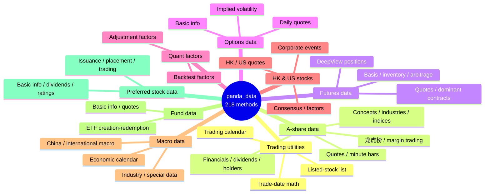
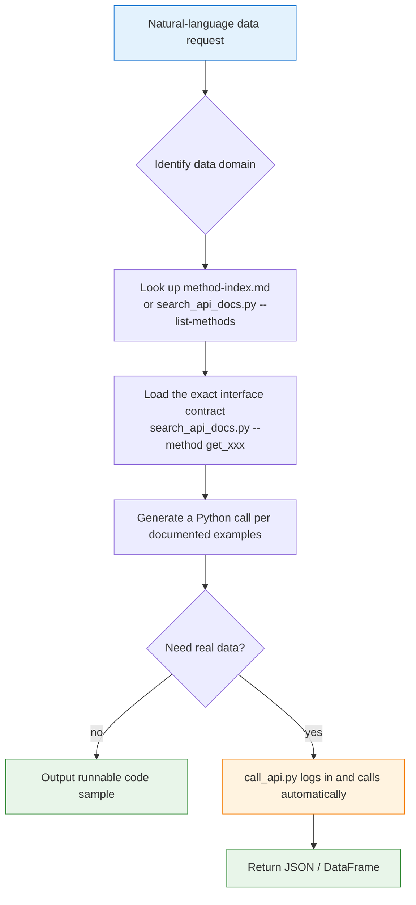

# 🐼 Pandadata API Skill

[简体中文](README.md) | **English**

> Routes natural-language data requests to the right `panda_data` API and generates Python calls that run as-is.

<p align="center">
  
  
  
  
  
  
</p>

---

## 📖 What is this

`pandadata-api` is an **Agent Skill** — it packages the Chinese API documentation of the Pandadata / `panda_data` Python SDK (218 data interfaces) into a local knowledge base that AI Agents can query, cite, and validate against.

When you ask an Agent (Claude Code, Codex, Cursor, …) something like *"fetch A-share daily bars for 000001.SZ"*, this skill will:

1. 🧭 **Route** — locate the right interface among 9 data domains
2. 📑 **Load the contract** — read the **exact** parameter names / fields / examples from the docs instead of inventing them from memory
3. ✍️ **Generate code** — write a runnable `panda_data` call that follows the documented conventions
4. 🚀 **Real call** (optional) — auto-load credentials, initialize the SDK, execute the interface, and return results

> Core principle: **Prefer the bundled reference over memory.** Read the docs first, then answer.

---

## 🗂️ Data Domain Overview



| Data domain | Representative interfaces | Description |
|---|---|---|
| 🛠️ **Trading utilities** | `get_trade_cal` · `get_last_trade_date` | Trading calendar, trade-date math, listed stocks |
| 📈 **A-share data** | `get_stock_daily` · `get_stock_dividend` · `get_fina_reports` | Quotes, concepts/industries, funds, corporate actions, financials |
| 🔩 **Futures data** | `get_future_daily` · `get_future_dominant` · `get_broker_netmarg` | Quotes, dominant contracts, DeepView broker-seat positions |
| ⚖️ **Options data** | `get_option_daily` · `get_option_implied_volatility` | Option info, daily bars, volatility |
| 🧮 **Quant factors** | `get_factor` · `get_adj_factor` | Backtest factors, adjustment factors |
| 🌏 **HK & US stocks** | `get_hk_daily` · `get_us_daily` | Quotes, corporate events, consensus, financial factors |
| 🏛️ **Macro data** | `get_macro_na` · `get_macro_cal` | China/international macro, industries, special data, economic calendar |
| 🧾 **Fund data** | `get_fund_detail` · `get_fund_daily` | Fund basics, quotes, ETF creation-redemption lists |
| 💠 **Preferred stock data** | `get_stock_preferred_detail` · `get_stock_preferred_dividend` | Present in gateway docs; not exported by SDK 0.0.12 |

The full mapping of all 218 interfaces lives in [`references/method-index.md`](references/method-index.md).
Of those, 201 are directly callable with `panda_data==0.0.12`; 17 exist only in the gateway documentation and are marked `not exported`. See [`references/sdk-0.0.12.md`](references/sdk-0.0.12.md) for the compatibility details.

---

## ⚡ Agent Workflow



---

## 📦 Directory Layout

```
pandadata-api/
├── SKILL.md                          # Skill entry: workflow, calling conventions, rules
├── requirements.txt                  # panda_data==0.0.12, requests
├── references/
│   ├── method-index.md               # 📇 218-interface quick index (grouped by domain + doc line numbers)
│   ├── sdk-0.0.12.md                 # 🧩 SDK version, auth changes, and interface differences
│   ├── api_catalog.json              # 🧭 Method-to-MCP-gateway /pandaData endpoint mapping
│   ├── api-docs.md                   # 📚 Full Chinese API documentation
│   └── agent-integration.md          # 🔌 Install/load/smoke-test per Agent
├── scripts/
│   ├── search_api_docs.py            # 🔍 Search/extract API docs
│   ├── call_api.py                   # 📞 Credential-aware interface runner
│   ├── setup_runtime.py              # 🔐 Interactive install + login + credential save
│   ├── pandadata_runtime.py          # In-process SDK initialization helper
│   ├── sdk_compat.py                 # SDK version and documented-interface constraints
│   └── build_method_index.py         # Rebuild method-index from api-docs.md
└── agents/
    ├── cursor-rule.mdc               # Cursor rule adapter
    ├── openai.yaml                   # OpenAI/Codex adapter
    └── portable-loader.md            # Portable loader
```

---

## 🚀 Quick Start

### 1️⃣ Search the docs (no credentials needed)

```bash
# List all methods (should be 218)
python scripts/search_api_docs.py --list-methods

# Show a method's full parameters / fields / examples
python scripts/search_api_docs.py --method get_stock_daily

# Keyword search (multiple terms must hit the same line)
python scripts/search_api_docs.py 股票 分红 --context-lines 4
```

### 2️⃣ First-time runtime setup (install SDK + login)

```bash
python scripts/setup_runtime.py
```

The script: installs `panda_data` → prompts for username/password with hidden input → validates login → optionally saves credentials to `~/.pandadata/pandadata.env`.

### 3️⃣ Call an interface for real

```bash
python scripts/call_api.py \
  --method get_stock_daily \
  --params '{"symbol":["000001.SZ"],"start_date":"20250101","end_date":"20250131","fields":[]}'
```

`call_api.py` automatically: reads credentials from the environment or `~/.pandadata/pandadata.env` → falls back to interactive `setup_runtime.py` when missing → runs `init_token()` in-process → executes the interface → prints JSON by default.

### 4️⃣ Use it from your own Python

```python
from pathlib import Path
import sys

sys.path.append(str(Path("scripts").resolve()))
from pandadata_runtime import init_pandadata

panda_data = init_pandadata()                       # login validated in-process
result = panda_data.get_stock_daily(
    symbol=["000001.SZ"],
    start_date="20250101",
    end_date="20250131",
    fields=[],
)
print(result)
```

---

## 🔌 Multi-Agent Installation

The skill is a `SKILL.md` package: **keep the whole directory** (it depends on `references/` and `scripts/`); never copy `SKILL.md` alone.

```bash
# Pin the source path first
export PANDADATA_SKILL_ROOT="/path/to/pandadata-api"
```

| Agent | Install location | Usage example |
|---|---|---|
| **Claude Code** | `~/.claude/skills/` or project `.claude/skills/` | `Use $pandadata-api to ...` |
| **Codex** | `$CODEX_HOME/skills` (default `~/.codex/skills`) | `Use $pandadata-api to ...` |
| **Hermes** | `~/.hermes/skills/finance/pandadata-api/` | `hermes chat --toolsets skills,terminal` |
| **OpenClaw** | `~/.openclaw/skills/` (real directory, avoid symlinks) | `openclaw -p "Use $pandadata-api ..."` |
| **Cursor** | `.cursor/skills/` + rule `.cursor/rules/pandadata-api.mdc` | auto-attached on demand after window reload |
| **WorkBuddy** | via Claude Code install + `portable-loader.md` | call after attaching the loader |

Full per-Agent install commands and smoke tests live in [`references/agent-integration.md`](references/agent-integration.md).

### ✅ Universal smoke test

```bash
cd "$PANDADATA_SKILL_ROOT"
python -m pip install -r requirements.txt
python scripts/setup_runtime.py --no-install --skip-login-check --non-interactive --no-save-env
python scripts/search_api_docs.py --method get_stock_daily | head -60
python scripts/search_api_docs.py --list-methods | wc -l
python scripts/call_api.py --method get_stock_competitor_information --params '{}' --dry-run
```

**Expected**: the imported version is **0.0.12**, `get_stock_daily` prints its parameter table, the documented method count is **218**, and the 0.0.12 method-name dry-run succeeds.

---

## 📐 Core Conventions

| Convention | Example | Notes |
|---|---|---|
| 📅 Date format | `20250131` | Always `YYYYMMDD` strings |
| 🏷️ A-share codes | `000001.SZ` · `600000.SH` | With exchange suffix |
| 🌐 Exchange codes | `SH` · `HK` · `US` | For calendar-type interfaces |
| 📋 All fields | `fields=[]` | Most interfaces return all fields; some take `fields` as `string` — **follow each method's example** |
| 🔢 Parameter types | `symbol=["000001.SZ"]` vs `symbol="000001.SZ"` | List vs scalar varies by interface — **match the target method's example exactly** |

> ⚠️ For broad / unfiltered calls, warn the user that the interface may return a very large table.

Live availability depends on the Pandadata service URL, account permissions, and upstream data coverage. This skill is data-access and research tooling; its examples and outputs do not constitute investment advice.

---

## 🤖 Agent Usage Rules

- **Search before answering**: API questions start with a doc lookup, not memory.
- **Cite exactly**: method and parameter names follow the docs verbatim; never invent parameters / fields / codes / auth steps.
- **Minimal runnable examples**: validate with `head()`, `shape`, or explicit row counts.
- **Separate fetching from analysis**: fetch and validate the DataFrame first, then transform/analyze.
- **Self-check empty results**: verify date range, code format, and required filters before blaming the service.

---

## 🔄 Docs Maintenance

When the upstream `接口文档.md` is updated:

```bash
cp /path/to/接口文档.md references/api-docs.md
python scripts/build_method_index.py > references/method-index.md
python scripts/search_api_docs.py --list-methods | wc -l   # re-check the method count
```

Then rerun the universal smoke test.

---

## 🔐 Credentials & Dependencies

- The SDK raises `ClientNotInitializedError` until `init_token()` succeeds.
- Credentials can come from environment variables or `~/.pandadata/pandadata.env`: `DEFAULT_USERNAME` / `DEFAULT_PASSWORD` / `JAVA_SERVICE_BASE_URL` (`PANDADATA_BASE_URL` is also accepted). Pass the **plaintext password**; the SDK hashes it internally.
- SDK 0.0.12 `init_token()` writes encrypted credentials and expiry metadata to `user.json`, while keeping the token in memory. `--no-save-env` only disables the skill's separate plaintext shell env file.
- `panda_data==0.0.12` requires Python `>=3.10`; runtime dependencies: `pandas>=2.0.0`, `numpy>=1.22,<2.0`, `python-snappy>=0.7.3`, `python-dotenv>=1.0.0`, `PyYAML>=6.0`, `zstandard>=0.22.0`, `duckdb`, `pyarrow`, `websockets>=13.0`, `requests`.

> Credential files (`*.env`, `user.json`, `.pandadata/`) are git-ignored and never committed.

---

## 📜 License

This project is licensed under the GNU General Public License v3.0. See [LICENSE](LICENSE).

Maintainer: [`abgyjaguo`](https://github.com/abgyjaguo)

## 🐼 PandaAI / QUANTSKILLS Community

<div align="center">
  
  <br>
  <sub>Scan the QR code to join the PandaAI community for QUANTSKILLS skills, agent workflows, and quantitative research practice.</sub>
</div>
