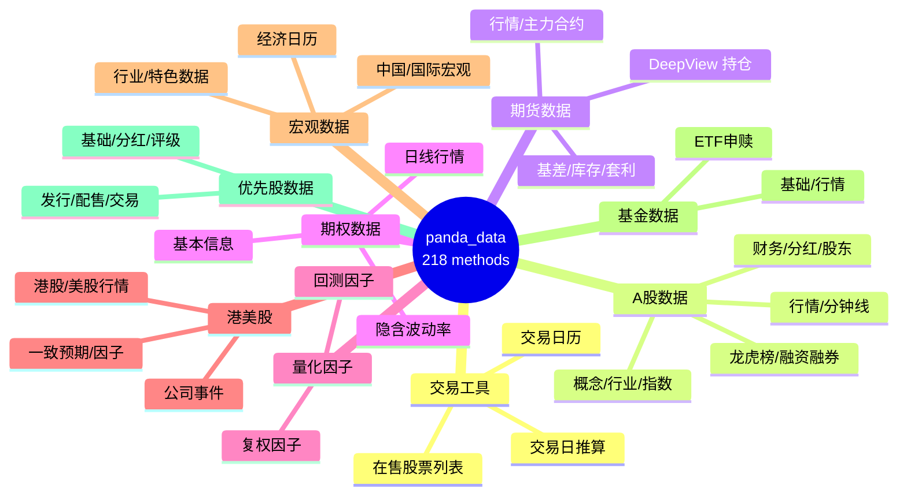
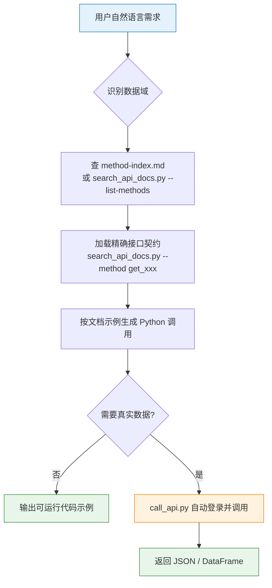

# 🐼 Pandadata API Skill

**简体中文** | [English](README.en.md)

> 把自然语言数据需求，精准路由到正确的 `panda_data` API，并生成可直接运行的 Python 调用。

<p align="center">
  
  
  
  
  
  
</p>

---

## 📖 这是什么

`pandadata-api` 是一个 **Agent Skill**（技能包）——它把 Pandadata / `panda_data` Python SDK 的中文接口文档（218 个数据接口）打包成 AI Agent 可以查询、引用、校验的本地知识库。

当你向 Agent（Claude Code、Codex、Cursor 等）提出诸如 *"帮我查 000001.SZ 的 A 股日线"* 这类需求时，这个技能会：

1. 🧭 **路由** —— 在 9 大数据域中定位到正确的接口
2. 📑 **加载契约** —— 从接口文档中读取**精确的**参数名 / 字段名 / 示例，而不是凭记忆瞎编
3. ✍️ **生成代码** —— 写出符合文档约定的、可运行的 `panda_data` 调用
4. 🚀 **真实调用**（可选）—— 自动加载凭证、初始化 SDK、执行接口并返回结果

> 核心原则：**Prefer the bundled reference over memory.** 先查文档，再回答。

---

## 🗂️ 数据域总览



| 数据域 | 代表接口 | 说明 |
|---|---|---|
| 🛠️ **交易工具** | `get_trade_cal` · `get_last_trade_date` | 交易日历、交易日推算、在售股票 |
| 📈 **A股数据** | `get_stock_daily` · `get_stock_dividend` · `get_fina_reports` | 行情、概念行业、资金、公司行为、财务 |
| 🔩 **期货数据** | `get_future_daily` · `get_future_dominant` · `get_broker_netmarg` | 行情、主力合约、DeepView 持仓席位 |
| ⚖️ **期权数据** | `get_option_daily` · `get_option_implied_volatility` | 期权信息、日线、波动率 |
| 🧮 **量化因子** | `get_factor` · `get_adj_factor` | 回测因子、复权因子 |
| 🌏 **港美股** | `get_hk_daily` · `get_us_daily` | 行情、公司事件、一致预期、财务因子 |
| 🏛️ **宏观数据** | `get_macro_na` · `get_macro_cal` | 中国/国际宏观、行业、特色数据、经济日历 |
| 🧾 **基金数据** | `get_fund_detail` · `get_fund_daily` | 基金基础信息、行情、ETF 申赎清单 |
| 💠 **优先股数据** | `get_stock_preferred_detail` · `get_stock_preferred_dividend` | 网关文档已收录；SDK 0.0.12 尚未导出 |

完整 218 个接口映射见 [`references/method-index.md`](references/method-index.md)。
其中 201 个可由 `panda_data==0.0.12` 直接调用，17 个仅存在于网关文档并在索引中标记为 `not exported`；详细兼容说明见 [`references/sdk-0.0.12.md`](references/sdk-0.0.12.md)。

---

## ⚡ Agent 工作流



---

## 📦 目录结构

```
pandadata-api/
├── SKILL.md                          # 技能入口：工作流、调用约定、规则
├── requirements.txt                  # panda_data==0.0.12, requests
├── references/
│   ├── method-index.md               # 📇 218 接口速查表（按域分组 + 文档行号）
│   ├── sdk-0.0.12.md                 # 🧩 SDK 版本、认证变化与接口差异
│   ├── api_catalog.json              # 🧭 方法到 MCP 网关 /pandaData endpoint 的映射
│   ├── api-docs.md                   # 📚 完整中文接口文档
│   └── agent-integration.md          # 🔌 各 Agent 安装/加载/冒烟测试
├── scripts/
│   ├── search_api_docs.py            # 🔍 检索/抽取接口文档
│   ├── call_api.py                   # 📞 凭证感知的接口运行器
│   ├── setup_runtime.py              # 🔐 交互式安装 + 登录 + 保存凭证
│   ├── pandadata_runtime.py          # 同进程初始化 SDK 的运行时助手
│   ├── sdk_compat.py                 # SDK 版本与文档接口兼容约束
│   └── build_method_index.py         # 从 api-docs.md 重建 method-index
└── agents/
    ├── cursor-rule.mdc               # Cursor 规则适配
    ├── openai.yaml                   # OpenAI/Codex 适配
    └── portable-loader.md            # 通用加载器
```

---

## 🚀 快速开始

### 1️⃣ 检索接口（无需凭证，纯文档查询）

```bash
# 列出全部方法（应为 218）
python scripts/search_api_docs.py --list-methods

# 查看某个方法的完整参数 / 字段 / 示例
python scripts/search_api_docs.py --method get_stock_daily

# 关键词检索（多个词需命中同一行）
python scripts/search_api_docs.py 股票 分红 --context-lines 4
```

### 2️⃣ 首次配置运行时（安装 SDK + 登录）

```bash
python scripts/setup_runtime.py
```

该脚本会：安装 `panda_data` → 隐藏输入用户名/密码 → 校验登录 → 可选保存凭证到 `~/.pandadata/pandadata.env`。

### 3️⃣ 真实调用接口

```bash
python scripts/call_api.py \
  --method get_stock_daily \
  --params '{"symbol":["000001.SZ"],"start_date":"20250101","end_date":"20250131","fields":[]}'
```

`call_api.py` 会自动：读取当前环境或 `~/.pandadata/pandadata.env` 的凭证 → 缺失则触发交互式 `setup_runtime.py` → 同进程 `init_token()` → 执行接口 → 默认输出 JSON。

### 4️⃣ 在自定义 Python 中使用

```python
from pathlib import Path
import sys

sys.path.append(str(Path("scripts").resolve()))
from pandadata_runtime import init_pandadata

panda_data = init_pandadata()                       # 同进程完成登录校验
result = panda_data.get_stock_daily(
    symbol=["000001.SZ"],
    start_date="20250101",
    end_date="20250131",
    fields=[],
)
print(result)
```

---

## 🔌 多 Agent 安装

技能为 `SKILL.md` 包结构，**必须保留整个目录**（依赖 `references/` 与 `scripts/`），不要只拷贝 `SKILL.md`。

```bash
# 先固定源路径
export PANDADATA_SKILL_ROOT="/path/to/pandadata-api"
```

| Agent | 安装位置 | 用法示例 |
|---|---|---|
| **Claude Code** | `~/.claude/skills/` 或项目 `.claude/skills/` | `Use $pandadata-api to ...` |
| **Codex** | `$CODEX_HOME/skills`（默认 `~/.codex/skills`） | `Use $pandadata-api to ...` |
| **Hermes** | `~/.hermes/skills/finance/pandadata-api/` | `hermes chat --toolsets skills,terminal` |
| **OpenClaw** | `~/.openclaw/skills/`（用真实目录，避免符号链接） | `openclaw -p "Use $pandadata-api ..."` |
| **Cursor** | `.cursor/skills/` + 规则 `.cursor/rules/pandadata-api.mdc` | 重载窗口后自动按需附加 |
| **WorkBuddy** | 经 Claude Code 安装 + `portable-loader.md` | 附加加载器后调用 |

各 Agent 的完整安装命令与冒烟测试见 [`references/agent-integration.md`](references/agent-integration.md)。

### ✅ 通用冒烟测试

```bash
cd "$PANDADATA_SKILL_ROOT"
python -m pip install -r requirements.txt
python scripts/setup_runtime.py --no-install --skip-login-check --non-interactive --no-save-env
python scripts/search_api_docs.py --method get_stock_daily | head -60
python scripts/search_api_docs.py --list-methods | wc -l
python scripts/call_api.py --method get_stock_competitor_information --params '{}' --dry-run
```

**预期结果**：导入版本为 **0.0.12**，`get_stock_daily` 打印参数表，文档方法计数为 **218**，且 0.0.12 新方法名的 dry-run 通过。

---

## 📐 核心约定

| 约定 | 示例 | 说明 |
|---|---|---|
| 📅 日期格式 | `20250131` | 统一 `YYYYMMDD` 字符串 |
| 🏷️ A 股代码 | `000001.SZ` · `600000.SH` | 带交易所后缀 |
| 🌐 交易所代码 | `SH` · `HK` · `US` | 用于日历类接口 |
| 📋 全字段 | `fields=[]` | 多数接口返回全字段；部分接口 `fields` 为 `string`，**以方法示例为准** |
| 🔢 入参类型 | `symbol=["000001.SZ"]` vs `symbol="000001.SZ"` | 列表 / 标量因接口而异，**严格匹配目标方法示例** |

> ⚠️ 对于宽口径 / 无过滤的调用，需提醒用户接口可能返回大表。

实时可用性取决于 Pandadata 服务地址、账户权限和上游数据覆盖。本技能仅用于数据访问与研究工程，示例和输出不构成投资建议。

---

## 🤖 Agent 使用规则

- **先查再答**：API 相关问题先检索文档，不要凭记忆。
- **精确引用**：方法名、参数名严格按文档书写，不发明参数 / 字段 / 代码 / 鉴权步骤。
- **示例最小可执行**：用 `head()`、`shape` 或显式行数做校验。
- **取数与分析分离**：先获取并验证 DataFrame，再做转换 / 分析。
- **空数据先自查**：返回空时先核对日期范围、代码格式、必填过滤，再判定服务异常。

---

## 🔄 文档维护

当上游 `接口文档.md` 更新时：

```bash
cp /path/to/接口文档.md references/api-docs.md
python scripts/build_method_index.py > references/method-index.md
python scripts/search_api_docs.py --list-methods | wc -l   # 复核方法计数
```

并重新执行通用冒烟测试。

---

## 🔐 凭证与依赖

- SDK 在 `init_token()` 成功前会抛出 `ClientNotInitializedError`。
- 可通过环境变量或 `~/.pandadata/pandadata.env` 提供凭证：`DEFAULT_USERNAME` / `DEFAULT_PASSWORD` / `JAVA_SERVICE_BASE_URL`（兼容 `PANDADATA_BASE_URL`）。传入**明文密码**，SDK 内部自行哈希。
- SDK 0.0.12 的 `init_token()` 会把加密凭证和过期元数据写入 `user.json`，token 仅保留在内存；`--no-save-env` 只是不写技能自己的明文 shell env 文件。
- `panda_data==0.0.12` 要求 Python `>=3.10`；运行时依赖：`pandas>=2.0.0`、`numpy>=1.22,<2.0`、`python-snappy>=0.7.3`、`python-dotenv>=1.0.0`、`PyYAML>=6.0`、`zstandard>=0.22.0`、`duckdb`、`pyarrow`、`websockets>=13.0`、`requests`。

> 凭证文件（`*.env`、`user.json`、`.pandadata/`）已在 `.gitignore` 中忽略，不会提交。

---

## 📜 License

This project is licensed under the GNU General Public License v3.0. See [LICENSE](LICENSE).

维护者：[`abgyjaguo`](https://github.com/abgyjaguo)

## 🐼 PandaAI / QUANTSKILLS 社群

<div align="center">
  
  <br>
  <sub>扫码加入 PandaAI 社群，交流 QUANTSKILLS 技能、Agent 工作流与量化研究实践。</sub>
</div>
