# Money Whisperer 对话 Agent 扩展 SQLite 数据库设计

> 版本：`2.0`  
> 日期：`2026-07-23`  
> 状态：可进入 Drizzle 迁移设计  
> 性质：对[队友数据库设计](./docs/superpowers/specs/2026-07-23-conversation-agent-database-design.md)的增量数据模型

## 1. 设计边界与唯一事实来源

队友数据库文档是用户、画像、资产、对话、Agent、证据、诊断、建议、模拟、决策、观察、审计和幂等数据的唯一事实来源。本文只增加智能查数、生成文件、Git 式模拟分支、静态评分、信息搜索、自选、通知和 RSS 所必需的表及既有表增量。

MVP 基线固定为：

- SQLite 单文件，推荐 Drizzle ORM；单 Node.js 进程。
- `PRAGMA foreign_keys=ON`、`journal_mode=WAL`、`synchronous=NORMAL`、`busy_timeout=5000`。
- ID 为应用生成的 UUIDv7 `TEXT`；时间为 UTC RFC 3339 `TEXT`；业务日期为 `YYYY-MM-DD`。
- 金额用最小货币单位 `INTEGER`；价格/数量和通用精确值用规范十进制 `TEXT`；比例存 bps `INTEGER`。
- 布尔值为 `INTEGER CHECK(value IN (0,1))`；JSON 为经 Zod 校验的 `TEXT`。
- 可变资源使用 `created_at/updated_at/deleted_at/row_version`；事件、快照和版本追加写入。
- 外部调用在事务外；使用短事务发布结果。SQLite busy 最多退避重试 3 次。
- PostgreSQL 只是未来迁移目标，类型和并发迁移沿用队友数据库第 25 节。

### 1.1 不创建的重复表

| 禁止新建 | 复用 |
| --- | --- |
| `async_jobs`, `async_job_events` | `agent_runs`, `agent_run_events` |
| `provider_calls` | `tool_calls`, `data_sources`, `skill_assets`, `skill_runs` |
| `api_idempotency_records` | `idempotency_records` |
| 第二套 `audit_events` | 既有 `audit_events` |
| `portfolio_analysis_snapshots` | `portfolio_snapshots`, `holding_snapshots`, `portfolio_score_snapshots` |
| `instrument_market_snapshots` | `market_snapshots`, `market_snapshot_metrics` |
| 第二套提醒规则/事件 | `watch_conditions`, `watch_condition_events` |

### 1.2 既有外键

所有引用直接连接队友物理表：`users`、`accounts`、`instruments`、`holdings`、`user_goals`、`conversation_sessions`、`messages`、`agent_runs`、`tool_calls`、`portfolio_snapshots`、`market_snapshots`、`recommendations`、`scenarios`、`simulations`、`decision_logs`、`watch_conditions`、`watch_condition_events`。

不存在 `portfolio_id` 或 `position_id`；使用 `portfolio_snapshot_id`、`account_id`、`holding_id`。

## 2. 枚举增量

SQLite 使用小写值，API 通过集中 Zod 映射输出 `UPPER_SNAKE_CASE`。

| 枚举 | SQLite 值 |
| --- | --- |
| `extension_run_type` | `data_query`, `artifact_generation`, `branch_option_generation`, `portfolio_refresh`, `research_search`, `rss_sync` |
| `output_mode` | `sql_only`, `chart`, `financial_report` |
| `data_query_status` | `queued`, `running`, `succeeded`, `failed`, `cancelled`, `interrupted` |
| `artifact_type` | `echarts_option`, `markdown` |
| `artifact_status` | `generating`, `ready`, `failed`, `deleted` |
| `workspace_status` | `active`, `archived` |
| `option_batch_status` | `queued`, `running`, `succeeded`, `failed`, `cancelled`, `interrupted` |
| `branch_event_type` | `root_created`, `option_executed`, `branch_switched`, `undo` |
| `search_status` | `queued`, `running`, `succeeded`, `partial`, `failed`, `cancelled`, `interrupted` |
| `search_adapter` | `web`, `mcp`, `knowledge_base`, `rss` |
| `source_status` | `succeeded`, `failed`, `skipped` |
| `notification_severity` | `information`, `attention`, `important`, `urgent` |
| `notification_mode` | `important_only`, `daily_digest`, `muted` |
| `rss_feed_status` | `active`, `disabled`, `error`, `deleted` |

`agent_runs.agent_type` 保持既有专业 Agent 语义；扩展根 run 使用 `chief_advisor` 或 `research`，具体 `extension_run_type` 写在公开 objective 前缀及经 Zod 校验的 `model_settings_json.runType`。若实现阶段愿意增加关系列，可在 `agent_runs` 加可空 `run_type`，但不得另建任务表。

既有 `watch_type` 增加 `unrealized_gain`；既有 `message_artifacts.artifact_type` 增加 `generated_artifact`。

每个演示用户 seed 一个内部运维会话：`conversation_sessions.mode='follow_up'`、`current_intent='system_operations'`。没有显式会话的扩展 run 使用该 session；普通会话仓储必须排除该标记。它不保存用户消息，不参与顾问上下文压缩。

## 3. ER 关系图

```mermaid
erDiagram
    USERS ||--o{ DATA_QUERIES : owns
    CONVERSATION_SESSIONS ||--o{ DATA_QUERIES : contextualizes
    MESSAGES ||--o{ DATA_QUERIES : may_trigger
    AGENT_RUNS ||--o| DATA_QUERIES : executes
    DATA_QUERIES ||--o{ DATA_QUERY_RESULT_CHUNKS : stores

    CONVERSATION_SESSIONS ||--o| CONVERSATION_OUTPUT_PREFERENCES : configures
    USERS ||--o{ GENERATED_ARTIFACTS : owns
    MESSAGES ||--o{ GENERATED_ARTIFACTS : sources
    DATA_QUERIES ||--o{ GENERATED_ARTIFACTS : sources
    AGENT_RUNS ||--o{ GENERATED_ARTIFACTS : generates
    GENERATED_ARTIFACTS ||--o{ GENERATED_ARTIFACT_VERSIONS : versions
    MESSAGES ||--o{ MESSAGE_ARTIFACTS : renders
    GENERATED_ARTIFACTS ||--o{ MESSAGE_ARTIFACTS : attaches

    USERS ||--o{ SIMULATION_WORKSPACES : owns
    PORTFOLIO_SNAPSHOTS ||--o{ SIMULATION_WORKSPACES : seeds
    RECOMMENDATIONS ||--o{ SIMULATION_WORKSPACES : may_drive
    SIMULATION_WORKSPACES ||--o{ SIMULATION_BRANCHES : contains
    SIMULATION_BRANCHES ||--o{ SIMULATION_OPTION_BATCHES : proposes_from
    SIMULATION_OPTION_BATCHES ||--o{ SIMULATION_OPTIONS : contains
    SIMULATION_BRANCHES ||--o{ SIMULATION_BRANCHES : parent_of
    SIMULATIONS ||--o| SIMULATION_BRANCHES : computes
    SIMULATION_BRANCHES ||--|| SIMULATION_ASSET_SNAPSHOTS : materializes
    SIMULATION_ASSET_SNAPSHOTS ||--o{ SIMULATION_ASSET_SNAPSHOT_ITEMS : contains
    SIMULATION_WORKSPACES ||--o{ SIMULATION_BRANCH_EVENTS : records

    PORTFOLIO_SNAPSHOTS ||--o| PORTFOLIO_SCORE_SNAPSHOTS : scores

    USERS ||--o{ RESEARCH_SEARCHES : owns
    AGENT_RUNS ||--o{ RESEARCH_SEARCHES : executes
    RESEARCH_SEARCHES ||--o{ RESEARCH_RESULTS : returns
    RESEARCH_RESULTS ||--o{ RESEARCH_CITATIONS : cites
    EVIDENCE_ITEMS ||--o{ RESEARCH_CITATIONS : may_promote

    USERS ||--o{ WATCHLISTS : owns
    WATCHLISTS ||--o{ WATCHLIST_ITEMS : contains
    INSTRUMENTS ||--o{ WATCHLIST_ITEMS : watches
    USERS ||--o{ NOTIFICATIONS : receives
    WATCH_CONDITION_EVENTS ||--o{ NOTIFICATIONS : projects
    USERS ||--o| NOTIFICATION_PREFERENCES : configures

    RSS_FEEDS ||--o{ RSS_ITEMS : contains
```



## 4. 既有表增量

### 4.1 `message_artifacts`

增加列：

| 字段 | 类型 | 必填 | 说明 |
| --- | --- | ---: | --- |
| `generated_artifact_id` | TEXT | 否 | FK `generated_artifacts.id`, `ON DELETE RESTRICT` |

把原“六个目标 FK 恰好一个非空”升级为“七个目标 FK 恰好一个非空”，`artifact_type='generated_artifact'` 时只能设置该列。增加索引 `generated_artifact_id`。软删除产物不会删除链接；UI 渲染“产物已删除”。

SQLite 不能直接替换旧 CHECK 时，Drizzle 迁移按“新表 -> 拷贝 -> 校验行数/FK -> rename”重建，不关闭外键后静默迁移。

### 4.2 `watch_conditions`

复用现有 `window_days`、threshold、severity、cooldown 和 parameters JSON。增加：

| 字段 | 类型 | 必填 | 说明 |
| --- | --- | ---: | --- |
| `holding_id` | TEXT | 否 | FK `holdings.id`, `ON DELETE CASCADE`；持仓级规则优先于仅 instrument |
| `last_metric_snapshot_json` | TEXT | 否 | 最近成功评估的最小指标证据，Zod 校验 |
| `last_crossing_state` | TEXT | 否 | `below/inside/above/unknown` |

约束：

- `watch_type='unrealized_gain'` 时 `holding_id IS NOT NULL`，`operator='cross_above'`，阈值十进制满足 `0 < value <= 10`。
- `watch_type='drawdown'` 时阈值满足 `-1 < value < 0`，且 `window_days > 0` 或 parameters 指定 `from_recent_high`。
- 修改阈值、窗口或从 paused 变 active 时清空 crossing state 和 last metric，防止补发旧穿越。
- 增加索引 `(holding_id,status)`；既有 `(status,next_evaluate_at)` 保留。

### 4.3 `watch_condition_events`

增加：

| 字段 | 类型 | 必填 | 说明 |
| --- | --- | ---: | --- |
| `portfolio_snapshot_id` | TEXT | 否 | FK `portfolio_snapshots.id`, `ON DELETE SET NULL` |
| `holding_snapshot_id` | TEXT | 否 | FK `holding_snapshots.id`, `ON DELETE SET NULL` |
| `threshold_decimal` | TEXT | 否 | 触发时阈值 |
| `previous_value_decimal` | TEXT | 否 | 穿越前值 |
| `metric_snapshot_json` | TEXT | 否 | 实际值、峰值、峰值日期、窗口、质量 |
| `dedupe_key` | TEXT | 否 | 一次穿越唯一键 |

部分唯一 `dedupe_key WHERE dedupe_key IS NOT NULL`；事件追加写，不更新指标证据。假趋势不得成为 snapshot 来源。

### 4.4 `audit_events`

沿用既有字段和安全边界，只增加稳定 `entity_type/event_type` 字典项，如 `data_query`、`generated_artifact`、`simulation_workspace`、`watchlist`、`rss_feed`。不改表结构，不存 SQL 参数值、搜索正文、产物正文或价格清单全文。

### 4.5 `idempotency_records`

直接复用 `(owner_key,route_code,idempotency_key)`。扩展 route code：

- `data_query.create`
- `generated_artifact.create`
- `simulation_workspace.create`
- `simulation_options.create`
- `simulation_branch.create`
- `simulation_workspace.undo`
- `portfolio_analysis.refresh`
- `research_search.create`
- `watchlist.create`
- `watchlist_item.create`
- `observation_conditions.evaluate`
- `rss_feed.create`
- `rss_feed.sync`

业务表不再对客户端幂等键建立永久唯一约束，避免 24 小时过期后阻止合法复用。

## 5. 会话偏好与智能查数

### 5.1 `conversation_output_preferences`

| 字段 | 类型 | 必填 | 约束/说明 |
| --- | --- | ---: | --- |
| `id` | TEXT | 是 | PK |
| `session_id` | TEXT | 是 | UNIQUE FK `conversation_sessions.id`, `ON DELETE CASCADE` |
| `user_id` | TEXT | 是 | FK `users.id`, `ON DELETE CASCADE` |
| `output_mode` | TEXT | 是 | `sql_only/chart/financial_report` |
| `created_at` | TEXT | 是 | UTC |
| `updated_at` | TEXT | 是 | UTC |
| `row_version` | INTEGER | 是 | 默认 1 |

索引 `(user_id,updated_at DESC)`。应用在事务中校验 session.user_id 与本表 user_id 一致；生产迁 PostgreSQL 后可用复合 FK 强化。

### 5.2 `data_queries`

| 字段 | 类型 | 必填 | 约束/说明 |
| --- | --- | ---: | --- |
| `id` | TEXT | 是 | PK |
| `user_id` | TEXT | 是 | FK `users.id`, `ON DELETE CASCADE` |
| `session_id` | TEXT | 否 | FK `conversation_sessions.id`, `ON DELETE SET NULL` |
| `source_message_id` | TEXT | 否 | FK `messages.id`, `ON DELETE SET NULL` |
| `agent_run_id` | TEXT | 是 | UNIQUE FK `agent_runs.id`, `ON DELETE RESTRICT` |
| `question_text` | TEXT | 是 | 1..2000；用户可见 |
| `account_scope_json` | TEXT | 否 | 规范排序的 account IDs，不含 userId |
| `requested_datasets_json` | TEXT | 是 | 注册数据集键数组 |
| `output_mode` | TEXT | 是 | 枚举 output_mode |
| `requested_limit` | INTEGER | 是 | 1..10000 |
| `status` | TEXT | 是 | 枚举 data_query_status |
| `plan_json` | TEXT | 否 | 维度、指标、时间范围；Zod 校验 |
| `redacted_sql` | TEXT | 否 | 脱敏单条 SQL；不得含敏感参数值 |
| `parameter_types_json` | TEXT | 否 | 参数类型和安全摘要 |
| `safety_checks_json` | TEXT | 否 | AST/authorizer 检查列表 |
| `column_metadata_json` | TEXT | 否 | 字段名、类型、单位和敏感级别 |
| `row_count` | INTEGER | 否 | `>=0` |
| `result_size_bytes` | INTEGER | 否 | `>=0` |
| `is_truncated` | INTEGER | 是 | 布尔，默认 0 |
| `data_as_of` | TEXT | 否 | 最旧/统一数据日期说明 |
| `source_summary_json` | TEXT | 否 | tool/skill/data source IDs 与方法 |
| `failure_code` | TEXT | 否 | 稳定错误码 |
| `failure_message` | TEXT | 否 | 脱敏摘要 |
| `result_expires_at` | TEXT | 否 | 默认成功后 30 天 |
| `started_at` | TEXT | 否 | 运行时间 |
| `completed_at` | TEXT | 否 | 终态时间 |
| `created_at` | TEXT | 是 | 游标时间 |

检查约束：

- `succeeded` 必须有 `plan_json/redacted_sql/column_metadata_json/row_count/completed_at` 且无 failure。
- `failed` 必须有 failure code/message/completed_at。
- `cancelled/interrupted` 必须 completed_at；不保存未发布结果块。
- `queued/running` 不得有 completed_at。
- `is_truncated IN (0,1)`；结果大小最大 5 MiB 由应用在写入前强制。

索引：

- `(user_id,created_at DESC,id DESC)` 游标列表。
- `(session_id,created_at DESC,id DESC)`。
- `(status,created_at)` 仅用于启动中断清理/运维，不用于队列领取。
- `agent_run_id` 唯一。

### 5.3 `data_query_result_chunks`

| 字段 | 类型 | 必填 | 约束/说明 |
| --- | --- | ---: | --- |
| `id` | TEXT | 是 | PK |
| `query_id` | TEXT | 是 | FK `data_queries.id`, `ON DELETE CASCADE` |
| `chunk_no` | INTEGER | 是 | 从 0 开始 |
| `first_row_no` | INTEGER | 是 | 从 0 开始 |
| `row_count` | INTEGER | 是 | `1..500` |
| `rows_json` | TEXT | 是 | Zod `Array<Record<string,scalar|null>>` |
| `content_sha256` | TEXT | 是 | 完整摘要 |
| `size_bytes` | INTEGER | 是 | `>0` |
| `created_at` | TEXT | 是 | 追加写 |

唯一 `(query_id,chunk_no)` 和 `(query_id,first_row_no)`；索引 `(query_id,chunk_no)`。块不可更新。查询发布事务一次插入所有块并将头状态改 succeeded；任何块失败则整个发布回滚。

## 6. 生成产物

### 6.1 `generated_artifacts`

| 字段 | 类型 | 必填 | 约束/说明 |
| --- | --- | ---: | --- |
| 标准审计列 | 见队友 4.5 | 是 | 含 soft delete/row_version |
| `user_id` | TEXT | 是 | FK `users.id`, `ON DELETE CASCADE` |
| `session_id` | TEXT | 否 | FK `conversation_sessions.id`, `ON DELETE SET NULL` |
| `source_message_id` | TEXT | 否 | FK `messages.id`, `ON DELETE SET NULL` |
| `source_query_id` | TEXT | 否 | FK `data_queries.id`, `ON DELETE SET NULL` |
| `agent_run_id` | TEXT | 是 | FK `agent_runs.id`, `ON DELETE RESTRICT` |
| `artifact_type` | TEXT | 是 | `echarts_option/markdown` |
| `status` | TEXT | 是 | 枚举 artifact_status |
| `title` | TEXT | 是 | 1..120 |
| `current_version_no` | INTEGER | 是 | 生成中 0，ready 时 `>=1` |
| `source_snapshot_json` | TEXT | 是 | 冻结的消息可见正文、上下文摘要、查询摘要、数据日期 |
| `source_snapshot_sha256` | TEXT | 是 | 生成输入摘要 |
| `provenance_json` | TEXT | 是 | 模型/算法/tool IDs，不含提示词 |
| `failure_code` | TEXT | 否 | 失败时必填 |
| `failure_message` | TEXT | 否 | 失败时必填 |
| `ready_at` | TEXT | 否 | ready 时间 |

至少一个 source FK 非空。状态检查：

- `generating`: version 0、ready/failure 空。
- `ready`: version >=1、ready_at 非空、failure 空。
- `failed`: version 0、failure 非空。
- `deleted`: `deleted_at` 非空；删除前可为 ready/failed，原状态可记录于审计摘要。

索引 `(user_id,created_at DESC,id DESC) WHERE deleted_at IS NULL`、`source_message_id`、`source_query_id`、`agent_run_id`。

`source_snapshot_json` 是可重放所必需的最小快照，最多 100 KiB；不保存隐藏提示词。消息 redaction 后允许按用户删除流程清空其中正文，但保留摘要和“来源已删除”标记。

### 6.2 `generated_artifact_versions`

| 字段 | 类型 | 必填 | 约束/说明 |
| --- | --- | ---: | --- |
| `id` | TEXT | 是 | PK |
| `artifact_id` | TEXT | 是 | FK `generated_artifacts.id`, `ON DELETE CASCADE` |
| `version_no` | INTEGER | 是 | 从 1 递增 |
| `content_text` | TEXT | 否 | Markdown |
| `content_json` | TEXT | 否 | ECharts Option JSON |
| `content_sha256` | TEXT | 是 | 摘要 |
| `size_bytes` | INTEGER | 是 | >0；Markdown <=1MiB，ECharts <=512KiB |
| `created_by_type` | TEXT | 是 | `user/agent/system` |
| `created_by_id` | TEXT | 否 | 用户或 run 的文本 ID |
| `edit_summary` | TEXT | 否 | 最多 300 |
| `created_at` | TEXT | 是 | 追加写 |

CHECK：Markdown 只填 content_text；ECharts 只填 content_json，且类型必须与父表一致（应用在事务中校验）。唯一 `(artifact_id,version_no)`；索引 `(artifact_id,version_no DESC)`。版本不可 UPDATE/DELETE，除用户彻底删除级联。

### 6.3 产物发布/编辑事务

生成发布：

1. 在事务外生成并净化内容。
2. `BEGIN IMMEDIATE`，确认 artifact 仍 generating、run 未取消。
3. 插入 version 1。
4. 更新头为 ready/current=1/ready_at。
5. 若有 assistant message，插入 `message_artifacts(generated_artifact_id=...)`。
6. 插入审计摘要并提交，再发 SSE。

编辑：按 `WHERE id=? AND row_version=? AND status='ready'` 更新头并插入 N+1 版本；受影响行数 0 返回 `412`。外部净化失败不进入事务。

## 7. Git 式分支模拟

### 7.1 `simulation_workspaces`

| 字段 | 类型 | 必填 | 约束/说明 |
| --- | --- | ---: | --- |
| 标准审计列 | 见队友 4.5 | 是 | 软删除不用于历史，通常归档 |
| `user_id` | TEXT | 是 | FK `users.id`, `ON DELETE CASCADE` |
| `session_id` | TEXT | 否 | FK `conversation_sessions.id`, `ON DELETE SET NULL` |
| `recommendation_id` | TEXT | 否 | FK `recommendations.id`, `ON DELETE SET NULL` |
| `portfolio_snapshot_id` | TEXT | 是 | FK `portfolio_snapshots.id`, `ON DELETE RESTRICT` |
| `name` | TEXT | 是 | 1..120 |
| `status` | TEXT | 是 | `active/archived` |
| `root_branch_id` | TEXT | 是 | FK 延迟校验 `simulation_branches.id` |
| `active_branch_id` | TEXT | 是 | FK 延迟校验 `simulation_branches.id` |
| `engine_parameters_json` | TEXT | 是 | 固定 v1 参数 |
| `created_at`,`updated_at`,`row_version`,`deleted_at` | 见标准 | 是 | deleted_at 通常空 |

根/活动 ID 在创建前应用预生成，两个 FK 声明 `DEFERRABLE INITIALLY DEFERRED`，单事务插入 workspace、root branch、root snapshot、root event。以 workspace 表的 `(id,root_branch_id)`、`(id,active_branch_id)` 复合 FK 指向 branches 的 `(workspace_id,id)`，数据库保证归属。索引 `(user_id,status,updated_at DESC,id DESC)`、`session_id`、`recommendation_id`。

### 7.2 `simulation_branches`

| 字段 | 类型 | 必填 | 约束/说明 |
| --- | --- | ---: | --- |
| `id` | TEXT | 是 | PK |
| `workspace_id` | TEXT | 是 | FK `simulation_workspaces.id`, `ON DELETE RESTRICT` |
| `parent_branch_id` | TEXT | 否 | 自 FK `ON DELETE RESTRICT` |
| `source_option_id` | TEXT | 否 | FK `simulation_options.id`, `ON DELETE RESTRICT` |
| `simulation_id` | TEXT | 否 | UNIQUE FK `simulations.id`, `ON DELETE RESTRICT` |
| `name` | TEXT | 是 | 1..120 |
| `depth` | INTEGER | 是 | 根 0，子=父+1 |
| `created_at` | TEXT | 是 | 追加写 |

根节点 parent/option/simulation 为空；非根必须全部非空。唯一 `(workspace_id,id)`（用于复合归属 FK）、`simulation_id`；父引用使用 `(workspace_id,parent_branch_id) -> (workspace_id,id)`。索引 `(workspace_id,parent_branch_id,created_at,id)`。

### 7.3 `simulation_option_batches`

| 字段 | 类型 | 必填 | 约束/说明 |
| --- | --- | ---: | --- |
| `id` | TEXT | 是 | PK |
| `workspace_id` | TEXT | 是 | FK `simulation_workspaces.id`, `ON DELETE RESTRICT` |
| `from_branch_id` | TEXT | 是 | 与 workspace 组成复合 FK 指向 branch，`ON DELETE RESTRICT` |
| `agent_run_id` | TEXT | 是 | UNIQUE FK `agent_runs.id`, `ON DELETE RESTRICT` |
| `status` | TEXT | 是 | 枚举 option_batch_status |
| `scenario_text` | TEXT | 是 | 1..2000 |
| `horizon_days` | INTEGER | 是 | 1..3650 |
| `engine_parameters_json` | TEXT | 是 | 本批次冻结参数 |
| `price_manifest_json` | TEXT | 否 | 规范排序标的/价格/来源 |
| `price_manifest_sha256` | TEXT | 否 | 摘要 |
| `data_as_of` | TEXT | 否 | 价格数据日期 |
| `failure_code`,`failure_message` | TEXT | 否 | 失败摘要 |
| `created_at`,`completed_at` | TEXT | 是/否 | 生命周期 |

成功必须存在 manifest/hash/data_as_of/completed_at；失败必须有 failure。索引 `(workspace_id,from_branch_id,created_at DESC)`、`status`。

### 7.4 `simulation_options`

| 字段 | 类型 | 必填 | 约束/说明 |
| --- | --- | ---: | --- |
| `id` | TEXT | 是 | PK |
| `batch_id` | TEXT | 是 | FK `simulation_option_batches.id`, `ON DELETE RESTRICT` |
| `label` | TEXT | 是 | `A..E` |
| `action` | TEXT | 是 | 复用建议动作小写值 |
| `summary` | TEXT | 是 | 用户可见 |
| `rationale_json` | TEXT | 是 | 最多 3 条依据和至少 1 条风险/反方证据 |
| `trades_json` | TEXT | 是 | 经 Zod 校验的结构化模拟交易 |
| `input_sha256` | TEXT | 是 | batch/branch/manifest/option 摘要 |
| `executed_branch_id` | TEXT | 否 | FK `simulation_branches.id`, `ON DELETE RESTRICT` |
| `expires_at` | TEXT | 是 | 到期后不能执行 |
| `created_at` | TEXT | 是 | 追加写 |

唯一 `(batch_id,label)`；`executed_branch_id` 唯一非空，保证一个候选只生成一个分支。索引 `(batch_id,created_at)`、`expires_at`。

### 7.5 `simulation_asset_snapshots`

| 字段 | 类型 | 必填 | 约束/说明 |
| --- | --- | ---: | --- |
| `id` | TEXT | 是 | PK |
| `branch_id` | TEXT | 是 | UNIQUE FK `simulation_branches.id`, `ON DELETE RESTRICT` |
| `base_currency` | TEXT | 是 | 货币 |
| `cash_value_minor` | INTEGER | 是 | `>=0` |
| `total_value_minor` | INTEGER | 是 | `>=0` |
| `unrealized_pnl_minor` | INTEGER | 否 | 可负 |
| `metrics_json` | TEXT | 是 | 回撤/波动/集中度等 |
| `data_as_of` | TEXT | 是 | 数据日期 |
| `price_manifest_sha256` | TEXT | 是 | 根可用 `root:<portfolioSnapshotId>` |
| `engine_version` | TEXT | 是 | `branch-simulation-v1` |
| `content_sha256` | TEXT | 是 | 资产事实摘要 |
| `created_at` | TEXT | 是 | 追加写 |

快照不可 UPDATE/DELETE。持仓明细关系化存入下一表；应用发布前验证现金非负、数量非负、权重和在容差内、manifest 与 option batch 相同。

### 7.6 `simulation_asset_snapshot_items`

| 字段 | 类型 | 必填 | 约束/说明 |
| --- | --- | ---: | --- |
| `id` | TEXT | 是 | PK |
| `asset_snapshot_id` | TEXT | 是 | FK `simulation_asset_snapshots.id`, `ON DELETE RESTRICT` |
| `instrument_id` | TEXT | 是 | FK `instruments.id`, `ON DELETE RESTRICT` |
| `quantity_decimal` | TEXT | 是 | `>=0` 的规范十进制 |
| `average_cost_decimal` | TEXT | 是 | `>=0` |
| `market_price_decimal` | TEXT | 是 | price manifest 中的价格 |
| `market_value_minor` | INTEGER | 是 | `>=0` |
| `cost_value_minor` | INTEGER | 是 | `>=0` |
| `unrealized_pnl_minor` | INTEGER | 是 | 可负 |
| `weight_bps` | INTEGER | 是 | 0..10000 |
| `created_at` | TEXT | 是 | 追加写 |

唯一 `(asset_snapshot_id,instrument_id)`；索引 `instrument_id`。行与头快照一同发布且不可更新。现金不伪装成 instrument item，保留在头表。

### 7.7 `simulation_branch_events`

| 字段 | 类型 | 必填 | 约束/说明 |
| --- | --- | ---: | --- |
| `id` | TEXT | 是 | PK |
| `workspace_id` | TEXT | 是 | FK `simulation_workspaces.id`, `ON DELETE RESTRICT` |
| `event_type` | TEXT | 是 | 枚举 branch_event_type |
| `from_branch_id` | TEXT | 否 | 与 workspace 组成复合 FK 指向 branch |
| `to_branch_id` | TEXT | 是 | 与 workspace 组成复合 FK 指向 branch |
| `option_id` | TEXT | 否 | FK option |
| `simulation_id` | TEXT | 否 | FK existing simulation |
| `actor_type` | TEXT | 是 | `user/agent/system` |
| `actor_id` | TEXT | 否 | 文本 ID |
| `reason_text` | TEXT | 否 | 最多 300 |
| `created_at` | TEXT | 是 | 追加写 |

索引 `(workspace_id,created_at,id)`、`to_branch_id`。根事件 from 为空；switch/undo 需 from/to；option_executed 需 option/simulation。复合 FK 防止事件串到其他工作区分支。

### 7.8 分支发布事务

候选生成在事务外调用模型并计算 price manifest，短事务插入 options 并将 batch succeeded。执行候选时：

1. 事务外基于保存的父快照和 price manifest 运行确定性引擎。
2. `BEGIN IMMEDIATE`，重读 workspace version、父分支、option 未执行且未过期、manifest 摘要一致。
3. 插入既有 `scenarios/simulations/simulation_metrics/simulation_allocations`。
4. 插入 branch、asset snapshot 及全部 snapshot items，设置 option.executed_branch_id。
5. 更新 active branch/row_version，插入 branch event 和审计摘要，提交后发 SSE。

切换/undo 只更新 workspace active pointer + version 并插 event。任何历史表不删除；真实 `holdings` 不在事务写集内。

## 8. 静态资产评分

### 8.1 `portfolio_score_snapshots`

| 字段 | 类型 | 必填 | 约束/说明 |
| --- | --- | ---: | --- |
| `id` | TEXT | 是 | PK |
| `portfolio_snapshot_id` | TEXT | 是 | UNIQUE FK `portfolio_snapshots.id`, `ON DELETE CASCADE` |
| `source_agent_run_id` | TEXT | 否 | FK `agent_runs.id`, `ON DELETE SET NULL` |
| `score_version` | TEXT | 是 | `portfolio-score-v1` |
| `health_score` | INTEGER | 是 | 0..100 |
| `risk_score` | INTEGER | 是 | 0..100 |
| `return_bps` | INTEGER | 否 | 收益 |
| `max_drawdown_bps` | INTEGER | 否 | -10000..0 |
| `annualized_volatility_bps` | INTEGER | 否 | >=0 |
| `largest_holding_weight_bps` | INTEGER | 否 | 0..10000 |
| `largest_sector_weight_bps` | INTEGER | 否 | 0..10000 |
| `concentration_hhi_decimal` | TEXT | 否 | 0..1 |
| `liquidity_days_decimal` | TEXT | 否 | >=0 |
| `data_completeness_bps` | INTEGER | 是 | 0..10000 |
| `components_json` | TEXT | 是 | 分项分数、质量和解释 |
| `missing_metrics_json` | TEXT | 是 | 缺失字段数组 |
| `calculation_input_sha256` | TEXT | 是 | holding/market snapshot IDs 与算法输入摘要 |
| `created_at` | TEXT | 是 | 追加写 |

本表只补已有快照缺失的版本化评分，不复制持仓行、行情或诊断建议。索引 `(score_version,created_at DESC)`、`source_agent_run_id`。

### 8.2 静态刷新事务

刷新在事务外获取市场数据和计算，发布时同一事务插入新的 `portfolio_snapshots`、全部 `holding_snapshots`、必要市场快照/指标和唯一 score snapshot。任何必需持仓行失败则整体回滚或将 portfolio data_quality 标 partial 并明确 missing，不能混用旧 score 与新 holdings。

### 8.3 假趋势

MVP 趋势由 `sha256(portfolioSnapshotId|metric|points|mock-trend-v1)` 作为确定性种子即时生成，不持久化表。响应硬编码 `source=MOCK/modelVersion=mock-trend-v1`。这样避免假数据进入市场快照、证据和提醒真源。

## 9. 信息搜索

### 9.1 `research_searches`

| 字段 | 类型 | 必填 | 约束/说明 |
| --- | --- | ---: | --- |
| `id` | TEXT | 是 | PK |
| `user_id` | TEXT | 是 | FK users |
| `session_id` | TEXT | 否 | FK conversation_sessions |
| `root_agent_run_id` | TEXT | 否 | FK agent_runs；可接既有分析 |
| `search_agent_run_id` | TEXT | 是 | UNIQUE FK agent_runs |
| `query_text` | TEXT | 是 | 1..1000 |
| `adapters_json` | TEXT | 是 | 1..4 个白名单适配器 |
| `filters_json` | TEXT | 否 | 标的/日期/语言，不含凭证 |
| `maximum_results` | INTEGER | 是 | 1..50 |
| `status` | TEXT | 是 | 枚举 search_status |
| `source_statuses_json` | TEXT | 否 | 各 adapter 状态/错误 |
| `result_count` | INTEGER | 是 | >=0，默认 0 |
| `failure_code`,`failure_message` | TEXT | 否 | 全部失败摘要 |
| `started_at`,`completed_at`,`created_at` | TEXT | 否/否/是 | 生命周期 |

索引 `(user_id,created_at DESC,id DESC)`、`(session_id,created_at DESC)`、`root_agent_run_id`、`status`。partial/succeeded 必须有 source statuses 和 completed_at；failed 必须 failure。

### 9.2 `research_results`

| 字段 | 类型 | 必填 | 约束/说明 |
| --- | --- | ---: | --- |
| `id` | TEXT | 是 | PK |
| `search_id` | TEXT | 是 | FK `research_searches.id`, `ON DELETE CASCADE` |
| `adapter` | TEXT | 是 | 枚举 search_adapter |
| `data_source_id` | TEXT | 否 | FK `data_sources.id`, `ON DELETE SET NULL` |
| `tool_call_id` | TEXT | 否 | FK `tool_calls.id`, `ON DELETE SET NULL` |
| `title` | TEXT | 是 | 最多 300 |
| `summary` | TEXT | 是 | 最多 2000，净化文本 |
| `canonical_url` | TEXT | 否 | http/https，安全校验后 |
| `source_name` | TEXT | 是 | 最多 200 |
| `published_at` | TEXT | 否 | 外部时间 |
| `retrieved_at` | TEXT | 是 | 获取时间 |
| `content_sha256` | TEXT | 是 | 去重摘要 |
| `trust_level` | TEXT | 是 | `primary/secondary/unverified_external` |
| `created_at` | TEXT | 是 | 追加写 |

唯一 `(search_id,adapter,content_sha256)`；索引 `(search_id,created_at,id)`、`canonical_url`、`tool_call_id`。不存整篇正文。

### 9.3 `research_citations`

| 字段 | 类型 | 必填 | 约束/说明 |
| --- | --- | ---: | --- |
| `id` | TEXT | 是 | PK |
| `research_result_id` | TEXT | 是 | FK result, `ON DELETE CASCADE` |
| `evidence_id` | TEXT | 否 | FK `evidence_items.id`, `ON DELETE SET NULL` |
| `source_locator` | TEXT | 否 | 章节/页码/记录键 |
| `excerpt` | TEXT | 否 | 最多 500 字 |
| `created_at` | TEXT | 是 | 追加写 |

索引 `research_result_id`、`evidence_id`；同 result/locator 去重。Evidence 发布事务先创建/校验 `evidence_items/evidence_source_links`，再回填 citation.evidence_id。citation 不能替代既有 evidence source link。

## 10. 自选与统一通知

### 10.1 `watchlists`

| 字段 | 类型 | 必填 | 约束/说明 |
| --- | --- | ---: | --- |
| 标准审计列 | 是 | 是 | 软删除、row_version |
| `user_id` | TEXT | 是 | FK users |
| `name` | TEXT | 是 | 1..60 |
| `description` | TEXT | 否 | <=300 |

部分唯一 `(user_id,name) WHERE deleted_at IS NULL`；游标索引 `(user_id,created_at DESC,id DESC) WHERE deleted_at IS NULL`。每用户 20 个活动列表由 `BEGIN IMMEDIATE` 内计数保证。

### 10.2 `watchlist_items`

| 字段 | 类型 | 必填 | 约束/说明 |
| --- | --- | ---: | --- |
| 标准审计列 | 是 | 是 | 软删除、row_version |
| `watchlist_id` | TEXT | 是 | FK watchlists, `ON DELETE CASCADE` |
| `instrument_id` | TEXT | 是 | FK instruments, `ON DELETE CASCADE` |
| `goal_id` | TEXT | 否 | FK user_goals, `ON DELETE SET NULL` |
| `reason_text` | TEXT | 是 | 1..500 |
| `planned_horizon` | TEXT | 是 | 复用 `horizon_bucket` |
| `source_type` | TEXT | 是 | `user/agent/import` |

部分唯一 `(watchlist_id,instrument_id) WHERE deleted_at IS NULL`；游标索引 `(watchlist_id,created_at DESC,id DESC)`；`(instrument_id,deleted_at)` 支持反查。估值、风险、组合关联、最新建议和提醒计数通过查询 JOIN 聚合，不落本表。

### 10.3 `notifications`

| 字段 | 类型 | 必填 | 约束/说明 |
| --- | --- | ---: | --- |
| `id` | TEXT | 是 | PK |
| `user_id` | TEXT | 是 | FK users, `ON DELETE CASCADE` |
| `watch_condition_event_id` | TEXT | 是 | FK watch_condition_events, `ON DELETE RESTRICT` |
| `severity` | TEXT | 是 | 四级枚举 |
| `title` | TEXT | 是 | <=120 |
| `body` | TEXT | 是 | <=1000，净化文本 |
| `group_key` | TEXT | 是 | 相似提醒分组键 |
| `latest_event_at` | TEXT | 是 | 合并后最新时间 |
| `actions_json` | TEXT | 是 | 允许的 UI 动作白名单 |
| `read_at` | TEXT | 否 | 首次已读 |
| `ignored_at` | TEXT | 否 | 忽略时间 |
| `created_at`,`updated_at` | TEXT | 是 | 生命周期 |
| `row_version` | INTEGER | 是 | 默认 1 |

每个事件最多属于一个通知：UNIQUE `watch_condition_event_id`。索引 `(user_id,created_at DESC,id DESC)`、未读部分索引 `(user_id,created_at DESC) WHERE read_at IS NULL AND ignored_at IS NULL`、`(user_id,group_key,latest_event_at DESC)`。

相似合并不把第二个事件“挪入”首个通知，因为 UNIQUE 是一事件一投影；每次触发各建通知，通过 `group_key` 在读取层聚合。API 的 `occurrenceCount` 是同组未忽略物理行计数，不落单行字段。若未来物理合并，必须另建 notification_event_links，不能覆盖事件 FK。

MARK_READ 使用 `read_at=COALESCE(read_at,now)`；IGNORE 同理设置 ignored_at。二者不可恢复为空。

### 10.4 `notification_preferences`

| 字段 | 类型 | 必填 | 约束/说明 |
| --- | --- | ---: | --- |
| `id` | TEXT | 是 | PK |
| `user_id` | TEXT | 是 | UNIQUE FK users, `ON DELETE CASCADE` |
| `mode` | TEXT | 是 | notification_mode |
| `digest_time` | TEXT | 否 | `HH:mm`；daily_digest 必填 |
| `timezone` | TEXT | 是 | IANA，默认 Asia/Shanghai |
| `created_at`,`updated_at` | TEXT | 是 | 时间 |
| `row_version` | INTEGER | 是 | 默认 1 |

CHECK 保证 daily_digest/digest_time 组合；MVP 无站外投递，偏好只控制列表聚合和非紧急显示。

## 11. RSS

### 11.1 `rss_feeds`

| 字段 | 类型 | 必填 | 约束/说明 |
| --- | --- | ---: | --- |
| 标准审计列 | 是 | 是 | 软删除、row_version |
| `name` | TEXT | 是 | 1..120 |
| `feed_url` | TEXT | 是 | 规范化 http/https URL |
| `site_url` | TEXT | 否 | http/https |
| `status` | TEXT | 是 | rss_feed_status |
| `refresh_interval_minutes` | INTEGER | 是 | 15..10080 |
| `etag` | TEXT | 否 | 条件请求 |
| `last_modified` | TEXT | 否 | 条件请求 |
| `last_synced_at` | TEXT | 否 | 成功/304 时间 |
| `last_agent_run_id` | TEXT | 否 | FK agent_runs, `ON DELETE SET NULL` |
| `failure_code`,`failure_message` | TEXT | 否 | 脱敏错误 |

唯一部分索引 `feed_url WHERE deleted_at IS NULL`；索引 `(status,last_synced_at)`。URL 在创建、修改、每次同步重定向后都做 DNS/SSRF 校验，数据库约束不能替代该检查。

### 11.2 `rss_items`

| 字段 | 类型 | 必填 | 约束/说明 |
| --- | --- | ---: | --- |
| `id` | TEXT | 是 | PK |
| `feed_id` | TEXT | 是 | FK rss_feeds, `ON DELETE CASCADE` |
| `guid` | TEXT | 否 | 源 guid |
| `title` | TEXT | 是 | <=300 |
| `summary` | TEXT | 否 | <=2000，净化文本 |
| `canonical_url` | TEXT | 否 | 安全 URL |
| `author` | TEXT | 否 | <=200 |
| `published_at` | TEXT | 否 | 源时间 |
| `content_sha256` | TEXT | 是 | 规范内容摘要 |
| `raw_date_text` | TEXT | 否 | 无法解析日期的审计摘要 |
| `created_at`,`updated_at` | TEXT | 是 | 时间 |

部分唯一 `(feed_id,guid) WHERE guid IS NOT NULL`；guid 空时唯一 `(feed_id,content_sha256)`；索引 `(feed_id,published_at DESC,id DESC)`、`(published_at DESC,id DESC)`、`canonical_url`。不存完整 HTML/XML 正文。

### 11.3 RSS 同步事务

网络获取/解析/净化在事务外，限制超时、重定向、响应大小并禁用 XML 外部实体。发布短事务：upsert items、更新 feed 水位/状态、写 tool call/run 结果和审计摘要。`304` 只更新 last_synced_at。取消时不发布未完成批次。

## 12. 索引与高频查询矩阵

| 查询 | 关键索引 |
| --- | --- |
| 最近查数 | `data_queries(user_id,created_at DESC,id DESC)` |
| 查询结果分页 | `data_query_result_chunks(query_id,chunk_no)` |
| 消息产物 | `generated_artifacts(source_message_id)`、`message_artifacts(generated_artifact_id)` |
| 产物版本 | `generated_artifact_versions(artifact_id,version_no DESC)` |
| 工作区列表 | `simulation_workspaces(user_id,status,updated_at DESC,id DESC)` |
| 分支树 | `simulation_branches(workspace_id,parent_branch_id,created_at,id)` |
| 分支资产明细 | `simulation_asset_snapshot_items(asset_snapshot_id,instrument_id)` |
| 候选批次 | `simulation_option_batches(workspace_id,from_branch_id,created_at DESC)` |
| 最新组合评分 | UNIQUE `portfolio_score_snapshots(portfolio_snapshot_id)` |
| 搜索结果 | `research_results(search_id,created_at,id)` |
| 自选条目 | `watchlist_items(watchlist_id,created_at DESC,id DESC)` |
| 未读通知 | partial `notifications(user_id,created_at DESC)` |
| 待检查观察条件 | 既有 `watch_conditions(status,next_evaluate_at)` |
| RSS 时间流 | `rss_items(published_at DESC,id DESC)` |

SQLite 不使用 `FOR UPDATE SKIP LOCKED`、分区、BRIN、RLS 或多角色连接。进程内 Map 防止同 run 重复执行；数据库唯一约束和 `BEGIN IMMEDIATE` 保证最终一致性。

## 13. 事务、并发与中断

### 13.1 固定锁/写入顺序

同一写事务按以下领域顺序操作，减少 busy/死锁式冲突：

1. `idempotency_records` 预留。
2. 既有根实体（session/run/snapshot/recommendation）。
3. 扩展头实体（query/artifact/workspace/search/watchlist/feed）。
4. 子项、版本、块、分支、事件。
5. `audit_events` 和幂等响应。

任何网络、模型、Python Skill 或大 JSON 净化不得在事务中执行。

### 13.2 服务启动恢复

启动事务把关联扩展资源的活动根 `agent_runs.status='running'` 改 `interrupted`，追加 `run.interrupted`，并把对应 query/batch/search/run-backed sync 状态改 interrupted。已经 ready/succeeded 的产物、查询块、分支和搜索结果不回滚。

### 13.3 乐观锁

偏好、产物、工作区、自选、通知偏好、RSS feed 的更新采用：

```sql
UPDATE resource
SET ..., row_version = row_version + 1, updated_at = ?
WHERE id = ? AND row_version = ? AND deleted_at IS NULL;
```

受影响 0 行后重读：不存在返回 404，版本不同返回 `412 VERSION_CONFLICT`。追加事件/版本/快照不使用乐观锁覆盖。

## 14. 数据保留、软删除与不可变性

| 数据 | 策略 | MVP 保留 |
| --- | --- | --- |
| 查询结果块 | 到期物理删除；头保留摘要 | 30 天 / 180 天 |
| 生成产物 | 软删除；版本随用户数据保留 | 删除后可由 reset/用户清除 |
| 分支工作区/分支/事件/快照 | 归档、不可变；不做单分支删除 | 与用户数据同生命周期 |
| 评分快照 | 随 portfolio snapshot | 90 天；被引用则延长 |
| 搜索结果/引用 | 不存正文；到期清理 | 90 天 |
| 自选 | 软删除 | reset/用户删除 |
| watch events/通知 | 事件不可变，通知只改 read/ignored | 180 天 |
| RSS items | 每源最多 5000 条，删除最旧未引用项 | 最多 1 年 |
| 偏好 | 可更新/删除 | 用户生命周期 |

不可 UPDATE：查询结果块、产物历史版本、分支、模拟资产快照、分支事件、评分快照、搜索引用、watch event、RSS 已发布历史关键字段。用户彻底删除通过 users 根 FK 级联；审计和法规保留按队友规则执行去标识化。

## 15. 数据安全与内容安全

- SQLite 文件放应用私有目录并由 `.gitignore` 排除；禁止把产物写入仓库、本地任意路径或 `/public`。
- 密钥只从进程环境读取；数据库不得出现 `DEFAULT_PASSWORD`、Token、Cookie、CSRF、Authorization 或连接信息。
- SQL 只保存脱敏 statement、参数类型和摘要；不存完整敏感值。
- source snapshot 只含生成所需可见文本/摘要；不含系统提示、隐藏推理或未授权会话。
- ECharts JSON 禁止函数字符串/外链脚本；Markdown 禁止原始 HTML 和危险协议。
- 搜索/RSS 正文视为不可信；不执行其中的指令、脚本或工具名。
- RSS/Web URL 每次解析、重定向后验证，阻止 loopback、私网、link-local、metadata IP 和非 http(s)。
- `tool_calls`、`skill_runs`、audit diff 写入前字段级脱敏。

## 16. PostgreSQL 未来迁移

迁移按队友第 25 节执行：TEXT UUID -> UUID，RFC3339 TEXT -> TIMESTAMPTZ，JSON TEXT -> JSONB，金额 INTEGER -> BIGINT/NUMERIC。额外注意：

- 用复合 FK 强化 `(session_id,user_id)`、`(workspace_id,branch_id)` 和搜索父子归属。
- 使用行锁替代 `BEGIN IMMEDIATE`；若未来引入真正队列，才允许 `FOR UPDATE SKIP LOCKED`。
- 用户隔离可升级为 RLS，但不是 MVP 行为，API 公共契约不因此改变。
- 大查询块、RSS、审计达到明确规模后再考虑分区；初期不预建。
- 产物超过 SQLite/数据库保留阈值后迁对象存储，数据库保留版本元数据、object key 和 SHA-256。

## 17. 迁移顺序

1. 校验队友基础迁移已包含 `users/accounts/instruments/holdings/conversations/messages/agent_runs/tool_calls/skills/snapshots/simulations/watch/audit/idempotency`。
2. 创建 `conversation_output_preferences`、`data_queries`、`data_query_result_chunks`。
3. 创建 `generated_artifacts`、`generated_artifact_versions`，重建/扩展 `message_artifacts` CHECK。
4. 创建工作区、分支、option batch/options、asset snapshots/items、branch events；循环 FK 使用预生成 ID 与 deferred 复合 FK。
5. 创建 `portfolio_score_snapshots`。
6. 创建 research 三表及 evidence 关联索引。
7. 创建 watchlists/items，扩展 watch conditions/events，再创建 notifications/preferences。
8. 创建 RSS 两表。
9. 加全部 CHECK、部分唯一、游标索引和 seed；运行 `PRAGMA foreign_key_check`。

所有迁移必须有前向修复路径；不执行会丢用户数据的自动 down migration。

## 18. API 到表双向追踪

| 表/增量 | 写入接口/流程 | 读取接口 |
| --- | --- | --- |
| `conversation_output_preferences` | PUT/DELETE output-preference | GET preference、消息模式解析 |
| `data_queries` | POST data-queries、run 状态发布 | query list/detail |
| `data_query_result_chunks` | safe query 发布事务 | query result |
| `generated_artifacts/versions` | artifact POST/PATCH/DELETE | list/detail/preview |
| `message_artifacts.generated_artifact_id` | artifact 发布 | 消息 GET |
| `simulation_workspaces` | workspace POST/PATCH、switch/undo | list/detail/tree |
| `simulation_branches` | 根创建、branch POST | tree/snapshot |
| `simulation_option_batches/options` | options POST/run | options GET、branch POST |
| `simulation_asset_snapshots/items` | 根/分支发布 | branch snapshot |
| `simulation_branch_events` | 根/执行/切换/撤回 | tree history |
| `portfolio_score_snapshots` | portfolio refresh | metrics GET |
| `research_searches/results/citations` | search POST/run、evidence 发布 | search detail/results |
| `watchlists/items` | watchlist CRUD | watchlist/item list |
| `watch_conditions` 增量 | observation condition POST/PATCH | condition list/evaluate |
| `watch_condition_events` 增量 | condition evaluate | notifications/evidence |
| `notifications/preferences` | evaluator、PATCH/PUT | notification list/preference |
| `rss_feeds/items` | admin feed CRUD/sync | rss feeds/items/search adapter |
| 既有 `agent_runs/events` | 所有长操作、状态/SSE | analyses API/SSE |
| 既有 `tool_calls/skill_runs` | PandaData/search/RSS | query/search/health/Evidence Lab |
| 既有 `idempotency_records` | 所有标记幂等 POST | 内部重放 |
| 既有 `audit_events` | 敏感写操作 | 后台审计（本期无用户 API） |

## 19. 数据库验收测试

### 19.1 约束

1. 所有新 FK 在 `PRAGMA foreign_key_check` 下无孤儿；删除父记录符合 CASCADE/RESTRICT/SET NULL 设计。
2. succeeded query 没有计划、SQL、字段或结果块时事务失败；failed query 没有错误摘要时失败。
3. ready artifact 必有版本，类型与 content 列一致；恶意 ECharts/Markdown 在应用校验层被拒绝。
4. message artifact 七个目标 FK 恰好一个非空。
5. workspace 创建后根/活动分支必填且属于本 workspace；根 snapshot 必存在。
6. 候选没有 price manifest/hash/dataAsOf 不得 succeeded；已执行候选不能再次创建分支。
7. 分支 snapshot 的 manifest hash 与 option batch 一致，模拟金额不经过浮点。
8. score 的范围/bps/缺失项合法；静态刷新不会引用旧 score。
9. research result 不存超长摘录或完整正文；citation evidence FK 合法。
10. 自选活动标的不重复；浮盈/回撤阈值、窗口和严重度符合约束。
11. 同一 watch crossing/dedupe 不重复事件；通知不能从已读改未读。
12. RSS guid/content hash 去重，危险 URL/XML 在入库前被拒绝。

### 19.2 并发与幂等

1. 同一 Idempotency-Key 并发只创建一个 query/artifact/workspace/search/feed sync。
2. 两个同版本 artifact 编辑只有一个成功，另一个 `412`，版本号无缺口/重复。
3. 同一父分支可并发创建两个不同 option 分支；活动指针只有一个 version 更新成功。
4. switch/undo 冲突返回 `412`，历史事件不丢失。
5. 同一阈值/同一指标快照并发评估只产生一个 watch event/notification。
6. SQLite busy 退避后无半发布块、半发布 Artifact 或 simulation 无 branch 的状态。

### 19.3 安全与恢复

1. 用户 A 不能经 ID、游标、account scope、JOIN 或 message source 读取用户 B 数据。
2. SQL authorizer 阻止写、PRAGMA、ATTACH、系统表、扩展、文件和网络能力。
3. 扫描所有新表不出现密码、Token、Cookie、CSRF、Authorization、完整模型提示或完整外部正文。
4. 进程重启把活动资源和 run 标 interrupted，已发布查询、版本、分支和事件仍可读取。
5. `Last-Event-ID` 可连续重放扩展运行事件；心跳不入库。
6. Demo reset 级联清理扩展用户数据，不删除全局安全的 RSS seed/幂等 reset 自身记录。

## 20. 关键设计结论

- 扩展与队友模块共用一个 SQLite、一个运行状态机、一个身份协议和一个证据/审计体系。
- 智能查数是受控工具，不是模型任意 SQL；外部行情通过既有 Skill 链路进入。
- 产物必须冻结最小消息/查询快照并保留不可变内容版本，才能支持异步生成和审计。
- Git 式分支只扩展既有 simulation；AI 生成候选，确定性引擎计算，真实 holdings 永不被模拟修改。
- 静态分析复用真实组合/持仓/市场快照，只新增版本化评分；假趋势不入库，从而不能污染证据和提醒。
- 自选保存用户意图，展示指标使用聚合；提醒复用 watch 条件/事件，通知只是统一站内投影。
- PostgreSQL/RLS/队列/对象存储是未来迁移选项，不是当前 MVP 的隐藏依赖。
