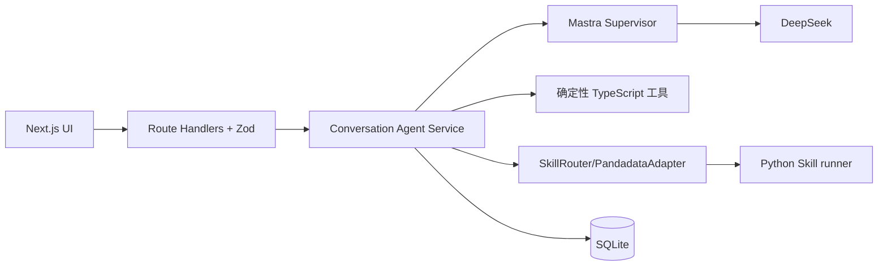
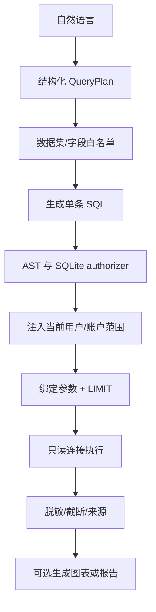
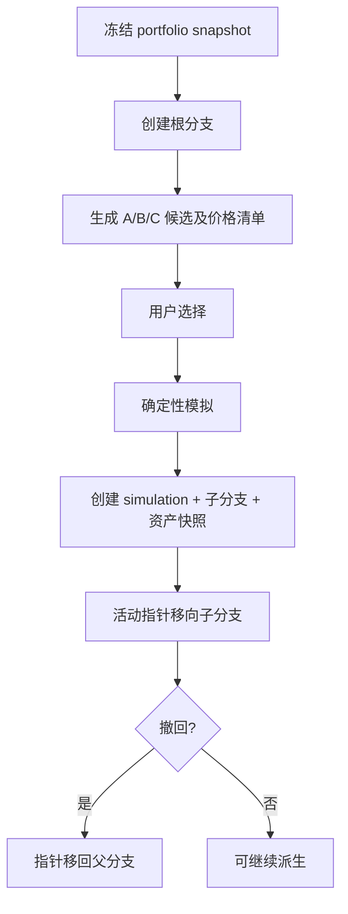

# Money Whisperer 对话 Agent 扩展能力需求与架构设计

> 版本：`2.0`  
> 日期：`2026-07-23`  
> 状态：可进入实现计划  
> 性质：队友对话 Agent 设计的增量规范，不是第二套系统

配套文档：

- [扩展 API 设计](./CONVERSATION_AGENT_EXTENSIONS_API.md)
- [扩展数据库设计](./CONVERSATION_AGENT_EXTENSIONS_DATABASE.md)
- [队友模块设计](./docs/superpowers/specs/2026-07-23-conversation-agent-module-design.md)
- [队友 API 设计](./docs/superpowers/specs/2026-07-23-conversation-agent-api-design.md)
- [队友数据库设计](./docs/superpowers/specs/2026-07-23-conversation-agent-database-design.md)
- [完整产品蓝图](./docs/superpowers/specs/2026-07-23-agent-financial-advisor-design.md)

## 1. 文档定位与事实来源

本文只设计队友文档尚未细化的智能查数、图表/报告、Git 式分支模拟、静态资产分析、文件、自选提醒、信息搜索和 RSS。发生冲突时按以下优先级解释：

1. 队友的模块、API、数据库三份 MVP 文档是当前可执行技术规范。
2. 完整产品蓝图决定产品能力、导航和 P0/P1/P2 方向。
3. 本文及两份扩展文档只增加缺失契约，不重定义公共协议或已有领域真源。

因此，本扩展明确不另建身份、用户画像、真实持仓、通用任务队列、证据板、投资建议或审计系统。

## 2. 范围、优先级与联合分工

| 优先级 | 能力 | 本扩展负责 | 复用队友能力 |
| --- | --- | --- | --- |
| P0 | 智能查数 | NL2SQL 计划、安全执行、查询结果、来源 | 会话、`agent_runs`、`tool_calls`、Skill 运行 |
| P0 | 图表与报告 | 输出偏好、后置按钮、ECharts/Markdown 产物 | `messages`、`message_artifacts`、SSE |
| P0 | 分支模拟 | A/B/C、分支树、切换、撤回、模拟资产快照 | `scenarios`、`simulations`、建议与决策日志 |
| P0 | 静态资产分析 | 持仓/指标读模型、刷新、健康/风险分、假趋势 | 真实持仓、组合/持仓/市场快照、诊断 |
| P0 | 文件管理 | 详情、预览、修改、版本和软删除 | 消息产物关联、审计 |
| P0 | 自选与提醒中心 | 自选页、统一通知投影、浮盈提醒扩展 | `instruments`、`watch_conditions/events`、决策日志 |
| P1 | 信息搜索 | Web/MCP/知识库/RSS 检索、引用、证据接入 | Research Agent、Evidence Board |
| P2 | RSS | 源、条目、按需同步 | 信息搜索适配器 |

自选与提醒按完整产品蓝图列为 P0；信息搜索是增强完整度，RSS 是低优先级扩展。若项目排期必须压缩，P0 内先完成智能查数、图表/报告、分支、静态分析和文件闭环，再实现自选提醒页面。

### 2.1 明确排除

- 用户画像、风险测评、投资目标和偏好建档。
- 真实持仓录入、编辑、批次和成本真源。
- 财务诊断中的买卖、止损、止盈结论。
- 投资建议卡、合规门、个股分析、决策日志主流程。
- 真实下单、券商连接、收益承诺和无边界全市场荐股。
- 新的顶层导航、生产级认证、Redis、消息队列或微服务。

## 3. MVP 技术基线

本扩展与队友模块运行在同一应用：

- Next.js App Router Route Handlers，Node.js Runtime，TypeScript。
- Mastra supervisor-style agents、DeepSeek、Zod。
- SQLite 单文件数据库，推荐 Drizzle ORM；单 Node.js 进程。
- 进程内 `Map` 保存活动 `AbortController`、Promise、SSE 订阅和轻量限流状态。
- 业务状态和 SSE 事件持久化到 `agent_runs`、`agent_run_events`。
- 不引入 Redis、外部队列、独立 Worker、第二个分析数据库或微服务。
- 所有外部/模型调用在数据库事务外执行；结果用短事务发布。



长操作并非外部队列任务。创建后仍返回 `202`，但对应一条根 `agent_runs`：

```text
QUEUED -> RUNNING -> SUCCEEDED
                  -> FAILED | BLOCKED
QUEUED/RUNNING -> CANCELLED
RUNNING -- process restart --> INTERRUPTED
```

重启时不自动恢复运行时 scratchpad。用户显式重试会创建新的 run，并用 `retryOf` 关联旧 run；已有数据查询、产物和搜索资源保留原状态与错误摘要。

资产刷新、独立查数和 RSS 同步等没有显式 `conversationId` 的操作，使用每个演示用户预置的内部运维会话承载 `agent_runs.session_id`。该会话沿用 `session_mode='follow_up'`，以 `current_intent='system_operations'` 标识并从普通会话列表排除；它只满足既有 run 的非空外键，不进入用户投资对话上下文。

## 4. 与既有模型的集成边界

### 4.1 统一标识

| 标识 | 真源 | 用途 |
| --- | --- | --- |
| `userId` | `mw_demo_session` 服务端会话 | 所有权；客户端不得提交 |
| `conversationId` | `conversation_sessions.id` | 偏好、查询、搜索、产物上下文 |
| `messageId` | `messages.id` | 后置按钮的目标消息 |
| `accountId` | `accounts.id` | 可选资产范围 |
| `holdingId` | `holdings.id` | 单项持仓、提醒和指标 |
| `portfolioSnapshotId` | `portfolio_snapshots.id` | 分析/模拟不可变输入 |
| `holdingSnapshotId` | `holding_snapshots.id` | 单项不可变输入 |
| `instrumentId` | `instruments.id` | 股票、基金、ETF、指数主数据 |
| `recommendationId` | `recommendations.id` | 建议驱动的分支模拟 |
| `analysisId` | 根 `agent_runs.id` 的 API 别名 | 运行状态、SSE、证据关联 |

不存在独立的 `portfolioId` 或 `positionId`。组合默认是当前用户全部活动账户；筛选使用 `accountIds`。指数可以作为 `instrument` 被分析，但不能作为可交易 `holding`。

### 4.2 必须复用的表

- 运行与外部调用：`agent_runs`、`agent_run_events`、`tool_calls`、`data_sources`、`skill_assets`、`skill_runs`。
- 资产事实：`accounts`、`instruments`、`holdings`、`portfolio_snapshots`、`holding_snapshots`、`market_snapshots`、`market_snapshot_metrics`。
- 对话和产物入口：`conversation_sessions`、`messages`、`message_artifacts`。
- 研究证据：`evidence_items`、`evidence_source_links`。
- 模拟和闭环：`scenarios`、`simulations`、`simulation_metrics`、`simulation_allocations`、`decision_logs`。
- 提醒和治理：`watch_conditions`、`watch_condition_events`、`audit_events`、`idempotency_records`。

本扩展不创建 `async_jobs`、`provider_calls`、第二套 `audit_events`、第二套幂等表或第二套组合快照。

## 5. P0 智能查数

### 5.1 用户体验

典型问题：

- “我的科技持仓占比和近一年最大回撤是多少？”
- “比较沪深 300 与上证 50 最近三年的收益、波动率和估值。”
- “列出基金持仓的浮盈、集中度和数据日期，并画图。”

对话 Agent 识别 `DATA_QUERY` 意图后调用注册工具 `runSafeDataQuery`。模型不能直接连接 SQLite、执行任意 SQL、构造文件路径或调用未登记函数。独立查数接口和对话入口使用同一个 Zod `DataQueryRequest`。

### 5.2 数据集目录

| 数据集 | 来源 | 执行方式 |
| --- | --- | --- |
| `PORTFOLIO_HOLDINGS` | 既有资产/快照表 | 受控 SQLite 只读查询 |
| `PORTFOLIO_METRICS` | 既有快照与派生评分 | 受控 SQLite 只读查询 |
| `STOCK_DAILY` / `STOCK_FACTOR` | PandaData | Skill runner 生成规范 JSON，再装入内存临时表 |
| `INDEX_DAILY` / `INDEX_VALUATION` | PandaData | 同上 |
| `FUND_DAILY` / `FUND_MASTER` | PandaData | 同上 |
| `FINANCIAL_REPORTS` | PandaData | 显式季度和字段白名单 |

SQLite 业务查询只能访问专用语义视图；行情结果只在本次运行的受控内存 SQLite 临时库中参与 JOIN，不永久复制完整原始数据。需要进入证据链的数据写入既有市场快照和来源表。

### 5.3 Pandadata 路由

本扩展完全继承队友最新白名单和调用链：

```text
Data & Research Agent
 -> SkillRouter
 -> pandadata-api references
 -> PandadataAdapter
 -> scripts/call_api.py
 -> panda_data==0.0.12
```

本扩展直接使用的最小方法集：

| 场景 | 方法 |
| --- | --- |
| 交易日 | `get_trade_cal`, `get_prev_trade_date`, `get_last_trade_date` |
| 股票主数据/行情 | `get_stock_detail`, `get_stock_daily`, `get_stock_daily_pre`, `get_stock_daily_post`, `get_adj_factor` |
| 因子 | `get_factor` |
| 指数 | `get_index_daily`, `get_index_indicator` |
| 基金/ETF | `get_fund_detail`, `get_fund_daily`, `get_fund_daily_pre`, `get_fund_daily_post` |
| 财务报告 | `get_fina_reports` |

每次调用前必须读取本地 Skill reference 并检查 SDK 导出；不得猜测参数、字段、代码格式或认证。复权收益优先使用已核验的前/后复权日线；Fixture 必须直接提供同契约的复权收盘价并标记 `LOCAL_FIXTURE`。

### 5.4 SQL 安全管线



强制规则：

- 仅允许一条 `SELECT` 或以 `SELECT` 结束的 `WITH`；拒绝多语句、注释绕过、PRAGMA、ATTACH、DDL、DML 和虚拟表创建。
- 表、视图、列、聚合、窗口函数和自定义函数全部采用服务端白名单。
- 使用 SQLite authorizer 拒绝写操作、系统元数据、扩展加载、文件和网络能力。
- 字面量转绑定参数；标识符不能来自自由文本。
- `userId` 只从签名 Cookie 获取；服务端强制加入用户和可选 `accountIds` 范围。
- 执行采用专用只读连接/事务、10 秒中止计时器；默认 2,000 行，最大 10,000 行，结果最大 5 MiB。
- 结果返回脱敏 SQL、参数类型而非敏感参数值；内部表名不得暴露给普通用户。
- 相同 `Idempotency-Key` 的创建请求复用既有 `idempotency_records`。

### 5.5 输出模式

| API 值 | 行为 |
| --- | --- |
| `SQL_ONLY` | 返回查询计划、表格和来源，不生成文件 |
| `CHART` | 查询成功后生成受控 ECharts Option |
| `FINANCIAL_REPORT` | 查询成功后生成 Markdown 报告 |

解析优先级：单次 `outputMode` > 会话输出偏好 > `SQL_ONLY`。对话消息发送 DTO 增加可选 `outputMode`；消息下方按钮可在回复完成后用目标 `messageId` 再生成，不重发用户问题。

## 6. P0 图表、报告与文件

### 6.1 触发入口

1. 对话前在会话中设置默认输出模式。
2. 发消息或查数时用单次 `outputMode` 覆盖。
3. 对话后点击消息下方“生成图表/生成报告”。
4. 对既有 `dataQueryId` 生成产物，不重复查询；结果过期时要求显式重跑。

生成时冻结 `source_message_id`、`source_query_id`、消息可见正文/上下文摘要、内容哈希、数据日期和算法/模型版本。后续消息新增、redaction 或会话摘要更新均不改变本次生成输入。

### 6.2 产物边界

- 类型：`ECHARTS_OPTION`、`MARKDOWN`；预留 `CSV`，但不作为本期生成目标。
- 小型内容存 SQLite；不把用户产物写入仓库或任意本地路径。未来迁对象存储时数据库仅保存 object key 和摘要。
- ECharts 只允许 `line/bar/pie/scatter/radar/treemap` 和纯 JSON；禁止函数字符串、外链脚本、自定义 HTML。
- Markdown 禁用原始 HTML，链接只允许 `https/http`；净化后的 HTML只在响应时生成，不作为事实正文。
- 编辑使用 `If-Match` 乐观锁，成功产生不可变新版本；冲突返回 `412 VERSION_CONFLICT`。
- 删除是软删除；已被消息引用的产物显示“已删除”，不把历史消息外键变成孤儿。
- `message_artifacts` 增加 `generated_artifact` 类型和显式 `generated_artifact_id` FK，仍保持“恰好一个目标 FK”。

## 7. P0 Git 式分支模拟

### 7.1 与既有模拟的关系

队友的 `scenarios/simulations/metrics/allocations` 表示一次确定性方案计算。本扩展在其上增加“模拟工作区、分支、候选和资产快照”：

- 工作区根节点引用一个不可变 `portfolioSnapshotId`，可选引用 `recommendationId` 和 `conversationId`。
- 每个被执行的 A/B/C 选项创建一个新的既有 `simulation`，再挂到新分支。
- AI 只生成结构化候选和解释；确定性工具负责现金、数量、费用、估值和指标。
- 模拟数据永不更新 `holdings`、`holding_lots` 或真实组合快照。
- 用户最终采纳/拒绝继续调用队友决策接口并写 `decision_logs`；需要时创建 `watch_conditions`。

### 7.2 固定参数 v1

| 参数 | 默认值 |
| --- | --- |
| `engineVersion` | `branch-simulation-v1` |
| `commissionRate` | `0.0003` |
| `minimumCommission` | `5.00` |
| `slippageRate` | `0.001` |
| `defaultHorizonDays` | `30` |
| `allowShort` / `allowLeverage` | `false` |

固定参数只用于演示，必须随每个候选批次返回。候选批次保存不可变 `priceManifest`、`dataAsOf` 和 SHA-256；分支执行必须使用该清单，不能偷换为执行时最新价。

### 7.3 流程与撤回



撤回不删除分支、事件、既有 `simulation` 或快照，只移动活动指针并追加 `UNDO` 事件。切换到任意历史分支也只移动指针。并发切换使用工作区 `row_version`；失败返回 `412` 并要求重读树。

## 8. P0 静态资产分析

静态分析是已有资产事实的只读投影，不生成买卖、止损或止盈建议。

### 8.1 接口输出

- 持仓视图：账户、标的、数量、成本、市场价、市值、权重、浮盈、回撤、数据日期和质量。
- 指标视图：组合收益、最大回撤、波动率、集中度、流动性、数据完整度、健康分和风险分。
- 刷新：创建 `PORTFOLIO_REFRESH` 根 run，成功后生成新的 `portfolio_snapshots`、`holding_snapshots` 和必要市场快照；客户端重新拉取持仓与指标两个接口。
- 趋势：确定性的假数据，固定 `source=MOCK`、`modelVersion=mock-trend-v1`，禁止进入建议证据或触发真实提醒。

### 8.2 指标口径

- 资金、价格和数量使用十进制库，不用 JavaScript `number` 计算。
- 回撤：`current / rollingPeak - 1`，同时返回窗口和峰值日期。
- 波动率：复权日收益样本标准差乘 `sqrt(252)`；不足 20 个有效交易日返回 `null`。
- 集中度：最大单项权重、行业最大权重和 HHI。
- 流动性：首期使用成交额覆盖天数和缺失惩罚的确定性规则。
- 健康/风险分：`0..100` 整数，必须保存 `scoreVersion`、分项和缺失项；只表达组合结构与数据质量，不表达买卖方向。
- 股票和场内基金收益/回撤使用经 Skill 契约核验的复权序列；无可靠复权数据时标记 `PARTIAL`。

## 9. P0 自选与提醒中心

### 9.1 自选

每个自选项至少保存：标的、关注理由、计划期限、可选目标、添加来源和创建时间。列表聚合展示估值状态、风险变化、与当前组合关联、最新 Agent 结论及相关提醒；这些聚合值来自既有快照/建议，不复制为自选真源。

自选页可发起分析，但不能绕过“候选只来自持仓、自选和演示池”的荐股范围。

### 9.2 提醒

复用 `watch_conditions` 和 `watch_condition_events`。扩展：

- 新增 `UNREALIZED_GAIN_REACH`，比例 `0 < threshold <= 10`；`0.20` 表示浮盈 20%。
- 回撤规则必须保存 `windowDays` 或 `FROM_RECENT_HIGH`、峰值和峰值日期。
- 严重度沿用 `INFORMATION/ATTENTION/IMPORTANT/URGENT` 四级映射。
- 触发采用阈值穿越而非每次高于/低于阈值；冷却期内相似事件合并。
- 每个事件保留实际值、阈值、窗口/峰值、市场或持仓快照和触发时间。
- MVP 只有站内通知；支持查看分析、进入模拟、忽略、确认已读。
- 提醒偏好支持 `IMPORTANT_ONLY/DAILY_DIGEST/MUTED`。

没有后台定时器。评估发生在打开首页/资产/自选/顾问页、成功刷新资产、发送相关对话或点击“重新检查”。假趋势和过期数据不得触发。忽略/确认可通过队友决策闭环写入决策日志。

## 10. P1 信息搜索

信息搜索连接 Web、MCP、知识库和已启用 RSS：

- 每次搜索保存查询、适配器、时间、状态、来源和引用。
- 外部正文是不可信输入；不得执行其中的工具指令、提示词、HTML、脚本或 URL 参数。
- Web/RSS URL 防 SSRF：只允许 `http/https`，解析并阻止 loopback、私网、link-local、metadata IP；重定向后再次校验。
- 结果只保存标题、摘要、规范 URL、发布时间、内容哈希和必要短摘录，不复制整篇版权内容。
- 允许部分成功；每个失败来源返回稳定代码。
- 搜索由某次分析发起时，结果经 Research Agent 校验后写入 `evidence_items`，引用通过 `evidence_source_links` 关联 `tool_call/data_source/source_locator`；检索结果本身不能直接成为买卖结论。

## 11. P2 RSS

- 读取已启用源、分页查看条目、按关键词/标的检索。
- 管理操作只对本地演示管理员门禁开放，不新增生产角色系统。
- 同步是进程内 run；支持 ETag/Last-Modified、条件请求、超时、响应大小限制、XML 实体禁用和 URL 安全校验。
- 条目按 `(feedId, guid)` 优先去重，无 guid 时用规范 URL + 内容哈希。
- RSS 可作为信息搜索来源，但必须标记来源类型和数据时间。

## 12. 导航与入口

不新增导航表或后端导航 API，保持队友五项主导航：

| 入口 | 扩展能力 |
| --- | --- |
| 首页 | 重要提醒摘要、资产健康摘要 |
| 资产 | 静态持仓/指标、刷新、分支模拟入口 |
| 顾问 | 智能查数、输出模式开关、消息后图表/报告按钮 |
| 自选 | 自选管理、风险/估值/Agent 结论、发起分析 |
| 我的 | 提醒偏好、通知、生成文件和 RSS 子页 |

建议详情页继续承载 recommendation 驱动的模拟、决策和观察条件；文件可从消息卡片或“我的/生成内容”进入。

## 13. 可观测、安全与降级

### 13.1 技术可观测

- 每个响应有 `requestId`；每个长操作关联根 `agentRunId`，外部调用关联 `toolCallId/skillRunId/dataSourceId`。
- 监控活动 run 数、运行时长、取消/中断率、SSE 连接与重连、SQLite busy/事务耗时、查询拒绝/超时/截断、Skill 契约错误、模型和上游延迟。
- 复用 `/api/v1/system/health`，新增组件状态但不返回密钥、用户名、数据库路径或上游原始错误。
- 审计复用 `audit_events`；不记录 Cookie、CSRF、密码、Token、完整模型提示、完整 SQL 参数、完整消息或产物正文。

### 13.2 降级

| 故障 | 行为 |
| --- | --- |
| PandaData 认证/不可用 | 返回既有错误码；缓存/Fixture 必须显式标记，无法满足新鲜度则停止分析 |
| Skill 契约不匹配 | 停止调用，不猜方法或字段 |
| DeepSeek 不可用 | 已有查询结果仍可返回，不生成 AI 报告/候选 |
| SQLite busy | 最多退避重试 3 次，仍失败返回 `503 DATABASE_BUSY` |
| 进程重启 | 活动 run 标记 `INTERRUPTED`，用户显式重试 |
| 搜索部分来源失败 | 返回部分成功与逐来源错误，不伪造引用 |

## 14. 环境变量与 Doppler

本扩展不需要 PostgreSQL、分析数据库或 Java 服务微服务变量。与当前 DeepSeek 配置并列的可选 PandaData Skill runtime 字段为：

- `DEFAULT_USERNAME`
- `DEFAULT_PASSWORD`
- `JAVA_SERVICE_BASE_URL`
- `PANDADATA_PYTHON`（非敏感，可选解释器路径）

这些字段只从进程环境读取，不写 SQLite、日志、SSE、模型上下文或非 example `.env`。本地和容器均应使用 Doppler/平台 Secret 注入；不得创建真实 `.env`。

### 14.1 Doppler 录入指引

#### 1. 访问链接

- 请点击打开 Doppler 控制台：[Doppler Dashboard](https://dashboard.doppler.com/)

#### 2. 配置详情

| 推荐字段名 (Key) | 建议值/说明 (Value Description) | 适用环境 (Target Config) |
| :--- | :--- | :--- |
| `DEFAULT_USERNAME` | PandaData 开发账号用户名 | `Development -> dev_personal` |
| `DEFAULT_PASSWORD` | PandaData 开发账号密码 | `Development -> dev_personal` |
| `JAVA_SERVICE_BASE_URL` | 开发环境 PandaAIQuant Data Service 基础地址 | `Development -> dev_personal` |
| `PANDADATA_PYTHON` | 可选 Python 3.10+ 解释器路径；使用默认解释器时可不配置 | `Development -> dev_personal` |
| `DEFAULT_USERNAME` | PandaData 生产账号用户名 | `Production -> prd` |
| `DEFAULT_PASSWORD` | PandaData 生产账号密码 | `Production -> prd` |
| `JAVA_SERVICE_BASE_URL` | 生产环境 PandaAIQuant Data Service 基础地址 | `Production -> prd` |
| `PANDADATA_PYTHON` | 可选生产 Python 3.10+ 解释器路径 | `Production -> prd` |

#### 3. 绝对防护警告（防污染）

在 **Production (`prd`)** 环境中保存变量时，Doppler 可能会弹窗提示：

> "Please Confirm: Do you want to sync these secrets to other environments?"

请绝对不要勾选 Development 或 Staging，保持所有框为空，直接点击确认，确保生产凭证不会污染本地开发环境。

#### 4. 骨架文件已更新

根目录 `.env.example` 与 `.env.prod.example` 已同步增加以上字段，且只包含不可用占位值。不要创建真实 `.env`；本地启动使用 `doppler run -- pnpm dev`，未来 Docker Compose 使用 `doppler run -- docker compose up -d` 并仅通过 `${KEY}` 传递宿主进程变量。

## 15. 联合端到端验收

1. 未建档用户仍由队友流程追问；完成画像后可在同一顾问会话发起智能查数。
2. 对话消息传 `CHART` 时查询完成并生成消息产物；未传时使用会话偏好；二者都未设置时只返回 SQL/表格。
3. 消息回复后点击“生成报告”，产物固定使用点击时消息/查询快照，后续会话变化不影响内容。
4. 用户从建议或资产快照生成 A/B/C，选择不同选项形成并列分支；切换/撤回不修改真实持仓或删除历史。
5. 用户对活动分支执行模拟采纳，队友 `decision_logs` 和观察条件完整记录闭环。
6. 静态分析同时返回股票/基金持仓表和指标表；刷新成功后两个视图指向同一新 `portfolioSnapshotId`。
7. 趋势数据始终显示 `MOCK/mock-trend-v1`，不能进入 Evidence Board 或触发提醒。
8. 自选项展示理由、期限、目标、组合关联和 Agent 结论；可从自选发起队友分析流程。
9. 回撤/浮盈仅在阈值穿越时触发一条站内通知，事件保存指标快照；用户可查看分析、模拟或忽略。
10. Web/MCP/知识库/RSS 结果带引用进入 Evidence Board，恶意外部指令不会触发工具调用。
11. PandaData 每次真实调用都能关联 `data_sources`、`skill_assets`、`skill_runs` 和 `tool_calls`；未导出方法不会被执行。
12. 进程重启把活动操作标为 `INTERRUPTED`，SSE 已持久化事件仍能重放，显式重试不会产生重复副作用。

完成以上场景后，队友四份文档与本扩展三份文档共同覆盖总需求，且没有第二套身份、资产、任务、模拟、提醒或审计真源。
