# Money Whisperer 对话 Agent MVP 数据库设计

## 1. 文档目的

本文定义 Money Whisperer 对话 Agent MVP 的持久化数据模型，覆盖：

- 初始用户建档、情景式风险评估、投资目标与偏好。
- 账户、标的、持仓、买入批次和历史持仓快照。
- 对话会话、消息、主动追问和结构化卡片。
- Agent 运行、子 Agent 委派、工具调用和可审计证据。
- 财务健康诊断、个股/ETF/指数分析和组合风险发现。
- 买入、持有、减仓、退出建议及其理由、风险、条件和替代方案。
- 情景分析、模拟采纳、用户决策和后续观察条件。
- 市场快照、PE、MACD、财务指标、事件消息和数据来源。

本设计服务于本地比赛演示，不连接真实交易，不保存券商密码，不执行真实下单。

配套文档：

- `2026-07-23-conversation-agent-module-design.md`：领域边界、Agent 状态机和业务流程。
- `2026-07-23-conversation-agent-api-design.md`：后端接口、SSE 事件、错误码和 wire enum。

## 2. 技术边界

### 2.1 MVP 运行方式

- 持久化数据库：本地 SQLite 单文件。
- 业务语言：TypeScript。
- 数据访问：推荐 Drizzle ORM，但本文使用通用关系模型描述，不依赖具体 ORM。
- 活动状态：当前 Agent scratchpad、流式 token、临时工具结果保存在进程内 `Map`。
- 持久状态：用户输入、消息、Agent 可观察行为、工具调用摘要、证据、建议和决策写入 SQLite。
- 并发模型：单 Node.js 进程、单写者；不引入 Redis、任务队列或分布式锁。
- 后续迁移目标：PostgreSQL。

### 2.2 非目标

- 不持久化模型隐藏推理或 chain-of-thought。
- 不保存真实交易凭证、银行卡密码或券商 Token。
- 不建立高频行情仓库。
- 不把完整 Pandadata 原始数据永久复制到业务库。
- 不使用数据库触发器实现复杂金融逻辑；计算由确定性 TypeScript/Python 工具完成。

## 3. 总体设计原则

1. **当前事实与历史快照分离**：`holdings` 表示当前录入状态，`portfolio_snapshots` 与 `holding_snapshots` 固化某次分析使用的事实。
2. **建议必须可重放**：每条建议绑定用户画像、风险评估、持仓快照、市场数据、Agent run 和证据。
3. **建议不可覆盖**：建议发布后不可原地改写；新结论通过 `supersedes_recommendation_id` 形成版本链。
4. **核心字段关系化**：金额、仓位、价格区间、状态、风险等级和条件使用明确列，不藏在 JSON。
5. **JSON 仅用于扩展边界**：工具参数、原始供应商响应、图表序列和低频扩展配置可以使用 JSON。
6. **金融计算不依赖 SQLite 浮点精度**：货币使用最小货币单位整数；价格和数量使用规范十进制字符串，由 decimal 库计算。
7. **事件记录追加写入**：消息、快照、Agent run、tool call、证据、决策和观察触发记录原则上不可修改。
8. **演示可恢复**：服务重启后可以恢复会话历史和已发布建议；仅运行中的临时 scratchpad 会丢失并标记为中断。

## 4. SQLite 基础约定

启动连接后必须执行：

```sql
PRAGMA foreign_keys = ON;
PRAGMA journal_mode = WAL;
PRAGMA synchronous = NORMAL;
PRAGMA busy_timeout = 5000;
```

### 4.1 主键

- 所有业务表使用 `id TEXT PRIMARY KEY`。
- ID 由应用生成，推荐 UUIDv7；不得依赖 SQLite 自增 `rowid`。
- 迁移 PostgreSQL 后映射为原生 `uuid`。

### 4.2 时间

- SQLite 类型：`TEXT`。
- 格式：UTC RFC 3339，例如 `2026-07-23T08:30:15.123Z`。
- 时间由应用写入，不依赖 SQLite `CURRENT_TIMESTAMP`。
- 业务日期单独使用 `DATE_TEXT`，格式为 `YYYY-MM-DD`。

### 4.3 金额、价格、数量和比例

| 语义 | SQLite 存储 | 示例 | PostgreSQL 目标类型 |
|---|---|---|---|
| 货币金额 | `INTEGER` 最小货币单位 | CNY 123.45 存 `12345` | `BIGINT` 或 `NUMERIC(20,2)` |
| 证券价格 | `TEXT` 规范十进制 | `"46.2800"` | `NUMERIC(24,8)` |
| 持仓数量 | `TEXT` 规范十进制 | `"1000"`、`"12.3456"` | `NUMERIC(28,10)` |
| 百分比/仓位 | `INTEGER` 基点 bps | 12.50% 存 `1250` | `INTEGER` |
| 概率/置信度 | `INTEGER` 基点 bps | 68.00% 存 `6800` | `INTEGER` |
| 近似分析指标 | `TEXT` 十进制或 `REAL` | Sharpe、MACD | `NUMERIC` 或 `DOUBLE PRECISION` |

所有十进制字符串必须满足：

```text
^-?[0-9]+(\.[0-9]+)?$
```

应用层使用 `decimal.js`、`big.js` 或同类库，禁止用 JavaScript `number` 直接计算资金、成本和交易数量。

### 4.4 布尔值

- SQLite 使用 `INTEGER NOT NULL CHECK (value IN (0, 1))`。
- PostgreSQL 迁移为 `BOOLEAN`。

### 4.5 标准审计列

可变业务实体默认包含：

| 字段 | 类型 | 必填 | 说明 |
|---|---|---:|---|
| `id` | TEXT | 是 | UUIDv7 |
| `created_at` | TEXT | 是 | 创建时间 |
| `updated_at` | TEXT | 是 | 最后更新时间 |
| `deleted_at` | TEXT | 否 | 软删除时间 |
| `row_version` | INTEGER | 是 | 乐观锁版本，默认 1 |

追加写入实体包含 `id`、`created_at`，通常不包含 `updated_at` 和 `deleted_at`。用户执行彻底删除时，追加实体通过用户根记录物理级联删除。

## 5. 核心枚举

SQLite 使用 `TEXT + CHECK`；应用层使用同名 TypeScript union。除迁移外，不允许直接写未登记值。

| 枚举 | 值 |
|---|---|
| `risk_profile` | `conservative`, `balanced`, `aggressive` |
| `risk_capacity` | `low`, `medium`, `high` |
| `horizon_bucket` | `short`, `medium`, `long` |
| `goal_status` | `draft`, `active`, `paused`, `completed`, `cancelled` |
| `preference_scope` | `stock`, `sector`, `index`, `etf`, `fund`, `gold`, `cash`, `other` |
| `account_type` | `cash`, `brokerage`, `fund`, `gold`, `manual`, `demo` |
| `instrument_type` | `stock`, `etf`, `index`, `fund`, `gold`, `cash`, `bond`, `future`, `option`, `other` |
| `instrument_subtype` | `common_stock`, `broad_index_etf`, `sector_etf`, `gold_etf`, `index_fund`, `mutual_fund`, `other` |
| `market` | `cn`, `hk`, `us`, `global`, `other` |
| `session_status` | `active`, `waiting_user`, `completed`, `archived`, `error` |
| `session_mode` | `onboarding`, `advisory`, `diagnosis`, `follow_up` |
| `message_role` | `user`, `assistant`, `system` |
| `message_type` | `text`, `question`, `card`, `event`, `error` |
| `run_status` | `queued`, `running`, `waiting_user`, `succeeded`, `blocked`, `failed`, `cancelled`, `interrupted` |
| `tool_status` | `queued`, `running`, `succeeded`, `failed`, `timeout`, `cancelled` |
| `information_status` | `open`, `answered`, `waived`, `expired` |
| `evidence_kind` | `user_input`, `market_fact`, `fundamental_fact`, `technical_fact`, `event_fact`, `calculation`, `model_inference`, `rule_hit`, `missing_data` |
| `evidence_stance` | `support`, `counter`, `neutral`, `missing` |
| `evidence_quality` | `high`, `medium`, `low`, `unknown` |
| `diagnostic_status` | `queued`, `running`, `succeeded`, `partial`, `failed` |
| `finding_severity` | `info`, `attention`, `high`, `critical` |
| `recommendation_action` | `observe`, `trial_buy`, `scale_in`, `hold`, `stop_adding`, `scale_out`, `exit`, `risk_notice` |
| `recommendation_status` | `draft`, `pending_review`, `published`, `degraded`, `blocked`, `expired`, `superseded` |
| `suitability_level` | `high`, `medium`, `low`, `unsuitable` |
| `confidence_level` | `high`, `medium`, `low`, `insufficient` |
| `reason_kind` | `support`, `counter` |
| `risk_category` | `market`, `valuation`, `fundamental`, `technical`, `event`, `liquidity`, `concentration`, `goal_mismatch`, `data_quality`, `behavioral`, `compliance` |
| `condition_type` | `entry`, `add_position`, `stop_loss`, `take_profit`, `invalidation`, `review` |
| `condition_operator` | `lt`, `lte`, `gt`, `gte`, `between`, `cross_above`, `cross_below`, `equals`, `event_occurs`, `manual_review` |
| `scenario_type` | `base`, `bull`, `bear`, `event`, `adopt`, `no_action`, `alternative` |
| `simulation_status` | `queued`, `running`, `succeeded`, `partial`, `failed` |
| `decision_type` | `accepted`, `rejected`, `deferred`, `asked_follow_up`, `simulated` |
| `watch_type` | `price`, `drawdown`, `valuation`, `technical`, `fundamental`, `event`, `portfolio`, `time` |
| `watch_status` | `active`, `triggered`, `paused`, `expired`, `cancelled` |
| `source_type` | `user_input`, `pandadata`, `quant_skill`, `local_fixture`, `derived_engine`, `model`, `system` |

## 6. ER 图

```mermaid
erDiagram
    USERS ||--|| USER_PROFILES : has
    USERS ||--o{ RISK_ASSESSMENTS : completes
    RISK_ASSESSMENTS ||--o{ RISK_ASSESSMENT_ANSWERS : contains
    USERS ||--o{ USER_GOALS : owns
    USERS ||--o{ INVESTMENT_PREFERENCES : defines
    USER_GOALS ||--o{ INVESTMENT_PREFERENCES : may_scope

    USERS ||--o{ ACCOUNTS : owns
    ACCOUNTS ||--o{ HOLDINGS : contains
    INSTRUMENTS ||--o{ HOLDINGS : identifies
    INSTRUMENTS ||--o{ INSTRUMENT_ALIASES : has
    HOLDINGS ||--o{ HOLDING_LOTS : composed_of
    USERS ||--o{ HOLDING_PARSE_DRAFTS : prepares
    USER_GOALS ||--o{ HOLDINGS : may_link
    USERS ||--o{ PORTFOLIO_SNAPSHOTS : captures
    PORTFOLIO_SNAPSHOTS ||--o{ HOLDING_SNAPSHOTS : contains
    HOLDINGS ||--o{ HOLDING_SNAPSHOTS : freezes
    INSTRUMENTS ||--o{ HOLDING_SNAPSHOTS : values

    DATA_SOURCES ||--o{ MARKET_SNAPSHOTS : provides
    INSTRUMENTS ||--o{ MARKET_SNAPSHOTS : observed_in
    MARKET_SNAPSHOTS ||--o{ MARKET_SNAPSHOT_METRICS : contains
    DATA_SOURCES ||--o{ MARKET_EVENTS : publishes
    MARKET_EVENTS ||--o{ MARKET_EVENT_INSTRUMENTS : affects
    INSTRUMENTS ||--o{ MARKET_EVENT_INSTRUMENTS : affected_by

    USERS ||--o{ CONVERSATION_SESSIONS : starts
    CONVERSATION_SESSIONS ||--o{ MESSAGES : contains
    MESSAGES ||--o{ INFORMATION_REQUESTS : asks
    CONVERSATION_SESSIONS ||--o{ INFORMATION_REQUESTS : tracks
    MESSAGES ||--o{ MESSAGE_ARTIFACTS : renders

    CONVERSATION_SESSIONS ||--o{ AGENT_RUNS : executes
    MESSAGES ||--o{ AGENT_RUNS : triggers
    AGENT_RUNS ||--o{ AGENT_RUNS : delegates
    AGENT_RUNS ||--o{ TOOL_CALLS : invokes
    AGENT_RUNS ||--o{ AGENT_RUN_EVENTS : emits
    DATA_SOURCES ||--o{ TOOL_CALLS : accesses
    AGENT_RUNS ||--o{ EVIDENCE_ITEMS : produces
    EVIDENCE_ITEMS ||--o{ EVIDENCE_SOURCE_LINKS : cites

    USERS ||--o{ DIAGNOSTIC_RUNS : receives
    PORTFOLIO_SNAPSHOTS ||--o{ DIAGNOSTIC_RUNS : analyzed_by
    AGENT_RUNS ||--o{ DIAGNOSTIC_RUNS : drives
    DIAGNOSTIC_RUNS ||--o{ DIAGNOSTIC_FINDINGS : produces
    HOLDING_SNAPSHOTS ||--o{ DIAGNOSTIC_FINDINGS : may_target

    USERS ||--o{ RECOMMENDATIONS : receives
    AGENT_RUNS ||--o{ RECOMMENDATIONS : generates
    PORTFOLIO_SNAPSHOTS ||--o{ RECOMMENDATIONS : based_on
    INSTRUMENTS ||--o{ RECOMMENDATIONS : may_target
    RECOMMENDATIONS ||--o{ RECOMMENDATION_REASONS : explains
    EVIDENCE_ITEMS ||--o{ RECOMMENDATION_REASONS : supports
    RECOMMENDATIONS ||--o{ RECOMMENDATION_RISKS : warns
    RECOMMENDATIONS ||--o{ RECOMMENDATION_CONDITIONS : gates
    RECOMMENDATIONS ||--o{ RECOMMENDATION_ALTERNATIVES : offers
    RECOMMENDATIONS ||--o{ RECOMMENDATIONS : supersedes

    RECOMMENDATIONS ||--o{ SCENARIOS : compares
    SCENARIOS ||--o{ SIMULATIONS : runs
    SIMULATIONS ||--o{ SIMULATION_METRICS : measures
    SIMULATIONS ||--o{ SIMULATION_ALLOCATIONS : reallocates
    INSTRUMENTS ||--o{ SIMULATION_ALLOCATIONS : includes

    USERS ||--o{ DECISION_LOGS : decides
    RECOMMENDATIONS ||--o{ DECISION_LOGS : receives
    SIMULATIONS ||--o{ DECISION_LOGS : informs
    USERS ||--o{ WATCH_CONDITIONS : owns
    RECOMMENDATIONS ||--o{ WATCH_CONDITIONS : creates
    RECOMMENDATION_CONDITIONS ||--o{ WATCH_CONDITIONS : activates
    WATCH_CONDITIONS ||--o{ WATCH_CONDITION_EVENTS : triggers
    AGENT_RUNS ||--o{ WATCH_CONDITION_EVENTS : evaluates

    USERS ||--o{ AUDIT_EVENTS : scopes
    USERS ||--o{ DEMO_RESET_RUNS : requests
```



`MESSAGE_ARTIFACTS` 和 `EVIDENCE_SOURCE_LINKS` 使用“多个显式可空 FK + 恰好一个目标”的约束连接不同实体，避免无法校验的通用 `entity_type/entity_id` 多态外键。

## 7. 用户与画像域

### 7.1 `users`

用户根实体，也是用户数据物理删除的级联根。

| 字段 | 类型 | 必填 | 约束/说明 |
|---|---|---:|---|
| 标准审计列 | 见 4.5 | 是 | 可软删除 |
| `display_name` | TEXT | 是 | 1 至 80 字符 |
| `locale` | TEXT | 是 | 默认 `zh-CN` |
| `timezone` | TEXT | 是 | 默认 `Asia/Shanghai` |
| `base_currency` | TEXT | 是 | ISO 4217，MVP 默认 `CNY` |
| `is_demo` | INTEGER | 是 | 布尔值，默认 1 |
| `demo_seed_key` | TEXT | 否 | 演示用户稳定标识 |
| `consent_version` | TEXT | 否 | 已接受的数据使用说明版本 |
| `consented_at` | TEXT | 否 | 接受时间 |

约束与索引：

- 唯一：`demo_seed_key`，允许空值。
- 索引：`(is_demo, deleted_at)`。
- 物理删除用户时，级联删除其画像、会话、持仓、建议和审计数据。

### 7.2 `user_profiles`

保存当前财务事实，不保存风险评估历史结论；当前风险结论从 `risk_assessments.is_current = 1` 获取。

| 字段 | 类型 | 必填 | 约束/说明 |
|---|---|---:|---|
| 标准审计列 | 见 4.5 | 是 |  |
| `user_id` | TEXT | 是 | FK `users.id`，`ON DELETE CASCADE` |
| `employment_status` | TEXT | 否 | `employed`, `self_employed`, `student`, `retired`, `other` |
| `income_stability` | TEXT | 否 | `stable`, `variable`, `uncertain` |
| `monthly_income_minor` | INTEGER | 否 | `>= 0` |
| `monthly_expense_minor` | INTEGER | 否 | `>= 0` |
| `liquid_assets_minor` | INTEGER | 否 | `>= 0` |
| `liabilities_minor` | INTEGER | 否 | `>= 0` |
| `emergency_fund_minor` | INTEGER | 否 | `>= 0` |
| `monthly_investable_minor` | INTEGER | 否 | `>= 0` |
| `near_term_cash_need_minor` | INTEGER | 否 | 未来一年预计使用资金 |
| `near_term_cash_need_date` | DATE_TEXT | 否 |  |
| `investment_experience_years` | INTEGER | 否 | `0..80` |
| `trade_frequency` | TEXT | 否 | `rare`, `monthly`, `weekly`, `daily` |
| `notes` | TEXT | 否 | 用户补充信息，限制 2000 字符 |

约束与索引：

- 部分唯一：`UNIQUE(user_id) WHERE deleted_at IS NULL`。
- 索引：`(user_id, deleted_at)`。
- 业务规则：`monthly_investable_minor` 不应高于可解释的收入结余；超出时记录风险冲突，而不是静默改值。

### 7.3 `risk_assessments`

每次完整或局部重评生成一条记录，保留当时问卷版本和结果。

| 字段 | 类型 | 必填 | 约束/说明 |
|---|---|---:|---|
| `id` | TEXT | 是 | PK |
| `user_id` | TEXT | 是 | FK `users.id`，`ON DELETE CASCADE` |
| `session_id` | TEXT | 否 | FK `conversation_sessions.id`，`ON DELETE SET NULL` |
| `questionnaire_version` | TEXT | 是 | 例如 `risk-v1` |
| `assessment_type` | TEXT | 是 | `initial`, `periodic`, `event_driven` |
| `subjective_profile` | TEXT | 是 | 枚举 `risk_profile` |
| `objective_capacity` | TEXT | 是 | 枚举 `risk_capacity` |
| `final_profile` | TEXT | 是 | 枚举 `risk_profile` |
| `subjective_score` | INTEGER | 是 | `0..100` |
| `capacity_score` | INTEGER | 是 | `0..100` |
| `max_acceptable_drawdown_bps` | INTEGER | 是 | `0..10000` |
| `max_equity_weight_bps` | INTEGER | 是 | `0..10000` |
| `max_single_position_bps` | INTEGER | 是 | `0..10000` |
| `max_sector_weight_bps` | INTEGER | 是 | `0..10000` |
| `liquidity_need_level` | TEXT | 是 | `low`, `medium`, `high` |
| `conflict_detected` | INTEGER | 是 | 主观偏好与客观能力是否冲突 |
| `conflict_summary` | TEXT | 否 | 冲突解释 |
| `is_current` | INTEGER | 是 | 布尔值 |
| `completed_at` | TEXT | 是 |  |
| `created_at` | TEXT | 是 | 追加写入 |

约束与索引：

- 部分唯一索引：`UNIQUE(user_id) WHERE is_current = 1`。
- 索引：`(user_id, completed_at DESC)`、`session_id`。
- 事务内先将旧记录 `is_current` 设为 0，再插入新记录。

### 7.4 `risk_assessment_answers`

保存用户实际看到的问题和答案快照，避免代码中的题库升级后无法解释旧评分。

| 字段 | 类型 | 必填 | 约束/说明 |
|---|---|---:|---|
| `id` | TEXT | 是 | PK |
| `assessment_id` | TEXT | 是 | FK `risk_assessments.id`，`ON DELETE CASCADE` |
| `question_code` | TEXT | 是 | 稳定问题代码 |
| `question_text_snapshot` | TEXT | 是 | 当时题目文本 |
| `scenario_text_snapshot` | TEXT | 否 | 情景描述 |
| `answer_code` | TEXT | 否 | 结构化选项代码 |
| `answer_text` | TEXT | 是 | 用户答案或选项文本 |
| `normalized_value` | TEXT | 否 | 规范化结果 |
| `score_delta` | INTEGER | 是 | 本题分值，可为负 |
| `dimension` | TEXT | 是 | `preference`, `capacity`, `liquidity`, `behavior` |
| `sequence_no` | INTEGER | 是 | `>= 1` |
| `created_at` | TEXT | 是 |  |

约束与索引：

- 唯一：`(assessment_id, question_code)`。
- 唯一：`(assessment_id, sequence_no)`。
- 索引：`assessment_id`。

### 7.5 `user_goals`

明确区分“想达到的目标金额”和“当前可投入资金”。

| 字段 | 类型 | 必填 | 约束/说明 |
|---|---|---:|---|
| 标准审计列 | 见 4.5 | 是 |  |
| `user_id` | TEXT | 是 | FK `users.id`，`ON DELETE CASCADE` |
| `name` | TEXT | 是 | 例如“3 年积累 30 万” |
| `goal_type` | TEXT | 是 | `wealth_growth`, `house`, `emergency`, `education`, `retirement`, `custom` |
| `target_amount_minor` | INTEGER | 是 | `> 0` |
| `current_reserved_minor` | INTEGER | 是 | 默认 0 |
| `initial_investable_minor` | INTEGER | 是 | 默认 0 |
| `monthly_contribution_minor` | INTEGER | 是 | 默认 0 |
| `currency` | TEXT | 是 | 默认继承用户基础币种 |
| `target_date` | DATE_TEXT | 否 | 与期限至少填写一个 |
| `horizon_bucket` | TEXT | 是 | 枚举 `horizon_bucket` |
| `priority` | INTEGER | 是 | 1 最高，范围 `1..100` |
| `capital_preservation_required` | INTEGER | 是 | 短期刚性目标通常为 1 |
| `status` | TEXT | 是 | 枚举 `goal_status` |
| `notes` | TEXT | 否 |  |

约束与索引：

- 唯一：`(user_id, name) WHERE deleted_at IS NULL`。
- 索引：`(user_id, status, priority)`、`target_date`。
- 检查：目标金额、投入金额和月投入均不得为负。

### 7.6 `investment_preferences`

“个股、板块、指数”属于投资偏好，不作为目标优先级存储。

| 字段 | 类型 | 必填 | 约束/说明 |
|---|---|---:|---|
| 标准审计列 | 见 4.5 | 是 |  |
| `user_id` | TEXT | 是 | FK `users.id`，`ON DELETE CASCADE` |
| `goal_id` | TEXT | 否 | FK `user_goals.id`，`ON DELETE CASCADE` |
| `scope` | TEXT | 是 | 枚举 `preference_scope` |
| `preference_mode` | TEXT | 是 | `prefer`, `allow`, `avoid`, `exclude` |
| `rank` | INTEGER | 是 | `1..100` |
| `label` | TEXT | 否 | 例如“科技板块”“宽基指数” |
| `max_weight_bps` | INTEGER | 否 | 用户主动设置的上限 |
| `reason` | TEXT | 否 | 偏好原因 |

约束与索引：

- 表达式部分唯一：`UNIQUE(user_id, COALESCE(goal_id, ''), scope, COALESCE(label, '')) WHERE deleted_at IS NULL`。
- 索引：`(user_id, preference_mode, rank)`、`goal_id`。

## 8. 资产与持仓域

### 8.1 `accounts`

MVP 支持演示账户和手工录入账户。

| 字段 | 类型 | 必填 | 约束/说明 |
|---|---|---:|---|
| 标准审计列 | 见 4.5 | 是 |  |
| `user_id` | TEXT | 是 | FK `users.id`，`ON DELETE CASCADE` |
| `name` | TEXT | 是 |  |
| `account_type` | TEXT | 是 | 枚举 `account_type` |
| `provider_name` | TEXT | 否 | 演示可为 `Money Whisperer Demo` |
| `currency` | TEXT | 是 | ISO 4217 |
| `cash_balance_minor` | INTEGER | 是 | 默认 0 |
| `source_type` | TEXT | 是 | `manual`, `fixture`, `import` |
| `external_reference` | TEXT | 否 | 不保存密钥 |
| `is_demo` | INTEGER | 是 | 布尔值 |
| `valued_at` | TEXT | 否 | 余额估值时间 |

约束与索引：

- 唯一：`(user_id, name) WHERE deleted_at IS NULL`。
- 索引：`(user_id, account_type, deleted_at)`。

### 8.2 `instruments`

证券、基金、指数、黄金和现金的统一标的主数据。

| 字段 | 类型 | 必填 | 约束/说明 |
|---|---|---:|---|
| 标准审计列 | 见 4.5 | 是 | 全局主数据，通常不物理删除 |
| `symbol` | TEXT | 是 | 例如 `510300.SH` |
| `name` | TEXT | 是 |  |
| `instrument_type` | TEXT | 是 | 枚举 `instrument_type` |
| `instrument_subtype` | TEXT | 否 | 枚举 `instrument_subtype`，用于区分行业 ETF、黄金 ETF、指数基金等 |
| `market` | TEXT | 是 | 枚举 `market` |
| `exchange` | TEXT | 否 | `SSE`, `SZSE`, `HKEX`, `NASDAQ` 等 |
| `currency` | TEXT | 是 |  |
| `sector_code` | TEXT | 否 | 行业代码 |
| `sector_name` | TEXT | 否 |  |
| `benchmark_instrument_id` | TEXT | 否 | 自关联 FK，`ON DELETE SET NULL` |
| `is_tradable` | INTEGER | 是 | 指数通常为 0 |
| `price_scale` | INTEGER | 是 | 默认 4 |
| `quantity_scale` | INTEGER | 是 | 默认 0 |
| `status` | TEXT | 是 | `active`, `suspended`, `delisted`, `unknown` |
| `metadata_json` | TEXT | 否 | 仅存低频扩展属性 |

约束与索引：

- 唯一：`(market, symbol)`。
- 索引：`name`、`(instrument_type, instrument_subtype)`、`(instrument_type, sector_code)`、`benchmark_instrument_id`。
- 应用规则：用户说“买了指数”而 `is_tradable = 0` 时，必须追问实际 ETF/基金，不可直接建持仓。

### 8.3 `instrument_aliases`

用于把口语名称、简称和数据供应商代码解析为唯一标的。

| 字段 | 类型 | 必填 | 约束/说明 |
|---|---|---:|---|
| `id` | TEXT | 是 | PK |
| `instrument_id` | TEXT | 是 | FK `instruments.id`，`ON DELETE CASCADE` |
| `alias` | TEXT | 是 | 规范化为小写、去多余空格 |
| `alias_type` | TEXT | 是 | `common_name`, `provider_symbol`, `pinyin`, `user_defined` |
| `source_id` | TEXT | 否 | FK `data_sources.id`，`ON DELETE SET NULL` |
| `created_at` | TEXT | 是 |  |

约束与索引：

- 唯一：`(alias, alias_type)`。
- 索引：`instrument_id`、`alias`。

### 8.4 `holdings`

当前聚合持仓。市场价格、浮盈和回撤不写入本表，避免过期数据污染当前事实。

| 字段 | 类型 | 必填 | 约束/说明 |
|---|---|---:|---|
| 标准审计列 | 见 4.5 | 是 |  |
| `account_id` | TEXT | 是 | FK `accounts.id`，`ON DELETE CASCADE` |
| `instrument_id` | TEXT | 是 | FK `instruments.id`，`ON DELETE RESTRICT` |
| `goal_id` | TEXT | 否 | FK `user_goals.id`，`ON DELETE SET NULL` |
| `quantity_decimal` | TEXT | 是 | `>= 0` |
| `average_cost_decimal` | TEXT | 是 | `>= 0` |
| `cost_currency` | TEXT | 是 |  |
| `total_cost_minor` | INTEGER | 是 | `>= 0` |
| `investment_purpose` | TEXT | 否 | `core`, `satellite`, `hedge`, `trading`, `unknown` |
| `planned_horizon` | TEXT | 否 | 枚举 `horizon_bucket` |
| `user_note` | TEXT | 否 |  |
| `source_message_id` | TEXT | 否 | FK `messages.id`，`ON DELETE SET NULL` |

约束与索引：

- 部分唯一：`(account_id, instrument_id) WHERE deleted_at IS NULL`。
- 索引：`account_id`、`instrument_id`、`goal_id`。
- 检查：数量为 0 时应软删除或标记清仓，不保留“活动的零持仓”。

### 8.5 `holding_lots`

保存“100 元买入 100 股”等原始买入批次，支持多次买入后的成本追溯。

| 字段 | 类型 | 必填 | 约束/说明 |
|---|---|---:|---|
| 标准审计列 | 见 4.5 | 是 |  |
| `holding_id` | TEXT | 是 | FK `holdings.id`，`ON DELETE CASCADE` |
| `acquired_at` | TEXT | 否 | 用户不知道时允许为空 |
| `quantity_decimal` | TEXT | 是 | `> 0` |
| `unit_cost_decimal` | TEXT | 是 | `>= 0` |
| `fees_minor` | INTEGER | 是 | 默认 0 |
| `currency` | TEXT | 是 |  |
| `entry_method` | TEXT | 是 | `manual`, `conversation`, `fixture`, `import` |
| `source_message_id` | TEXT | 否 | FK `messages.id`，`ON DELETE SET NULL` |
| `note` | TEXT | 否 |  |

约束与索引：

- 索引：`(holding_id, acquired_at)`、`source_message_id`。
- 更新批次时，必须在同一事务内重新计算 `holdings` 聚合数量、平均成本和总成本。

### 8.6 `portfolio_snapshots`

一次诊断、建议或模拟所使用的组合事实头记录。

| 字段 | 类型 | 必填 | 约束/说明 |
|---|---|---:|---|
| `id` | TEXT | 是 | PK |
| `user_id` | TEXT | 是 | FK `users.id`，`ON DELETE CASCADE` |
| `reason` | TEXT | 是 | `diagnosis`, `recommendation`, `simulation`, `manual`, `demo_seed` |
| `as_of` | TEXT | 是 | 快照时点 |
| `base_currency` | TEXT | 是 |  |
| `total_value_minor` | INTEGER | 是 |  |
| `cash_value_minor` | INTEGER | 是 |  |
| `invested_value_minor` | INTEGER | 是 |  |
| `total_cost_minor` | INTEGER | 是 |  |
| `unrealized_pnl_minor` | INTEGER | 是 | 可为负 |
| `unrealized_pnl_bps` | INTEGER | 否 |  |
| `data_quality` | TEXT | 是 | `complete`, `partial`, `stale`, `invalid` |
| `source_agent_run_id` | TEXT | 否 | FK `agent_runs.id`，`ON DELETE SET NULL` |
| `created_at` | TEXT | 是 | 追加写入 |

约束与索引：

- 索引：`(user_id, as_of DESC)`、`source_agent_run_id`。
- 不对同一时点强制唯一，因为诊断与模拟可以使用不同原因生成快照。

### 8.7 `holding_snapshots`

固化每项持仓在组合快照时点的成本、价格、浮盈和回撤。

| 字段 | 类型 | 必填 | 约束/说明 |
|---|---|---:|---|
| `id` | TEXT | 是 | PK |
| `portfolio_snapshot_id` | TEXT | 是 | FK `portfolio_snapshots.id`，`ON DELETE CASCADE` |
| `holding_id` | TEXT | 否 | FK `holdings.id`，`ON DELETE SET NULL` |
| `instrument_id` | TEXT | 是 | FK `instruments.id`，`ON DELETE RESTRICT` |
| `market_snapshot_id` | TEXT | 否 | FK `market_snapshots.id`，`ON DELETE SET NULL` |
| `quantity_decimal` | TEXT | 是 |  |
| `average_cost_decimal` | TEXT | 是 |  |
| `market_price_decimal` | TEXT | 否 | 数据缺失时为空 |
| `market_value_minor` | INTEGER | 否 |  |
| `cost_value_minor` | INTEGER | 是 |  |
| `unrealized_pnl_minor` | INTEGER | 否 |  |
| `unrealized_pnl_bps` | INTEGER | 否 |  |
| `portfolio_weight_bps` | INTEGER | 否 |  |
| `peak_price_decimal` | TEXT | 否 | 明确窗口内高点 |
| `drawdown_bps` | INTEGER | 否 | 当前回撤，通常为负或 0 |
| `max_drawdown_bps` | INTEGER | 否 | 选定窗口最大回撤 |
| `drawdown_window_days` | INTEGER | 否 |  |
| `created_at` | TEXT | 是 |  |

约束与索引：

- 唯一：`(portfolio_snapshot_id, instrument_id)`。
- 索引：`holding_id`、`instrument_id`、`market_snapshot_id`。
- 应用校验：同一组合快照中仓位总和允许因现金和四舍五入小于等于 10000 bps。

### 8.8 `holding_parse_drafts`

保存自然语言持仓解析的待确认结果，使 `parseId` 在刷新或进程重启后仍可用于确认。正式持仓字段仍写入 `holdings`/`holding_lots`，本表只保存短期草稿。

| 字段 | 类型 | 必填 | 约束/说明 |
|---|---|---:|---|
| `id` | TEXT | 是 | PK，对应 API `parseId` |
| `user_id` | TEXT | 是 | FK `users.id`，`ON DELETE CASCADE` |
| `session_id` | TEXT | 否 | FK `conversation_sessions.id`，`ON DELETE SET NULL` |
| `source_text` | TEXT | 是 | 用户原始输入，最多 2000 字符 |
| `status` | TEXT | 是 | `pending_confirmation`, `confirmed`, `rejected`, `expired` |
| `candidates_json` | TEXT | 是 | 经 Zod 校验的候选标的、数量、成本和置信度数组 |
| `ambiguities_json` | TEXT | 否 | 需要用户选择或补充的字段 |
| `confirmed_holding_ids_json` | TEXT | 否 | 确认后生成的 holding ID 数组 |
| `expires_at` | TEXT | 是 | 默认创建后 24 小时 |
| `confirmed_at` | TEXT | 否 |  |
| `created_at` | TEXT | 是 |  |
| `updated_at` | TEXT | 是 |  |
| `row_version` | INTEGER | 是 | 乐观锁版本 |

约束与索引：

- 索引：`(user_id, status, created_at DESC)`、`expires_at`、`session_id`。
- `confirmed` 状态必须至少包含一个 `confirmed_holding_ids_json` 项。
- 确认事务使用 `row_version` 防止双击重复创建持仓，并同时受 API 幂等键保护。
- 到期草稿只允许读取摘要，不允许确认；启动清理可将其更新为 `expired`。

## 9. 市场数据与来源域

### 9.1 `data_sources`

记录用户输入、Pandadata、QuantSkills、本地 fixture 和计算引擎的来源元数据。

| 字段 | 类型 | 必填 | 约束/说明 |
|---|---|---:|---|
| 标准审计列 | 见 4.5 | 是 | 全局主数据 |
| `code` | TEXT | 是 | 稳定代码，如 `pandadata`, `demo_fixture`, `user_input` |
| `name` | TEXT | 是 |  |
| `source_type` | TEXT | 是 | 枚举 `source_type` |
| `provider` | TEXT | 否 |  |
| `version` | TEXT | 否 | API、Skill 或 fixture 版本 |
| `base_url` | TEXT | 否 | 不保存 Token |
| `license_note` | TEXT | 否 |  |
| `reliability_level` | TEXT | 是 | `primary`, `secondary`, `derived`, `unknown` |
| `is_enabled` | INTEGER | 是 | 布尔值 |
| `last_verified_at` | TEXT | 否 |  |

约束与索引：

- 唯一：`code`。
- 索引：`(source_type, is_enabled)`。

### 9.2 `market_snapshots`

市场数据快照头。报价、估值、基本面和技术指标可分别形成快照，避免把不同日期的数据伪装为同一时点。

| 字段 | 类型 | 必填 | 约束/说明 |
|---|---|---:|---|
| `id` | TEXT | 是 | PK |
| `instrument_id` | TEXT | 是 | FK `instruments.id`，`ON DELETE RESTRICT` |
| `data_source_id` | TEXT | 是 | FK `data_sources.id`，`ON DELETE RESTRICT` |
| `snapshot_type` | TEXT | 是 | `quote`, `valuation`, `fundamental`, `technical`, `composite` |
| `as_of` | TEXT | 是 | 指标有效时间 |
| `trading_date` | DATE_TEXT | 否 |  |
| `market_timezone` | TEXT | 是 |  |
| `freshness_status` | TEXT | 是 | `fresh`, `stale`, `unknown` |
| `quality_status` | TEXT | 是 | `valid`, `partial`, `invalid` |
| `source_method` | TEXT | 否 | Pandadata 方法或 Skill 名 |
| `source_parameters_json` | TEXT | 否 | 仅保存已脱敏查询参数 |
| `raw_payload_json` | TEXT | 否 | 可裁剪的原始响应，受保留策略限制 |
| `created_at` | TEXT | 是 |  |

约束与索引：

- 唯一：`(instrument_id, data_source_id, snapshot_type, as_of)`。
- 索引：`(instrument_id, snapshot_type, as_of DESC)`、`(data_source_id, created_at DESC)`、`freshness_status`。

### 9.3 `market_snapshot_metrics`

以关系行存储 PE、PB、ROE、MACD、RSI、均线、回撤等指标。

| 字段 | 类型 | 必填 | 约束/说明 |
|---|---|---:|---|
| `id` | TEXT | 是 | PK |
| `market_snapshot_id` | TEXT | 是 | FK `market_snapshots.id`，`ON DELETE CASCADE` |
| `metric_code` | TEXT | 是 | 如 `close_price`, `pe_ttm`, `pe_3y_percentile`, `macd_dif`, `macd_signal`, `rsi_14` |
| `metric_name` | TEXT | 是 | 展示名称 |
| `value_decimal` | TEXT | 否 | 数值型指标 |
| `value_text` | TEXT | 否 | `golden_cross`, `below_zero_axis` 等 |
| `unit` | TEXT | 否 | `CNY`, `percent`, `bps`, `ratio`, `signal` |
| `period_code` | TEXT | 是 | 默认 `spot`，也可为 `FY2025`, `20d`, `3y` |
| `comparison_basis` | TEXT | 否 | 行业中位数、自身历史等 |
| `percentile_bps` | INTEGER | 否 | `0..10000` |
| `signal_direction` | TEXT | 否 | `bullish`, `bearish`, `neutral`, `unknown` |
| `quality_status` | TEXT | 是 | `valid`, `estimated`, `missing`, `invalid` |
| `formula_version` | TEXT | 否 | 派生指标算法版本 |
| `created_at` | TEXT | 是 |  |

约束与索引：

- 检查：`value_decimal` 与 `value_text` 至少一个非空。
- 唯一：`(market_snapshot_id, metric_code, period_code)`。
- 索引：`metric_code`、`(market_snapshot_id, metric_code)`。
- MVP 推荐指标代码见第 20 节。

### 9.4 `market_events`

保存财报、公告、政策、贸易冲突、解禁、增减持等可能影响建议的事件。

| 字段 | 类型 | 必填 | 约束/说明 |
|---|---|---:|---|
| `id` | TEXT | 是 | PK |
| `data_source_id` | TEXT | 是 | FK `data_sources.id`，`ON DELETE RESTRICT` |
| `external_event_id` | TEXT | 否 | 来源方事件 ID |
| `event_type` | TEXT | 是 | `earnings`, `guidance`, `policy`, `geopolitical`, `trade`, `unlock`, `insider`, `dividend`, `other` |
| `title` | TEXT | 是 |  |
| `summary` | TEXT | 是 | 不保存整篇版权内容 |
| `published_at` | TEXT | 是 |  |
| `effective_at` | TEXT | 否 | 事件实际发生时间 |
| `impact_horizon` | TEXT | 否 | `short`, `medium`, `long` |
| `impact_direction` | TEXT | 是 | `positive`, `negative`, `mixed`, `unknown` |
| `severity` | TEXT | 是 | `info`, `attention`, `high`, `critical` |
| `source_locator` | TEXT | 否 | API 记录键或可访问链接 |
| `raw_payload_json` | TEXT | 否 | 可裁剪原始字段 |
| `created_at` | TEXT | 是 |  |

约束与索引：

- 唯一：`(data_source_id, external_event_id)`，`external_event_id` 非空时生效。
- 索引：`(published_at DESC)`、`(event_type, severity)`。

### 9.5 `market_event_instruments`

事件与受影响标的的多对多关系。

| 字段 | 类型 | 必填 | 约束/说明 |
|---|---|---:|---|
| `id` | TEXT | 是 | PK |
| `market_event_id` | TEXT | 是 | FK `market_events.id`，`ON DELETE CASCADE` |
| `instrument_id` | TEXT | 是 | FK `instruments.id`，`ON DELETE CASCADE` |
| `relationship` | TEXT | 是 | `direct`, `sector`, `supply_chain`, `macro` |
| `relevance_bps` | INTEGER | 否 | 证据相关度，不代表涨跌概率 |
| `created_at` | TEXT | 是 |  |

约束与索引：

- 唯一：`(market_event_id, instrument_id, relationship)`。
- 索引：`(instrument_id, created_at DESC)`。

## 10. 对话域

### 10.1 `conversation_sessions`

| 字段 | 类型 | 必填 | 约束/说明 |
|---|---|---:|---|
| 标准审计列 | 见 4.5 | 是 |  |
| `user_id` | TEXT | 是 | FK `users.id`，`ON DELETE CASCADE` |
| `title` | TEXT | 否 | 可由首条问题生成 |
| `mode` | TEXT | 是 | 枚举 `session_mode` |
| `status` | TEXT | 是 | 枚举 `session_status` |
| `current_intent` | TEXT | 否 | 如 `ask_entry_timing`, `ask_reduce_position`, `portfolio_diagnosis` |
| `summary_text` | TEXT | 否 | 压缩后的可见上下文，不含隐藏推理 |
| `last_message_at` | TEXT | 否 |  |
| `waiting_for_field_code` | TEXT | 否 | 当前最关键缺失信息 |
| `interrupted_run_id` | TEXT | 否 | FK `agent_runs.id`，延迟添加或应用维护 |

约束与索引：

- 索引：`(user_id, status, last_message_at DESC)`、`interrupted_run_id`。
- 会话仅保存稳定摘要；活动计划、流式输出和临时上下文放进程内。

### 10.2 `messages`

仅保存用户可见内容、系统提示摘要和结构化响应引用。

| 字段 | 类型 | 必填 | 约束/说明 |
|---|---|---:|---|
| `id` | TEXT | 是 | PK |
| `session_id` | TEXT | 是 | FK `conversation_sessions.id`，`ON DELETE CASCADE` |
| `sequence_no` | INTEGER | 是 | 会话内递增 |
| `role` | TEXT | 是 | 枚举 `message_role` |
| `message_type` | TEXT | 是 | 枚举 `message_type` |
| `content_text` | TEXT | 否 | 可见文本 |
| `reply_to_message_id` | TEXT | 否 | 自关联 FK，`ON DELETE SET NULL` |
| `client_message_id` | TEXT | 否 | 前端生成，用于幂等 |
| `delivery_status` | TEXT | 是 | `pending`, `complete`, `failed`, `redacted` |
| `model_provider` | TEXT | 否 | assistant 消息使用 |
| `model_name` | TEXT | 否 |  |
| `input_tokens` | INTEGER | 否 |  |
| `output_tokens` | INTEGER | 否 |  |
| `created_at` | TEXT | 是 |  |
| `redacted_at` | TEXT | 否 | 用户删除内容时保留空壳审计 |

约束与索引：

- 唯一：`(session_id, sequence_no)`。
- 部分唯一：`(session_id, client_message_id)`，`client_message_id` 非空时生效。
- 索引：`(session_id, created_at)`、`reply_to_message_id`。
- 禁止存储模型隐藏推理；Agent 可观察步骤写入 `agent_runs.output_summary`。

### 10.3 `message_artifacts`

一条 assistant 消息可以渲染多个卡片。每行必须且只能引用一个业务对象。

| 字段 | 类型 | 必填 | 约束/说明 |
|---|---|---:|---|
| `id` | TEXT | 是 | PK |
| `message_id` | TEXT | 是 | FK `messages.id`，`ON DELETE CASCADE` |
| `artifact_type` | TEXT | 是 | `risk_assessment`, `goal`, `portfolio_snapshot`, `diagnostic`, `recommendation`, `simulation` |
| `risk_assessment_id` | TEXT | 否 | FK `risk_assessments.id`，`ON DELETE CASCADE` |
| `goal_id` | TEXT | 否 | FK `user_goals.id`，`ON DELETE CASCADE` |
| `portfolio_snapshot_id` | TEXT | 否 | FK `portfolio_snapshots.id`，`ON DELETE CASCADE` |
| `diagnostic_run_id` | TEXT | 否 | FK `diagnostic_runs.id`，`ON DELETE CASCADE` |
| `recommendation_id` | TEXT | 否 | FK `recommendations.id`，`ON DELETE CASCADE` |
| `simulation_id` | TEXT | 否 | FK `simulations.id`，`ON DELETE CASCADE` |
| `display_order` | INTEGER | 是 | 默认 1 |
| `created_at` | TEXT | 是 |  |

约束与索引：

- CHECK：六个目标 FK 中恰好一个非空，并与 `artifact_type` 一致。
- 唯一：`(message_id, artifact_type, display_order)`。
- 索引：所有目标 FK。

### 10.4 `information_requests`

持久化 Agent 对缺失信息的主动追问，例如持有期、投入金额和最大回撤。

| 字段 | 类型 | 必填 | 约束/说明 |
|---|---|---:|---|
| `id` | TEXT | 是 | PK |
| `session_id` | TEXT | 是 | FK `conversation_sessions.id`，`ON DELETE CASCADE` |
| `agent_run_id` | TEXT | 否 | FK `agent_runs.id`，`ON DELETE SET NULL` |
| `field_code` | TEXT | 是 | 如 `planned_horizon`, `investment_amount`, `max_drawdown`, `instrument_preference`, `near_term_cash_need` |
| `prompt_text` | TEXT | 是 | Agent 实际提出的问题 |
| `reason_text` | TEXT | 是 | 为什么缺少该信息不能继续 |
| `is_required` | INTEGER | 是 | 布尔值 |
| `status` | TEXT | 是 | 枚举 `information_status` |
| `asked_message_id` | TEXT | 是 | FK `messages.id`，`ON DELETE CASCADE` |
| `answer_message_id` | TEXT | 否 | FK `messages.id`，`ON DELETE SET NULL` |
| `normalized_value_json` | TEXT | 否 | 仅保存该字段的结构化答案 |
| `expires_at` | TEXT | 否 |  |
| `answered_at` | TEXT | 否 |  |
| `created_at` | TEXT | 是 |  |

约束与索引：

- 一个会话同一字段只能有一个未回答请求：部分唯一 `(session_id, field_code) WHERE status = 'open'`。
- 索引：`(session_id, status)`、`agent_run_id`。

## 11. Agent 执行与证据域

### 11.1 `agent_runs`

Supervisor 和子 Agent 每次执行各占一行，以父子关系表示动态委派，不预设固定工作流。

| 字段 | 类型 | 必填 | 约束/说明 |
|---|---|---:|---|
| `id` | TEXT | 是 | PK |
| `session_id` | TEXT | 是 | FK `conversation_sessions.id`，`ON DELETE CASCADE` |
| `trigger_message_id` | TEXT | 否 | FK `messages.id`，`ON DELETE SET NULL` |
| `parent_run_id` | TEXT | 否 | 自关联 FK，`ON DELETE CASCADE` |
| `root_run_id` | TEXT | 是 | 根 run ID；根记录等于自身 ID |
| `agent_type` | TEXT | 是 | `chief_advisor`, `profile`, `research`, `portfolio_risk`, `compliance` |
| `objective` | TEXT | 是 | 用户可审计的任务目标 |
| `status` | TEXT | 是 | 枚举 `run_status` |
| `model_provider` | TEXT | 否 |  |
| `model_name` | TEXT | 否 |  |
| `model_settings_json` | TEXT | 否 | 温度、最大 token 等非秘密配置 |
| `input_summary` | TEXT | 否 | 不复制完整敏感上下文 |
| `output_summary` | TEXT | 否 | 可观察结论与下一步，不含隐藏推理 |
| `error_code` | TEXT | 否 | 稳定错误码 |
| `error_message` | TEXT | 否 | 脱敏错误摘要 |
| `started_at` | TEXT | 否 |  |
| `completed_at` | TEXT | 否 |  |
| `latency_ms` | INTEGER | 否 |  |
| `created_at` | TEXT | 是 |  |

约束与索引：

- 索引：`(session_id, created_at DESC)`、`root_run_id`、`parent_run_id`、`(status, created_at)`。
- CHECK：根 run 的 `parent_run_id IS NULL`；子 run 的 `root_run_id` 必须指向同一会话根记录，由应用验证。
- 服务启动时将超过超时阈值且仍为 `running` 的记录更新为 `interrupted`。

### 11.2 `tool_calls`

记录 Agent 实际调用的确定性工具、QuantSkill 或数据接口。

| 字段 | 类型 | 必填 | 约束/说明 |
|---|---|---:|---|
| `id` | TEXT | 是 | PK |
| `agent_run_id` | TEXT | 是 | FK `agent_runs.id`，`ON DELETE CASCADE` |
| `parent_tool_call_id` | TEXT | 否 | 自关联 FK，`ON DELETE SET NULL` |
| `data_source_id` | TEXT | 否 | FK `data_sources.id`，`ON DELETE SET NULL` |
| `tool_name` | TEXT | 是 | 如 `get_market_snapshot`, `calculate_drawdown` |
| `tool_version` | TEXT | 是 |  |
| `status` | TEXT | 是 | 枚举 `tool_status` |
| `idempotency_key` | TEXT | 否 | 防止重复写入 |
| `arguments_json` | TEXT | 是 | 结构化参数，必须脱敏 |
| `result_summary` | TEXT | 否 | 可审计摘要 |
| `result_json` | TEXT | 否 | 裁剪后的结构化结果 |
| `error_code` | TEXT | 否 |  |
| `error_message` | TEXT | 否 |  |
| `started_at` | TEXT | 否 |  |
| `completed_at` | TEXT | 否 |  |
| `latency_ms` | INTEGER | 否 |  |
| `created_at` | TEXT | 是 |  |

约束与索引：

- 部分唯一：`idempotency_key` 非空时唯一。
- 索引：`(agent_run_id, created_at)`、`data_source_id`、`(tool_name, status)`。
- 工具运行期间不持有数据库事务。

### 11.3 `evidence_items`

保存建议可以展示和引用的事实、计算、推断、反方证据与缺失数据。

| 字段 | 类型 | 必填 | 约束/说明 |
|---|---|---:|---|
| `id` | TEXT | 是 | PK |
| `agent_run_id` | TEXT | 是 | FK `agent_runs.id`，`ON DELETE CASCADE` |
| `kind` | TEXT | 是 | 枚举 `evidence_kind` |
| `stance` | TEXT | 是 | 枚举 `evidence_stance` |
| `quality` | TEXT | 是 | 枚举 `evidence_quality` |
| `title` | TEXT | 是 |  |
| `statement` | TEXT | 是 | 对事实或推断的完整描述 |
| `metric_code` | TEXT | 否 |  |
| `value_decimal` | TEXT | 否 |  |
| `value_text` | TEXT | 否 |  |
| `unit` | TEXT | 否 |  |
| `observed_at` | TEXT | 否 | 数据有效时间 |
| `fresh_until` | TEXT | 否 | 超过后视为过期 |
| `confidence_bps` | INTEGER | 否 | 证据完整性/一致性，不是上涨概率 |
| `is_material` | INTEGER | 是 | 是否影响最终建议 |
| `created_at` | TEXT | 是 |  |

约束与索引：

- 索引：`(agent_run_id, stance, is_material)`、`metric_code`、`fresh_until`。
- 推断类证据必须至少链接一个来源；`missing_data` 可以没有市场数据引用，但需链接产生它的 tool call。

### 11.4 `evidence_source_links`

每条证据可引用多个来源；每行除 `data_source_id` 外，只能引用一个具体来源对象。

| 字段 | 类型 | 必填 | 约束/说明 |
|---|---|---:|---|
| `id` | TEXT | 是 | PK |
| `evidence_id` | TEXT | 是 | FK `evidence_items.id`，`ON DELETE CASCADE` |
| `data_source_id` | TEXT | 是 | FK `data_sources.id`，`ON DELETE RESTRICT` |
| `tool_call_id` | TEXT | 否 | FK `tool_calls.id`，`ON DELETE CASCADE` |
| `market_snapshot_id` | TEXT | 否 | FK `market_snapshots.id`，`ON DELETE RESTRICT` |
| `market_snapshot_metric_id` | TEXT | 否 | FK `market_snapshot_metrics.id`，`ON DELETE RESTRICT` |
| `market_event_id` | TEXT | 否 | FK `market_events.id`，`ON DELETE RESTRICT` |
| `message_id` | TEXT | 否 | FK `messages.id`，`ON DELETE CASCADE` |
| `holding_snapshot_id` | TEXT | 否 | FK `holding_snapshots.id`，`ON DELETE RESTRICT` |
| `risk_assessment_id` | TEXT | 否 | FK `risk_assessments.id`，`ON DELETE RESTRICT` |
| `source_locator` | TEXT | 否 | 外部 API 记录键、报告页或文件位置 |
| `excerpt` | TEXT | 否 | 最多 500 字，不复制长篇版权内容 |
| `created_at` | TEXT | 是 |  |

约束与索引：

- CHECK：七个具体来源 FK 中恰好一个非空；仅外部 locator 场景允许全部为空，但 `source_locator` 必填。
- 唯一：应用按 `(evidence_id, data_source_id, 具体来源)` 去重。
- 索引：`evidence_id`、所有具体来源 FK。

### 11.5 `agent_run_events`

保存可通过 SSE 重放的业务事件。它记录可观察状态、工具摘要、证据和最终结果，不保存模型隐藏推理。

| 字段 | 类型 | 必填 | 约束/说明 |
|---|---|---:|---|
| `id` | TEXT | 是 | PK，同时作为 SSE `eventId` |
| `root_run_id` | TEXT | 是 | FK `agent_runs.id`，`ON DELETE CASCADE` |
| `session_id` | TEXT | 是 | FK `conversation_sessions.id`，`ON DELETE CASCADE` |
| `sequence_no` | INTEGER | 是 | 同一根 run 内从 1 递增 |
| `event_type` | TEXT | 是 | 如 `run.started`, `stage.changed`, `tool.completed`, `run.completed` |
| `payload_json` | TEXT | 是 | 通过对应 SSE Zod schema 校验后的 JSON |
| `occurred_at` | TEXT | 是 | 业务事件发生时间 |
| `created_at` | TEXT | 是 | 入库时间 |

约束与索引：

- 唯一：`(root_run_id, sequence_no)`。
- 索引：`(root_run_id, sequence_no)`、`(session_id, occurred_at)`。
- 业务事件先提交数据库，再向连接中的客户端发送；`Last-Event-ID` 按 `id` 找到序号后继续读取。
- `heartbeat` 不入库；`message.delta` 可入库，但必须在 `message.completed` 后以完整 `messages.content` 作为最终事实来源。
- `stage.changed` payload 保存 API `AnalysisStage`；根 run 终态仍以 `agent_runs.status` 为准。

## 12. 诊断域

### 12.1 `diagnostic_runs`

一次完整持仓健康诊断的头记录。

| 字段 | 类型 | 必填 | 约束/说明 |
|---|---|---:|---|
| `id` | TEXT | 是 | PK |
| `user_id` | TEXT | 是 | FK `users.id`，`ON DELETE CASCADE` |
| `session_id` | TEXT | 否 | FK `conversation_sessions.id`，`ON DELETE SET NULL` |
| `agent_run_id` | TEXT | 是 | FK `agent_runs.id`，`ON DELETE CASCADE` |
| `portfolio_snapshot_id` | TEXT | 是 | FK `portfolio_snapshots.id`，`ON DELETE RESTRICT` |
| `status` | TEXT | 是 | 枚举 `diagnostic_status` |
| `overall_health` | TEXT | 否 | `healthy`, `attention`, `high_risk`, `insufficient_data` |
| `summary` | TEXT | 否 | 最重要的三项问题摘要 |
| `data_cutoff_at` | TEXT | 是 | 本次诊断数据截止时间 |
| `started_at` | TEXT | 否 |  |
| `completed_at` | TEXT | 否 |  |
| `created_at` | TEXT | 是 |  |

约束与索引：

- 唯一：`agent_run_id`。
- 索引：`(user_id, created_at DESC)`、`portfolio_snapshot_id`、`status`。

### 12.2 `diagnostic_findings`

单持仓、组合、目标和流动性层面的具体发现。

| 字段 | 类型 | 必填 | 约束/说明 |
|---|---|---:|---|
| `id` | TEXT | 是 | PK |
| `diagnostic_run_id` | TEXT | 是 | FK `diagnostic_runs.id`，`ON DELETE CASCADE` |
| `scope_type` | TEXT | 是 | `portfolio`, `holding`, `goal`, `liquidity` |
| `holding_snapshot_id` | TEXT | 否 | FK `holding_snapshots.id`，`ON DELETE SET NULL` |
| `goal_id` | TEXT | 否 | FK `user_goals.id`，`ON DELETE SET NULL` |
| `instrument_id` | TEXT | 否 | FK `instruments.id`，`ON DELETE SET NULL` |
| `category` | TEXT | 是 | `pnl`, `drawdown`, `concentration`, `valuation`, `fundamental`, `technical`, `goal_fit`, `liquidity`, `data_quality` |
| `severity` | TEXT | 是 | 枚举 `finding_severity` |
| `title` | TEXT | 是 |  |
| `detail` | TEXT | 是 | 为什么重要、对目标的影响 |
| `metric_code` | TEXT | 否 |  |
| `actual_value_decimal` | TEXT | 否 |  |
| `threshold_value_decimal` | TEXT | 否 |  |
| `unit` | TEXT | 否 |  |
| `recommended_next_step` | TEXT | 否 | 不直接代替正式建议 |
| `priority` | INTEGER | 是 | 1 最高 |
| `primary_evidence_id` | TEXT | 否 | FK `evidence_items.id`，`ON DELETE SET NULL` |
| `created_at` | TEXT | 是 |  |

约束与索引：

- 索引：`(diagnostic_run_id, priority)`、`instrument_id`、`holding_snapshot_id`、`severity`。
- CHECK：`scope_type = 'holding'` 时 `holding_snapshot_id` 或 `instrument_id` 至少一个非空。

## 13. 建议域

### 13.1 `recommendations`

结构化建议卡主表。正式发布后不可修改关键决策字段。

| 字段 | 类型 | 必填 | 约束/说明 |
|---|---|---:|---|
| `id` | TEXT | 是 | PK |
| `user_id` | TEXT | 是 | FK `users.id`，`ON DELETE CASCADE` |
| `session_id` | TEXT | 否 | FK `conversation_sessions.id`，`ON DELETE SET NULL` |
| `agent_run_id` | TEXT | 是 | FK `agent_runs.id`，`ON DELETE RESTRICT` |
| `diagnostic_run_id` | TEXT | 否 | FK `diagnostic_runs.id`，`ON DELETE SET NULL` |
| `portfolio_snapshot_id` | TEXT | 是 | FK `portfolio_snapshots.id`，`ON DELETE RESTRICT` |
| `risk_assessment_id` | TEXT | 是 | FK `risk_assessments.id`，`ON DELETE RESTRICT` |
| `goal_id` | TEXT | 否 | FK `user_goals.id`，`ON DELETE SET NULL` |
| `target_type` | TEXT | 是 | `instrument`, `portfolio`, `asset_class`, `cash` |
| `instrument_id` | TEXT | 否 | FK `instruments.id`，`ON DELETE RESTRICT` |
| `target_label` | TEXT | 是 | 资产类别或组合建议时使用 |
| `action` | TEXT | 是 | 枚举 `recommendation_action` |
| `status` | TEXT | 是 | 枚举 `recommendation_status` |
| `suitability` | TEXT | 是 | 枚举 `suitability_level` |
| `confidence_level` | TEXT | 是 | 枚举 `confidence_level` |
| `confidence_basis` | TEXT | 是 | 解释证据完整性与一致性 |
| `horizon_bucket` | TEXT | 是 | 枚举 `horizon_bucket` |
| `planned_holding_days` | INTEGER | 否 | 具体期限 |
| `urgency` | TEXT | 是 | `low`, `medium`, `high`, `immediate_review` |
| `currency` | TEXT | 否 | 价格建议使用 |
| `reference_price_decimal` | TEXT | 否 | 生成建议时价格 |
| `entry_price_low_decimal` | TEXT | 否 | 参考区间下限 |
| `entry_price_high_decimal` | TEXT | 否 | 参考区间上限 |
| `first_position_min_bps` | INTEGER | 否 | 首次投入占总资产下限 |
| `first_position_max_bps` | INTEGER | 否 |  |
| `target_position_min_bps` | INTEGER | 否 | 建议总仓位下限 |
| `target_position_max_bps` | INTEGER | 否 |  |
| `reduce_position_bps` | INTEGER | 否 | 减仓比例 |
| `execution_plan` | TEXT | 是 | 分批节奏、每批比例和等待条件的用户可见摘要 |
| `summary` | TEXT | 是 | 一句话结论 |
| `valid_from` | TEXT | 是 |  |
| `valid_until` | TEXT | 是 | 到期自动失效 |
| `compliance_outcome` | TEXT | 是 | `passed`, `degraded`, `blocked` |
| `compliance_summary` | TEXT | 否 |  |
| `supersedes_recommendation_id` | TEXT | 否 | 自关联 FK，`ON DELETE SET NULL` |
| `published_at` | TEXT | 否 |  |
| `created_at` | TEXT | 是 |  |

约束与索引：

- `target_type = 'instrument'` 时 `instrument_id` 必填。
- 买入类动作必须具备仓位区间或明确“观察不行动”的说明。
- 减仓类动作 `scale_out` 必须具备 `reduce_position_bps`。
- `valid_until > valid_from`。
- 区间字段满足下限小于等于上限。
- 唯一：`supersedes_recommendation_id` 最多被一个直接新版本取代。
- 索引：`(user_id, status, created_at DESC)`、`(instrument_id, created_at DESC)`、`agent_run_id`、`portfolio_snapshot_id`、`valid_until`。

### 13.2 `recommendation_reasons`

最多三条主要支持依据，并至少包含一条反方证据。

| 字段 | 类型 | 必填 | 约束/说明 |
|---|---|---:|---|
| `id` | TEXT | 是 | PK |
| `recommendation_id` | TEXT | 是 | FK `recommendations.id`，`ON DELETE CASCADE` |
| `reason_kind` | TEXT | 是 | 枚举 `reason_kind` |
| `title` | TEXT | 是 |  |
| `detail` | TEXT | 是 |  |
| `evidence_id` | TEXT | 是 | FK `evidence_items.id`，`ON DELETE RESTRICT` |
| `importance` | INTEGER | 是 | `1..100` |
| `display_order` | INTEGER | 是 |  |
| `created_at` | TEXT | 是 |  |

约束与索引：

- 唯一：`(recommendation_id, reason_kind, display_order)`。
- 索引：`recommendation_id`、`evidence_id`。
- 发布校验：支持依据最多 3 条；反方依据至少 1 条。SQLite 不跨行强制，由发布服务在事务内校验。

### 13.3 `recommendation_risks`

| 字段 | 类型 | 必填 | 约束/说明 |
|---|---|---:|---|
| `id` | TEXT | 是 | PK |
| `recommendation_id` | TEXT | 是 | FK `recommendations.id`，`ON DELETE CASCADE` |
| `category` | TEXT | 是 | 枚举 `risk_category` |
| `severity` | TEXT | 是 | `low`, `medium`, `high`, `critical` |
| `likelihood` | TEXT | 是 | `low`, `medium`, `high`, `unknown` |
| `title` | TEXT | 是 |  |
| `detail` | TEXT | 是 |  |
| `mitigation` | TEXT | 否 | 分批、限制仓位、等待等 |
| `evidence_id` | TEXT | 否 | FK `evidence_items.id`，`ON DELETE SET NULL` |
| `display_order` | INTEGER | 是 |  |
| `created_at` | TEXT | 是 |  |

约束与索引：

- 唯一：`(recommendation_id, display_order)`。
- 索引：`(recommendation_id, severity)`、`evidence_id`。
- UI 默认最多展示三项，数据库可保存更多。

### 13.4 `recommendation_conditions`

把加仓、止损、止盈和建议失效条件存为可执行的原子条件。

| 字段 | 类型 | 必填 | 约束/说明 |
|---|---|---:|---|
| `id` | TEXT | 是 | PK |
| `recommendation_id` | TEXT | 是 | FK `recommendations.id`，`ON DELETE CASCADE` |
| `condition_type` | TEXT | 是 | 枚举 `condition_type` |
| `group_no` | INTEGER | 是 | 同组条件组合 |
| `group_operator` | TEXT | 是 | `all`, `any` |
| `metric_code` | TEXT | 否 | 如 `close_price`, `drawdown_bps`, `pe_percentile`, `macd_signal` |
| `operator` | TEXT | 是 | 枚举 `condition_operator` |
| `threshold_low_decimal` | TEXT | 否 |  |
| `threshold_high_decimal` | TEXT | 否 |  |
| `threshold_text` | TEXT | 否 | 事件、状态或人工条件 |
| `unit` | TEXT | 否 |  |
| `window_days` | INTEGER | 否 |  |
| `description` | TEXT | 是 | 面向用户解释 |
| `is_hard_gate` | INTEGER | 是 | 未满足时是否禁止行动 |
| `display_order` | INTEGER | 是 |  |
| `created_at` | TEXT | 是 |  |

约束与索引：

- `between` 必须同时有上下限，且下限小于等于上限。
- 数值比较必须有 `metric_code` 和至少一个阈值。
- `event_occurs` 或 `manual_review` 必须有 `threshold_text`。
- 唯一：`(recommendation_id, condition_type, display_order)`。
- 索引：`(recommendation_id, condition_type)`、`metric_code`。

### 13.5 `recommendation_alternatives`

| 字段 | 类型 | 必填 | 约束/说明 |
|---|---|---:|---|
| `id` | TEXT | 是 | PK |
| `recommendation_id` | TEXT | 是 | FK `recommendations.id`，`ON DELETE CASCADE` |
| `alternative_type` | TEXT | 是 | `instrument`, `asset_class`, `cash`, `no_action` |
| `instrument_id` | TEXT | 否 | FK `instruments.id`，`ON DELETE SET NULL` |
| `label` | TEXT | 是 | 如“宽基 ETF”“继续持有现金” |
| `rationale` | TEXT | 是 |  |
| `target_weight_bps` | INTEGER | 否 |  |
| `display_order` | INTEGER | 是 |  |
| `created_at` | TEXT | 是 |  |

约束与索引：

- `alternative_type = 'instrument'` 时 `instrument_id` 必填。
- 唯一：`(recommendation_id, display_order)`。
- 索引：`instrument_id`。

## 14. 情景与模拟域

### 14.1 `scenarios`

表示基准、上涨、下跌、事件、采纳、不操作和替代方案等假设。

| 字段 | 类型 | 必填 | 约束/说明 |
|---|---|---:|---|
| `id` | TEXT | 是 | PK |
| `user_id` | TEXT | 是 | FK `users.id`，`ON DELETE CASCADE` |
| `recommendation_id` | TEXT | 否 | FK `recommendations.id`，`ON DELETE CASCADE` |
| `scenario_type` | TEXT | 是 | 枚举 `scenario_type` |
| `name` | TEXT | 是 |  |
| `description` | TEXT | 是 |  |
| `horizon_days` | INTEGER | 是 | `> 0` |
| `assumptions_json` | TEXT | 是 | 受控假设列表，不保存核心结果 |
| `created_by_type` | TEXT | 是 | `user`, `agent`, `system` |
| `created_at` | TEXT | 是 |  |

约束与索引：

- 索引：`(recommendation_id, scenario_type)`、`(user_id, created_at DESC)`。
- 不展示伪精确的事件发生概率；如保存 `probability_bps`，仅允许来自明确模型并需附证据，本 MVP 不设该列。

### 14.2 `simulations`

一次确定性组合模拟的执行头记录。

| 字段 | 类型 | 必填 | 约束/说明 |
|---|---|---:|---|
| `id` | TEXT | 是 | PK |
| `scenario_id` | TEXT | 是 | FK `scenarios.id`，`ON DELETE CASCADE` |
| `recommendation_id` | TEXT | 否 | FK `recommendations.id`，`ON DELETE CASCADE` |
| `portfolio_snapshot_id` | TEXT | 是 | FK `portfolio_snapshots.id`，`ON DELETE RESTRICT` |
| `agent_run_id` | TEXT | 否 | FK `agent_runs.id`，`ON DELETE SET NULL` |
| `tool_call_id` | TEXT | 否 | FK `tool_calls.id`，`ON DELETE SET NULL` |
| `status` | TEXT | 是 | 枚举 `simulation_status` |
| `engine_name` | TEXT | 是 |  |
| `engine_version` | TEXT | 是 |  |
| `data_cutoff_at` | TEXT | 是 |  |
| `assumption_summary` | TEXT | 是 | 面向用户 |
| `chart_data_json` | TEXT | 否 | 仅保存图表序列 |
| `error_message` | TEXT | 否 |  |
| `started_at` | TEXT | 否 |  |
| `completed_at` | TEXT | 否 |  |
| `created_at` | TEXT | 是 |  |

约束与索引：

- 索引：`(recommendation_id, created_at DESC)`、`scenario_id`、`portfolio_snapshot_id`、`status`。

### 14.3 `simulation_metrics`

结构化保存模拟前后风险和目标指标。

| 字段 | 类型 | 必填 | 约束/说明 |
|---|---|---:|---|
| `id` | TEXT | 是 | PK |
| `simulation_id` | TEXT | 是 | FK `simulations.id`，`ON DELETE CASCADE` |
| `metric_code` | TEXT | 是 | 如 `portfolio_value`, `max_drawdown_bps`, `volatility_bps`, `goal_success_bps`, `sector_concentration_bps` |
| `before_value_decimal` | TEXT | 否 |  |
| `after_value_decimal` | TEXT | 否 |  |
| `delta_value_decimal` | TEXT | 否 |  |
| `unit` | TEXT | 是 |  |
| `interpretation` | TEXT | 否 |  |
| `created_at` | TEXT | 是 |  |

约束与索引：

- 至少一个数值列非空。
- 唯一：`(simulation_id, metric_code)`。
- 索引：`metric_code`。

### 14.4 `simulation_allocations`

保存模拟调仓前后每个标的或资产类别的变化。

| 字段 | 类型 | 必填 | 约束/说明 |
|---|---|---:|---|
| `id` | TEXT | 是 | PK |
| `simulation_id` | TEXT | 是 | FK `simulations.id`，`ON DELETE CASCADE` |
| `allocation_key` | TEXT | 是 | 如 `instrument:uuid`、`asset_class:equity` |
| `instrument_id` | TEXT | 否 | FK `instruments.id`，`ON DELETE SET NULL` |
| `asset_class` | TEXT | 否 | 标的为空时必填 |
| `before_weight_bps` | INTEGER | 是 | `0..10000` |
| `after_weight_bps` | INTEGER | 是 | `0..10000` |
| `before_value_minor` | INTEGER | 否 |  |
| `after_value_minor` | INTEGER | 否 |  |
| `trade_amount_minor` | INTEGER | 否 | 绝对金额 |
| `direction` | TEXT | 是 | `buy`, `sell`, `hold` |
| `created_at` | TEXT | 是 |  |

约束与索引：

- 唯一：`(simulation_id, allocation_key)`。
- 索引：`instrument_id`。
- CHECK：`instrument_id` 与 `asset_class` 至少一个非空。

## 15. 决策与持续观察域

### 15.1 `decision_logs`

不可变地记录用户对建议的采纳、拒绝、延期、追问和模拟行为。

| 字段 | 类型 | 必填 | 约束/说明 |
|---|---|---:|---|
| `id` | TEXT | 是 | PK |
| `user_id` | TEXT | 是 | FK `users.id`，`ON DELETE CASCADE` |
| `session_id` | TEXT | 否 | FK `conversation_sessions.id`，`ON DELETE SET NULL` |
| `message_id` | TEXT | 否 | FK `messages.id`，`ON DELETE SET NULL` |
| `recommendation_id` | TEXT | 是 | FK `recommendations.id`，`ON DELETE RESTRICT` |
| `simulation_id` | TEXT | 否 | FK `simulations.id`，`ON DELETE SET NULL` |
| `decision_type` | TEXT | 是 | 枚举 `decision_type` |
| `reason_code` | TEXT | 否 | `risk_too_high`, `need_cash`, `disagree`, `need_more_info`, `prefer_alternative`, `other` |
| `reason_text` | TEXT | 否 |  |
| `client_request_id` | TEXT | 否 | 幂等键 |
| `created_at` | TEXT | 是 |  |

约束与索引：

- 部分唯一：`client_request_id` 非空时唯一。
- 索引：`(user_id, created_at DESC)`、`recommendation_id`、`simulation_id`。
- 用户可以多次记录不同动作，但“采纳/拒绝”的最终状态由最新记录推导，不覆盖历史。

### 15.2 `watch_conditions`

建议发布或用户手工创建的后续观察条件。

| 字段 | 类型 | 必填 | 约束/说明 |
|---|---|---:|---|
| 标准审计列 | 见 4.5 | 是 |  |
| `user_id` | TEXT | 是 | FK `users.id`，`ON DELETE CASCADE` |
| `recommendation_id` | TEXT | 否 | FK `recommendations.id`，`ON DELETE SET NULL` |
| `recommendation_condition_id` | TEXT | 否 | FK `recommendation_conditions.id`，`ON DELETE SET NULL` |
| `instrument_id` | TEXT | 否 | FK `instruments.id`，`ON DELETE CASCADE` |
| `goal_id` | TEXT | 否 | FK `user_goals.id`，`ON DELETE CASCADE` |
| `watch_type` | TEXT | 是 | 枚举 `watch_type` |
| `metric_code` | TEXT | 否 |  |
| `operator` | TEXT | 是 | 枚举 `condition_operator` |
| `threshold_low_decimal` | TEXT | 否 |  |
| `threshold_high_decimal` | TEXT | 否 |  |
| `threshold_text` | TEXT | 否 | 事件/状态条件 |
| `window_days` | INTEGER | 否 | 回撤窗口等 |
| `severity` | TEXT | 是 | `info`, `attention`, `high`, `critical` |
| `status` | TEXT | 是 | 枚举 `watch_status` |
| `cooldown_minutes` | INTEGER | 是 | 默认 1440，避免重复提醒 |
| `last_evaluated_at` | TEXT | 否 |  |
| `last_triggered_at` | TEXT | 否 |  |
| `next_evaluate_at` | TEXT | 否 | MVP 可由页面打开时检查 |
| `expires_at` | TEXT | 否 |  |
| `parameters_json` | TEXT | 否 | 仅存事件筛选等扩展参数 |

约束与索引：

- 目标至少具备 `instrument_id`、`goal_id` 或组合级 `watch_type = 'portfolio'` 之一。
- 索引：`(status, next_evaluate_at)`、`(user_id, status)`、`instrument_id`、`recommendation_id`、`recommendation_condition_id`。
- MVP 不做后台定时任务；在进入首页、自选页、顾问页或点击“刷新提醒”时批量评估。

### 15.3 `watch_condition_events`

每次触发、跳过或解除都追加一条记录。

| 字段 | 类型 | 必填 | 约束/说明 |
|---|---|---:|---|
| `id` | TEXT | 是 | PK |
| `watch_condition_id` | TEXT | 是 | FK `watch_conditions.id`，`ON DELETE CASCADE` |
| `agent_run_id` | TEXT | 否 | FK `agent_runs.id`，`ON DELETE SET NULL` |
| `market_snapshot_id` | TEXT | 否 | FK `market_snapshots.id`，`ON DELETE SET NULL` |
| `event_status` | TEXT | 是 | `triggered`, `suppressed`, `resolved`, `acknowledged` |
| `actual_value_decimal` | TEXT | 否 |  |
| `summary` | TEXT | 是 |  |
| `triggered_at` | TEXT | 是 |  |
| `acknowledged_at` | TEXT | 否 |  |
| `decision_log_id` | TEXT | 否 | FK `decision_logs.id`，`ON DELETE SET NULL` |
| `created_at` | TEXT | 是 |  |

约束与索引：

- 索引：`(watch_condition_id, triggered_at DESC)`、`agent_run_id`、`decision_log_id`。

## 16. 审计与演示运维域

### 16.1 `audit_events`

保存对关键可变实体的创建、更新、软删除、发布和重置摘要。

| 字段 | 类型 | 必填 | 约束/说明 |
|---|---|---:|---|
| `id` | TEXT | 是 | PK |
| `user_id` | TEXT | 否 | FK `users.id`，`ON DELETE CASCADE` |
| `actor_type` | TEXT | 是 | `user`, `agent`, `system`, `demo_reset` |
| `actor_id` | TEXT | 否 | 用户或 run ID 的文本引用 |
| `event_type` | TEXT | 是 | `create`, `update`, `soft_delete`, `publish`, `expire`, `reset`, `redact` |
| `entity_type` | TEXT | 是 | 稳定表/实体代码 |
| `entity_id` | TEXT | 是 | 不使用 FK，避免所有表多态外键 |
| `change_summary` | TEXT | 是 | 人类可读摘要 |
| `before_json` | TEXT | 否 | 仅关键字段差异，需脱敏 |
| `after_json` | TEXT | 否 | 仅关键字段差异，需脱敏 |
| `request_id` | TEXT | 否 | 一次后端请求的关联 ID |
| `created_at` | TEXT | 是 |  |

约束与索引：

- 索引：`(user_id, created_at DESC)`、`(entity_type, entity_id)`、`request_id`。
- 不写入完整消息正文、模型提示词、Token 或原始行情包。

### 16.2 `demo_reset_runs`

记录演示数据重置结果。重置日志位于被重置用户之外，避免同事务级联删除自身。

| 字段 | 类型 | 必填 | 约束/说明 |
|---|---|---:|---|
| `id` | TEXT | 是 | PK |
| `requested_by_user_id` | TEXT | 否 | 不设 FK，保存被重置 demo user ID |
| `seed_version` | TEXT | 是 | 如 `demo-v1` |
| `status` | TEXT | 是 | `running`, `succeeded`, `failed` |
| `deleted_counts_json` | TEXT | 否 | 按表统计，不含业务数据 |
| `inserted_counts_json` | TEXT | 否 | 按表统计 |
| `error_message` | TEXT | 否 |  |
| `started_at` | TEXT | 是 |  |
| `completed_at` | TEXT | 否 |  |
| `created_at` | TEXT | 是 |  |

约束与索引：

- 索引：`(created_at DESC)`、`status`。
- 仅保留最近 20 次重置记录。

### 16.3 `idempotency_records`

为有副作用的 API 保存幂等预留记录和最终响应。该表不从属于 Demo 用户，确保 reset 删除并重建用户后仍能返回第一次响应。

| 字段 | 类型 | 必填 | 约束/说明 |
|---|---|---:|---|
| `id` | TEXT | 是 | PK |
| `owner_key` | TEXT | 是 | 如稳定的 demo session key；不直接保存 Cookie |
| `route_code` | TEXT | 是 | 如 `conversation.message.create`, `demo.reset` |
| `idempotency_key` | TEXT | 是 | 客户端请求头，最长 128 字符 |
| `request_hash` | TEXT | 是 | 规范化方法、路径和请求体的 SHA-256 |
| `status` | TEXT | 是 | `processing`, `completed`, `failed` |
| `response_status` | INTEGER | 否 | HTTP 状态码 |
| `response_body_json` | TEXT | 否 | 已脱敏的统一响应体 |
| `started_at` | TEXT | 是 |  |
| `completed_at` | TEXT | 否 |  |
| `expires_at` | TEXT | 是 | 默认 24 小时 |
| `created_at` | TEXT | 是 |  |

约束与索引：

- 唯一：`(owner_key, route_code, idempotency_key)`。
- 索引：`expires_at`、`(status, started_at)`。
- 相同键但 `request_hash` 不同返回 `IDEMPOTENCY_CONFLICT`。
- 插入 `processing` 预留记录与业务写入必须遵循固定锁顺序；业务成功后在同一事务或紧邻的短事务中保存最终响应。
- reset 不能删除自身的幂等记录；过期记录由启动清理或手工维护任务删除。

## 17. 软删除与物理删除

### 17.1 使用软删除的表

- `users`
- `user_profiles`
- `user_goals`
- `investment_preferences`
- `accounts`
- `instruments`
- `holdings`
- `holding_lots`
- `conversation_sessions`
- `watch_conditions`
- `data_sources`

默认查询必须包含 `deleted_at IS NULL`。唯一约束尽量使用 SQLite 部分唯一索引，仅约束活动记录。

### 17.2 追加写入或不可变表

- 风险评估及答案
- 组合和持仓快照
- 市场快照及指标
- 市场事件
- 消息
- Agent runs
- Agent run events
- tool calls
- evidence
- diagnostics
- 已发布 recommendations
- scenarios 与 simulations
- decision logs
- watch condition events
- audit events

这些表不提供普通编辑接口。错误修正使用新记录、状态变化、redaction 或 supersede。

### 17.3 用户删除

1. 先软删除用户并停止新 Agent run。
2. UI 隐藏所有用户数据。
3. 演示环境可立即物理删除；未来正式环境进入延迟清除队列。
4. 物理删除从 `users` 根记录开始，依赖 FK `ON DELETE CASCADE`。
5. 全局 `instruments`、`data_sources` 和公共市场数据不随用户删除。

## 18. JSON 使用边界

### 18.1 允许使用 JSON 的字段

- `instruments.metadata_json`
- `market_snapshots.source_parameters_json`
- `market_snapshots.raw_payload_json`
- `market_events.raw_payload_json`
- `holding_parse_drafts.candidates_json`
- `holding_parse_drafts.ambiguities_json`
- `holding_parse_drafts.confirmed_holding_ids_json`
- `information_requests.normalized_value_json`
- `agent_runs.model_settings_json`
- `agent_run_events.payload_json`
- `tool_calls.arguments_json`
- `tool_calls.result_json`
- `scenarios.assumptions_json`
- `simulations.chart_data_json`
- `watch_conditions.parameters_json`
- `audit_events.before_json` / `after_json`
- `demo_reset_runs.*_counts_json`
- `idempotency_records.response_body_json`

### 18.2 禁止隐藏在 JSON 中的字段

- 用户风险等级和最大可接受回撤。
- 目标金额、期限和优先级。
- 标的、持仓数量、成本和仓位。
- PE、MACD、ROE、回撤等推荐卡关键指标。
- 建议动作、适配度、价格区间和仓位区间。
- 止损、止盈、失效和加仓条件。
- 主要理由、反方证据和风险。
- 模拟前后核心指标。
- 用户采纳或拒绝结果。

### 18.3 JSON 规则

- 写入前必须通过 Zod schema。
- 每个 JSON 字段有独立 schema 版本。
- 单字段建议上限 256 KB；`raw_payload_json` 上限 1 MB。
- 严禁保存密钥、Cookie、Authorization header 和用户隐私原文副本。
- 需要查询、排序、约束或展示的字段应提升为关系列。

## 19. 关键事务边界

### 19.1 初始建档提交

单事务完成：

1. 更新 `user_profiles`。
2. 将旧 `risk_assessments.is_current` 置 0。
3. 插入新风险评估与答案。
4. 插入或更新用户目标和偏好。
5. 写入 `audit_events`。

任一步失败全部回滚。

### 19.2 对话录入持仓

标的解析和用户确认发生在事务外。确认后单事务完成：

1. 使用 `row_version` 将 `holding_parse_drafts.status` 从 `pending_confirmation` 更新为 `confirmed`。
2. 插入或更新 `holdings`。
3. 插入 `holding_lots`。
4. 重算聚合成本。
5. 回写 `confirmed_holding_ids_json`。
6. 写入来源 `message_id`。
7. 写入审计事件。

任一步失败全部回滚，草稿仍保持 `pending_confirmation`。如果用户输入的是不可交易指数，不开始确认事务，先创建 `information_requests` 追问实际 ETF/基金。

### 19.3 接收一轮用户消息

短事务完成：

1. 使用 `client_message_id` 幂等插入用户消息。
2. 更新会话 `last_message_at`、状态和当前意图。
3. 创建根 `agent_run`，状态为 `queued`。

事务提交后再调用模型。不得在数据库事务内等待 LLM 或外部 API。

### 19.4 工具调用

1. 短事务插入 `tool_calls(status='running')`。
2. 事务外运行工具。
3. 短事务更新状态、摘要和裁剪结果，并插入市场快照或证据。

工具具有副作用时使用 `idempotency_key`。

### 19.5 发布诊断

单事务完成：

1. 插入 `portfolio_snapshots` 与所有 `holding_snapshots`。
2. 插入 `diagnostic_runs` 与 findings。
3. 更新 run 状态。
4. 插入 assistant 消息和 `message_artifacts`。

### 19.6 发布建议

正式建议发布必须在单事务内校验并写入：

1. `recommendations`。
2. 1 至 3 条支持理由。
3. 至少 1 条反方理由。
4. 主要风险。
5. 加仓、止损、止盈、失效和复核条件。
6. 替代方案。
7. 合规结果。
8. assistant 消息及建议卡引用。
9. 需要时创建初始 `watch_conditions`。

合规未通过时只能发布 `risk_notice` 或 `status='blocked'`，不能发布买卖动作。

### 19.7 模拟与用户决策

- 模拟执行完成后，在一个事务中插入 scenario、simulation、metrics 和 allocations。
- 用户点击采纳、拒绝或稍后处理时，单独事务插入 `decision_logs`。
- 采纳不修改持仓，不生成真实订单。
- 根据决策产生的观察条件与 decision log 在同一事务中写入。

### 19.8 事务重试

SQLite 遇到 `SQLITE_BUSY` 时最多指数退避重试 3 次。使用乐观锁更新可变实体：

```sql
UPDATE user_profiles
SET ..., row_version = row_version + 1
WHERE id = ? AND row_version = ?;
```

影响行数为 0 时返回冲突，由应用重新读取。

## 20. 个股推荐卡最小数据集

以下指标通过 `market_snapshot_metrics` 和 evidence 存储。指标缺失时必须明确标记，不允许模型补值。

### 20.1 报价与收益

- `close_price`
- `return_20d_bps`
- `return_60d_bps`
- `current_drawdown_bps`
- `max_drawdown_1y_bps`
- `volatility_20d_bps`
- `volume_ratio`

### 20.2 估值

- `pe_ttm`
- `pe_3y_percentile`
- `industry_pe_median`
- `pb`
- `ps_ttm`
- `dividend_yield_bps`

亏损公司 PE 应写入 `quality_status = 'invalid'`，并用 evidence 解释改用 PB、PS、现金流等指标。

### 20.3 基本面

- `revenue_yoy_bps`
- `net_profit_yoy_bps`
- `adjusted_net_profit_yoy_bps`
- `roe_bps`
- `gross_margin_bps`
- `operating_cashflow_to_profit`
- `debt_asset_ratio_bps`
- `earnings_revision_direction`

### 20.4 技术趋势

- `ma_20`
- `ma_60`
- `ma_120`
- `price_vs_ma20_bps`
- `macd_dif`
- `macd_dea`
- `macd_histogram`
- `macd_signal`
- `macd_axis_position`
- `rsi_14`
- `volume_confirmation`
- `support_price_low`
- `support_price_high`
- `resistance_price_low`
- `resistance_price_high`

MACD 金叉必须同时保存发生日期、零轴位置、周线状态和成交量确认，不能只保存 `golden_cross` 标签。

### 20.5 事件

- 最近财报与业绩预告。
- 重大合同、回购、分红。
- 大股东增减持、质押、限售解禁。
- 政策、贸易冲突和地缘事件。
- 事件发布日期、实际发生日期、影响周期、方向和来源。

### 20.6 用户与组合适配

这些数据来自风险评估、目标、持仓快照和模拟，不来自市场指标：

- 用户风险画像。
- 计划持有期限。
- 当前持仓占比。
- 首次建议仓位。
- 单一标的仓位上限。
- 行业暴露上限。
- 加入后组合最大回撤变化。
- 是否使用短期刚性资金。

## 21. 推荐发布完整性规则

`RecommendationPublisher` 在事务开始前完成以下校验：

1. 用户存在当前风险评估。
2. 使用的风险评估、持仓快照和市场数据未过期。
3. 目标标的已唯一确认。
4. 价格、数量、金额和仓位字段格式合法。
5. 至少一条支持证据和一条反方证据。
6. 主要依据不超过三条，主要风险至少一条。
7. 买入/增配建议有首笔仓位、目标仓位、有效期和失效条件。
8. 持有建议有复核条件和风险说明。
9. 减仓建议有减仓比例、执行节奏、替代配置和不减仓情景。
10. 止损条件至少包含价格、回撤、基本面、事件或投资逻辑中的一种。
11. 建议不会让单票或行业仓位超过风险评估上限。
12. 合规 Agent 已输出 `passed` 或允许降级的 `degraded`。
13. `confidence_level` 表示证据完整性，不表示上涨概率。
14. 建议卡使用“模拟采纳”，不产生订单。

校验失败时：

- 缺少用户信息：创建 `information_requests`，run 进入 `waiting_user`。
- 数据不足或过期：发布 `risk_notice` 或 `degraded` 建议。
- 风险/合规不通过：记录 `blocked`，不展示可执行买卖按钮。

## 22. 索引策略与主要查询

### 22.1 高频查询

| 查询 | 支撑索引 |
|---|---|
| 获取用户当前画像和目标 | `user_profiles(user_id)`、`user_goals(user_id,status,priority)` |
| 获取当前风险评估 | 部分唯一 `risk_assessments(user_id) WHERE is_current=1` |
| 获取活动持仓 | `accounts(user_id,...)`、`holdings(account_id, instrument_id)` |
| 加载会话消息 | `messages(session_id, sequence_no)` |
| 查找待回答问题 | `information_requests(session_id, status)` |
| 查看 Agent 执行树 | `agent_runs(root_run_id)`、`agent_runs(parent_run_id)` |
| 查看 run 的工具调用 | `tool_calls(agent_run_id, created_at)` |
| SSE 重连与回放 | `agent_run_events(root_run_id, sequence_no)` |
| 展示建议卡 | `recommendations(user_id,status,created_at)` 与子表 FK 索引 |
| 查看某标的历史建议 | `recommendations(instrument_id,created_at)` |
| 获取最新市场快照 | `market_snapshots(instrument_id,snapshot_type,as_of DESC)` |
| 评估活动提醒 | `watch_conditions(status,next_evaluate_at)` |
| 查看决策历史 | `decision_logs(user_id,created_at DESC)` |
| 查找幂等响应 | `idempotency_records(owner_key,route_code,idempotency_key)` |

### 22.2 不做的索引

- 不给低基数字段单独建立大量索引。
- 不索引 JSON 文本。
- 不为比赛 demo 创建全文搜索索引。
- 不建立高频行情时间序列索引；MVP 只保存建议相关快照。

### 22.3 查询分页

消息、Agent run、建议和决策日志使用游标分页：

```text
(created_at, id) < (:cursor_created_at, :cursor_id)
ORDER BY created_at DESC, id DESC
LIMIT :limit
```

避免大偏移量 `OFFSET`。

## 23. 数据保留策略

| 数据 | MVP 默认保留 | 说明 |
|---|---|---|
| 用户画像、目标、持仓 | 直到 demo reset 或用户删除 | 核心状态 |
| 持仓解析草稿 | 24 小时 | 到期标记 `expired`，7 天后物理删除 |
| 会话和消息 | 180 天或 reset | 可配置 |
| Agent run 与 tool call 摘要 | 180 天 | 支持演示审计 |
| Agent SSE 业务事件 | 180 天 | 支持重连和演示回放 |
| `tool_calls.result_json` | 30 天 | 到期清空正文，保留摘要 |
| 市场原始 payload | 30 天 | 到期清空 `raw_payload_json` |
| 市场快照与结构化指标 | 90 天 | 被建议/证据引用的记录继续保留 |
| evidence、recommendations、decisions | 与用户数据同生命周期 | 保证可追溯 |
| simulations 图表 JSON | 90 天 | 结构化指标继续保留 |
| audit events | 365 天或 reset | 演示环境可缩短 |
| demo reset runs | 最近 20 条 | 与 demo user 分离 |
| idempotency records | 24 小时 | 到期可物理删除 |

清理顺序：

1. 清空过期 raw/result/chart JSON。
2. 删除未被 evidence、snapshot、recommendation 引用的旧市场快照。
3. 清理已过期且无决策关联的临时 simulation。
4. 最后执行 `VACUUM`，仅在无活动请求时手工运行。

## 24. Demo Reset 设计

### 24.1 固定 seed

种子数据必须带版本号，例如 `demo-v1`，至少包含：

- 一个演示用户与画像。
- 一次完整风险评估及答案。
- 两个投资目标和三类偏好。
- 一个演示账户。
- 股票、ETF、指数和黄金标的。
- 至少三项持仓及买入批次。
- 一组市场快照、PE、MACD、财务指标和事件。
- 两条演示会话：“科技板块是否入场”“黄金半仓是否减仓”。

### 24.2 Reset 事务

1. 在 `idempotency_records` 中取得 `demo.reset` 幂等预留记录；相同键已完成时直接返回历史响应。
2. 获取进程内 reset 互斥锁，触发该用户所有活动根 run 的 `AbortController`。
3. 用短事务把活动 run 标记为 `cancelled` 并追加 `run.cancelled` 事件，再从活动运行 `Map` 移除。
4. 在 `demo_reset_runs` 写入 `running`，事务提交。
5. 开启 `BEGIN IMMEDIATE`。
6. 根据 `users.demo_seed_key` 找到旧 demo user 并物理删除，触发用户域级联。
7. 删除仅属于该 seed 且未被其他用户引用的 demo 市场快照与事件。
8. 以稳定 `demo_seed_key` 和 UUID 集重新插入 seed。
9. 提交事务。
10. 更新 `demo_reset_runs` 为 `succeeded`，保存 bootstrap 响应到幂等记录；失败时记录脱敏错误。

Reset 必须幂等；连续执行两次得到相同业务状态，不产生重复用户、标的、别名或 fixture。

## 25. SQLite 到 PostgreSQL 迁移

### 25.1 类型映射

| SQLite | PostgreSQL |
|---|---|
| `TEXT` UUID | `UUID` |
| RFC 3339 `TEXT` | `TIMESTAMPTZ` |
| `DATE_TEXT` | `DATE` |
| 布尔 `INTEGER` | `BOOLEAN` |
| 金额 `INTEGER` | `BIGINT` 或 `NUMERIC(20,2)` |
| 十进制 `TEXT` | `NUMERIC(28,10)` |
| JSON `TEXT` | `JSONB` |

迁移前必须验证所有十进制文本和时间文本可成功转换；发现非法值时停止迁移，不做隐式截断。

### 25.2 枚举

建议 PostgreSQL 仍使用 `TEXT + CHECK`，便于 Agent 产品快速扩展状态。只有稳定且极少变化的枚举才迁移为 PostgreSQL ENUM。

### 25.3 索引

- SQLite 部分唯一索引可直接迁移为 PostgreSQL partial unique index。
- PostgreSQL 为 JSONB 原始数据加 GIN 索引不是 MVP 必需项，只有出现明确查询需求时增加。
- 高频时间查询可使用 `DESC` B-tree。
- 数据量增长后，可按月分区 `market_snapshots`、`tool_calls` 和 `audit_events`。

### 25.4 并发与锁

- 将 SQLite 单写者假设替换为 PostgreSQL 行级锁和连接池。
- 风险评估“当前记录”切换、建议发布和 demo reset 使用显式事务。
- 对 `user_profiles`、`holdings` 和 `watch_conditions` 保留 `row_version` 乐观锁。
- 工具调用和模型调用仍必须在事务外执行。

### 25.5 外键与删除

- 迁移时重新检查所有 `ON DELETE` 行为。
- 对 `recommendations`、`portfolio_snapshots`、`evidence_items` 等审计关键引用优先 `RESTRICT`。
- 用户彻底删除使用后台任务分批清除，避免单个巨大级联事务。

### 25.6 JSON 与多态链接

- JSONB 仅提升查询能力，不改变第 18 节边界。
- `message_artifacts` 与 `evidence_source_links` 继续使用显式可空 FK，不改为不可校验的多态 ID。
- 可以在 PostgreSQL 使用约束函数强化“恰好一个 FK 非空”，但 MVP 应先用 CHECK 与应用验证。

### 25.7 ID 和排序

- UUIDv7 可直接转 PostgreSQL UUID。
- 不依赖 SQLite `rowid`，因此迁移不需要重建业务主键。
- 同时间排序始终追加 `id`，避免时间精度变化导致顺序不稳定。

## 26. 数据安全与隐私

- 本地 SQLite 文件放在应用私有目录，不提交 Git。
- API Token 只读取环境变量，不进入数据库。
- `tool_calls.arguments_json` 和 audit diff 写入前执行字段级脱敏。
- 用户消息支持 redaction；被引用的金融事实保留结构化值并标记来源已删除。
- 错误日志不包含完整画像、持仓或消息正文。
- Evidence Lab 仅展示当前用户数据。
- 对外演示使用固定虚构用户和模拟持仓。

## 27. 实现顺序

### 27.1 第一版最小物理表

本文描述的是完整逻辑模型。比赛 MVP 第一版不要求一次创建全部表，建议先实现以下最小集合：

1. `users`
2. `user_profiles`
3. `risk_assessments`
4. `risk_assessment_answers`
5. `user_goals`
6. `investment_preferences`
7. `instruments`
8. `accounts`
9. `holdings`
10. `holding_lots`
11. `holding_parse_drafts`
12. `portfolio_snapshots`
13. `holding_snapshots`
14. `conversation_sessions`
15. `messages`
16. `information_requests`
17. `agent_runs`
18. `tool_calls`
19. `agent_run_events`
20. `evidence_items`
21. `diagnostic_runs`
22. `diagnostic_findings`
23. `recommendations`
24. `recommendation_reasons`
25. `recommendation_risks`
26. `recommendation_conditions`
27. `simulations`
28. `decision_logs`
29. `watch_conditions`
30. `idempotency_records`
31. `demo_reset_runs`

以下能力可在第二批迁移中增加：

- `market_snapshots` 与指标明细：需要保存多次数据快照时。
- `market_events`：需要结构化事件库时。
- `message_artifacts`：需要多种可复用卡片时。
- `scenarios` 和模拟明细：需要保存三情景完整对比时。
- `audit_events`：需要单独的后台审计页时。

Fixture 原始行情和完整 QuantSkills 报告可继续保存在本地 JSON 文件，只把进入建议链的摘要写入 `evidence_items`。这样可以保留审计能力，同时避免把 MVP 数据库做成行情仓库。

### 27.2 迁移批次

建议按以下迁移批次创建：

1. `users`、`user_profiles`、`risk_assessments`、`risk_assessment_answers`、`user_goals`、`investment_preferences`。
2. `data_sources`、`instruments`、`instrument_aliases`、`accounts`、`holdings`、`holding_lots`、`holding_parse_drafts`。
3. `conversation_sessions`、`messages`、`agent_runs`、`agent_run_events`、`information_requests`、`tool_calls`。
4. `market_snapshots`、`market_snapshot_metrics`、`market_events`、`market_event_instruments`。
5. `portfolio_snapshots`、`holding_snapshots`、`evidence_items`、`evidence_source_links`。
6. `diagnostic_runs`、`diagnostic_findings`。
7. `recommendations` 及 reasons、risks、conditions、alternatives。
8. `scenarios`、`simulations`、metrics、allocations、`message_artifacts`。
9. `decision_logs`、`watch_conditions`、`watch_condition_events`。
10. `audit_events`、`idempotency_records`、`demo_reset_runs`、全部索引和 seed。

上述批次表达功能依赖顺序，不是严格的 DDL 拓扑顺序。SQLite 允许表定义引用尚未创建的表，但所有被引用表必须在首次写入前完成创建。若 Drizzle 迁移器或 PostgreSQL 因循环 FK 阻碍建表，例如 `conversation_sessions.interrupted_run_id`，首版迁移可先创建列和索引，再用后续迁移添加 FK；不得永久只依赖应用层校验。

## 28. 验收标准

数据库设计实现完成后，应通过以下验证：

1. 可以完整保存一次风险建档及原题目答案。
2. 可以把“某 ETF 在 4.2 元买入 1000 份”保存为标的、持仓和 lot。
3. 待确认解析结果可通过 `parseId` 恢复，重复确认不会创建重复持仓。
4. 不可交易指数不能直接建立活动持仓。
5. 可以从当前持仓生成不可变组合快照和浮盈/回撤快照。
6. 可以恢复一段对话、未回答追问和 Agent 执行树。
7. 每个工具调用可追溯数据来源、参数摘要、结果和错误。
8. 个股建议可展示 PE、历史分位、基本面、MACD、事件和组合适配性。
9. 每条发布建议至少有支持证据、反方证据、风险和失效条件。
10. 可比较采纳、不操作和替代方案的模拟结果。
11. 用户采纳或拒绝不会改写历史建议或真实持仓。
12. 回撤、价格、估值、技术、事件和组合条件可以形成观察记录。
13. 服务重启后，运行中的 run 被标记中断，已发布建议和决策仍可读取。
14. demo reset 可重复执行且不会产生重复数据。
15. 删除 demo 用户后不存在孤立的用户私有记录。
16. 数据库开启外键检查时，全部 seed 和测试事务通过。
17. SSE 断开后可按 `Last-Event-ID` 从 `agent_run_events` 连续重放。
18. 相同幂等键返回首次响应，不会重复执行 reset 或其他副作用。

## 29. 关键设计结论

- 当前持仓与分析快照必须分表；建议永远绑定不可变快照。
- 用户“目标金额”和“可投资金额”必须分列，“个股/板块/指数”进入偏好表。
- 个股推荐不是单一指标打分，PE、MACD、消息等以证据项进入建议理由或风险。
- 支持与反方证据采用相同数据结构，避免 Agent 只保留支持自己结论的信息。
- 止损、止盈、加仓和失效条件使用可执行关系表，不写成一段无法评估的文本。
- Agent 的自主性通过动态父子 runs 和工具调用体现，数据库不预设固定工作流。
- 模型隐藏推理不入库，只保存用户可见结论、可观察行动、工具调用与证据。
- SQLite 负责 MVP 可靠持久化，进程内状态负责流式交互；两者之间以短事务和可恢复状态衔接。
