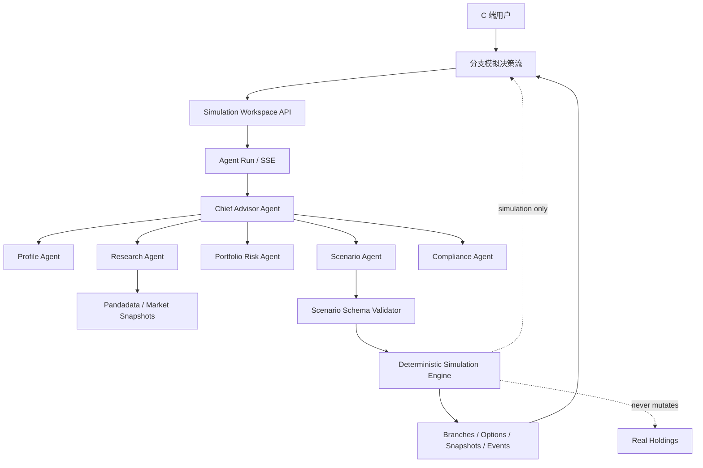

# 分支模拟与 Agent 情景决策设计

## 1. 目标

为理财 C 端用户提供 Git 式的组合分支模拟能力：

- 从当前真实持仓快照创建一个模拟工作区。
- 由 Agent 根据用户情景生成 A/B/C 等候选方案。
- 由确定性引擎校验交易并计算每个方案的模拟资产结果。
- 用户可以执行、切换和撤回分支。
- 任何模拟操作都不修改真实 `holdings`，不连接券商，不创建真实订单。

默认面向理财小白提供“决策流”体验，同时保留专业用户使用的分支实验室详情视图。

## 2. 用户流程

```text
当前组合
  -> 用户描述目标或情景
  -> Chief Advisor 委派画像、研究、组合风险、情景和合规角色
  -> 生成 A/B/C 候选
  -> 展示方案、交易动作、风险、证据和假设
  -> 用户选择一个候选
  -> 确定性模拟引擎执行并创建子分支
  -> 展示当前分支资产快照
  -> 用户继续生成下一轮方案、切换历史分支或撤回到父分支
```

默认候选包括：

- A：保持观察，不产生模拟交易。
- B：按风险预算进行平衡再配置。
- C：按压力约束进行防御性降险。

Agent 可以根据情景更改方案名称、动作和解释，但必须符合服务端交易与风险约束。

## 3. 总体架构



### 3.1 Agent 与引擎边界

Agent 负责：

- 理解用户的目标、偏好和情景。
- 提出 2 至 5 个候选方案。
- 选择交易方向、目标仓位和调整节奏。
- 解释支持证据、反方证据、风险、假设和失效条件。

确定性服务负责：

- 标的归属和可交易校验。
- 冻结价格清单和哈希。
- 现金、持仓数量、手续费和精度校验。
- 模拟后的资产、仓位、集中度、压力回撤和资产守恒。
- 持久化分支、快照和事件。

模型不能直接写入资产结果，也不能绕过服务端发布门。

## 4. Agent 设计

新增 Branch Scenario Agent 能力，复用现有 Chief Advisor：

```text
Chief Advisor
├── Profile Agent
├── Data Research Agent
├── Portfolio Risk Agent
├── Scenario Agent
└── Compliance Agent
```

分支场景输入至少包括：

- 用户问题和目标。
- 当前用户画像。
- 当前真实组合快照。
- 当前激活分支快照。
- 可用标的和最新数据日期。
- 最大回撤、单标的和行业仓位限制。

Agent 输出使用结构化 schema：

```json
{
  "options": [
    {
      "label": "B · 风险预算再平衡",
      "description": "降低黄金集中度并保留现金缓冲",
      "strategy": "BALANCED",
      "trades": [
        {
          "instrumentId": "instrument_x",
          "action": "SELL",
          "quantity": "100"
        }
      ],
      "targetAllocations": [],
      "rationale": [],
      "counterEvidence": [],
      "risks": [],
      "assumptions": [],
      "invalidationConditions": []
    }
  ]
}
```

要求：

- 方案数量为 2 至 5 个。
- `instrumentId` 必须来自服务端允许的标的集合。
- 交易方向只能是 `BUY` 或 `SELL`。
- 交易数量必须为正数字字符串。
- Agent 不提供最终成交价，价格由服务端冻结。
- 缺少数据时必须降级，不得伪造行情、收益概率或价格。
- 合规阻断时可以生成“观察/不交易”方案，但不能生成可执行买卖方案。

AI 不可用时：

- 运行确定性规则候选生成器。
- 响应中标记 `provider=DETERMINISTIC_FALLBACK`。
- 前端明确展示“规则降级方案，不是 AI 结论”。

## 5. 数据与状态模型

沿用当前表并完善状态：

- `simulation_workspaces`：模拟工作区、根分支、活动分支和版本。
- `simulation_branches`：根分支和子分支父子关系。
- `simulation_option_batches`：一次 A/B/C 候选批次、Agent run 和价格清单。
- `simulation_options`：候选方案、交易动作、分析结果和执行分支。
- `simulation_asset_snapshots`：每个分支的现金、总市值、指标和模型版本。
- `simulation_asset_snapshot_items`：分支内各标的数量、价格、市值和权重。
- `simulation_branch_events`：创建、执行、切换和撤回历史。

状态约束：

- 根分支必须有根资产快照。
- 子分支必须有父分支和被执行候选。
- 已执行候选不能再次执行。
- 切换和撤回只更新活动分支指针。
- 真实持仓表不在模拟事务写集内。
- 所有写操作使用幂等键和工作区 `row_version`。

## 6. API 设计

### 工作区

```text
POST /api/v1/simulation-workspaces
GET  /api/v1/simulation-workspaces
GET  /api/v1/simulation-workspaces/:id
PATCH /api/v1/simulation-workspaces/:id
GET  /api/v1/simulation-workspaces/:id/tree
```

### 候选方案

```text
POST /api/v1/simulation-workspaces/:id/options
GET  /api/v1/simulation-workspaces/:id/options
GET  /api/v1/analyses/:analysisId/events
```

生成候选使用异步语义：

```text
POST -> 202 QUEUED
SSE  -> agent/tool/stage/recommendation 事件
GET  -> QUEUED | RUNNING | SUCCEEDED | FAILED
```

### 分支执行

```text
POST  /api/v1/simulation-workspaces/:id/branches
PATCH /api/v1/simulation-workspaces/:id/active-branch
POST  /api/v1/simulation-workspaces/:id/undo
GET   /api/v1/simulation-workspaces/:id/branches/:branchId/snapshot
```

所有执行结果包含：

```json
{
  "ordersCreated": false,
  "branchId": "branch_x",
  "snapshotId": "snapshot_x",
  "activeBranchId": "branch_x"
}
```

## 7. 确定性模拟引擎

引擎执行顺序：

1. 校验价格清单哈希。
2. 加载父分支资产快照。
3. 校验每个交易标的、方向和数量。
4. 使用冻结价格计算交易金额和手续费。
5. 校验现金和持仓不会变成负数。
6. 计算模拟后的持仓、权重、集中度和压力场景。
7. 校验资产守恒。
8. 事务性写入 simulation、branch、snapshot、snapshot items 和 event。
9. 更新活动分支指针。
10. 发布 SSE `branch.created`。

快照必须返回：

- 现金。
- 总资产。
- 市值。
- 成本基础。
- 模拟浮盈浮亏。
- 持仓明细。
- 仓位权重。
- 集中度。
- 压力回撤。
- 数据日期。
- 价格清单哈希。
- 引擎版本。

## 8. 前端设计

### 8.1 默认决策流

页面结构：

1. 当前组合摘要：总资产、现金、最大回撤、最大集中度。
2. 当前问题和数据状态。
3. A/B/C 方案卡：
   - 一句话结论。
   - 模拟交易。
   - 模拟后资产。
   - 风险变化。
   - 证据和反方证据。
   - 假设和失效条件。
4. 用户选择方案。
5. 选择结果确认：
   - 明确“只创建模拟分支”。
   - 显示不会产生真实订单。
6. 当前分支资产快照。
7. 操作：继续生成、切换分支、撤回到父分支。

### 8.2 专业实验室视图

展示：

- 分支树。
- 当前活动分支。
- 每次生成和执行的事件时间线。
- 分支间资产差异。
- 冻结价格和数据日期。
- Agent 证据与工具调用状态。

## 9. 错误和降级

| 情况 | 行为 |
|---|---|
| 模型不可用 | 规则候选，标记 `DETERMINISTIC_FALLBACK` |
| Pandadata 不可用 | 不生成需要实时价格的买卖方案 |
| 价格过期 | 阻断可执行方案 |
| 资产数量不足 | 返回 `INSUFFICIENT_SIMULATED_HOLDING` |
| 现金不足 | 返回 `INSUFFICIENT_SIMULATED_CASH` |
| 版本冲突 | 返回 `412 VERSION_CONFLICT`，前端要求刷新 |
| 重复执行候选 | 返回 `409 OPTION_ALREADY_EXECUTED` |
| 工作区已归档 | 禁止生成和执行新候选 |

Agent 超时：

- 子 Agent 30 秒。
- 候选生成总任务 90 秒。
- 超时后保留已完成事件并切换降级或失败状态。
- 禁止长期停留在 `RUNNING`。

## 10. 测试与联调

### 单元测试

- Agent 输出 schema 校验。
- 交易动作和标的校验。
- 现金不足、超卖和价格篡改。
- 资产守恒。
- 分支候选确定性回退。
- P&L、集中度和压力回撤。

### API 测试

- 创建工作区。
- 生成候选。
- 执行多个并列分支。
- 切换历史分支。
- 撤回父分支。
- 并发版本冲突。
- 幂等请求。
- 真实 holdings 不改变。

### Playwright C 端测试

```text
登录/演示入口
  -> 打开分支模拟
  -> 创建工作区
  -> 生成 A/B/C
  -> 选择 B
  -> 查看模拟资产
  -> 切换到 A
  -> 撤回
  -> 验证页面显示根分支资产
```

最终验收必须启动本地 Next 服务，使用当前环境变量，完成真实前后端链路测试。
